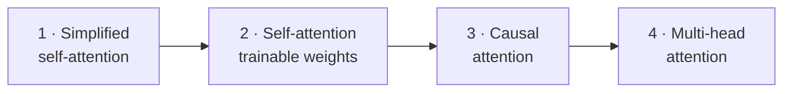
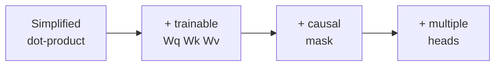

# Coding Attention Mechanisms

---
## Coding attention mechanisms

- the heart of every transformer LLM
- built up in four stages, from scratch

::: narration
This is a thorough walk through the attention mechanism — the computational core of every transformer-based large language model — following the development in chapter three of Sebastian Raschka's Build a Large Language Model From Scratch. We will build attention up in four stages, each adding exactly one idea to the last. First, a simplified self-attention with no learnable parameters, just to expose the skeleton. Then we add trainable weights to get the real scaled dot-product attention used in GPT. Then a causal mask, so the model can only look backward, which is what makes left-to-right generation possible. And finally multi-head attention, running several attention mechanisms in parallel. By the end the whole thing will be a single, efficient PyTorch module you could drop into a working language model.
:::

---
## The four variants we will build



- each builds on the one before

::: narration
Here is the map of the whole journey. We start on the left with simplified self-attention, a stripped-down version with no trainable weights, designed only to make the core idea visible. Moving right, we add the three trainable weight matrices that turn it into the self-attention actually used in language models. Next we add a causal mask, which restricts each position to attend only to earlier positions and itself. And finally we organize the mechanism into multiple heads operating in parallel, each able to focus on a different aspect of the input. Every stage reuses the machinery of the previous one; nothing is thrown away. Keep this four-box picture in mind, because we will return to it as our compass at each transition.
:::

---
## Why not just translate word by word?

<div class="tr">
<style>
.tr svg{width:88%}
.tr .box{fill:#F6E5D2;stroke:#1A3F70;stroke-width:1.5;rx:4}
.tr .de{fill:#ECDDC5;stroke:#7A736C;stroke-width:1.2}
.tr text{font-family:'Source Sans 3',sans-serif;font-size:12px;fill:#262A33;text-anchor:middle}
.tr .arr{stroke:#9D3A24;stroke-width:1.6;fill:none;opacity:0;animation:trshow 5s infinite}
.tr .straight{stroke:#B9A78A;stroke-width:1.4}
@keyframes trshow{0%,40%{opacity:0}55%,100%{opacity:.85}}
</style>
<svg viewBox="0 0 620 170">
<g font-style="italic">
<rect class="de" x="10" y="15" width="70" height="26"/><text x="45" y="32">Kannst</text>
<rect class="de" x="90" y="15" width="55" height="26"/><text x="117" y="32">du</text>
<rect class="de" x="155" y="15" width="55" height="26"/><text x="182" y="32">mir</text>
<rect class="de" x="220" y="15" width="65" height="26"/><text x="252" y="32">helfen</text>
<rect class="de" x="295" y="15" width="70" height="26"/><text x="330" y="32">diesen</text>
<rect class="de" x="375" y="15" width="55" height="26"/><text x="402" y="32">Satz</text>
</g>
<rect class="box" x="10" y="120" width="70" height="26"/><text x="45" y="137">Can</text>
<rect class="box" x="90" y="120" width="55" height="26"/><text x="117" y="137">you</text>
<rect class="box" x="155" y="120" width="55" height="26"/><text x="182" y="137">help</text>
<rect class="box" x="220" y="120" width="65" height="26"/><text x="252" y="137">me</text>
<rect class="box" x="295" y="120" width="70" height="26"/><text x="330" y="137">this</text>
<rect class="box" x="375" y="120" width="55" height="26"/><text x="402" y="137">sentence</text>
<line class="arr" x1="252" y1="44" x2="182" y2="118"/>
<line class="arr" x1="182" y1="44" x2="252" y2="118"/>
<line class="arr" x1="45" y1="44" x2="45" y2="118"/>
<line class="arr" x1="117" y1="44" x2="117" y2="118"/>
</svg>
</div>

- grammar reorders words across languages

::: narration
Before any attention machinery, consider the problem it was invented to solve. Suppose we are translating from German to English. We cannot simply translate word by word, because the grammatical structure of the two languages differs — words that come early in one language may belong late in the other, and vice versa. In the German sentence shown, the verb "helfen", meaning "help", sits in the middle, but in correct English "help" must move earlier, ahead of "me". A faithful translation has to reach across the sentence, pulling in words that appear earlier or later in the source. So even this simple task demands that, when producing each output word, the model can selectively access the right parts of the entire input. That requirement is the seed of attention.
:::

---
## The RNN encoder–decoder bottleneck

<div class="rnn">
<style>
.rnn svg{width:92%}
.rnn text{font-family:'Source Sans 3',sans-serif;font-size:11px;fill:#262A33;text-anchor:middle}
.rnn .cell{fill:#F6E5D2;stroke:#1A3F70;stroke-width:1.5}
.rnn .hid{fill:#ECDDC5;stroke:#7A736C;stroke-width:1.4}
.rnn .state{fill:#9D3A24;stroke:#9D3A24}
.rnn .flow{fill:#1A3F70}
.rnn .lbl{font-size:10px;fill:#7A736C}
</style>
<svg viewBox="0 0 620 200">
<text class="lbl" x="120" y="14">ENCODER</text>
<text class="lbl" x="470" y="14">DECODER</text>
<rect class="cell" x="20" y="120" width="46" height="26"/><text x="43" y="137">Kannst</text>
<rect class="cell" x="76" y="120" width="40" height="26"/><text x="96" y="137">du</text>
<rect class="cell" x="126" y="120" width="40" height="26"/><text x="146" y="137">mir</text>
<rect class="cell" x="176" y="120" width="40" height="26"/><text x="196" y="137">…</text>
<rect class="hid" x="20" y="70" width="46" height="26"/>
<rect class="hid" x="76" y="70" width="40" height="26"/>
<rect class="hid" x="126" y="70" width="40" height="26"/>
<rect class="hid" x="176" y="70" width="40" height="26"/>
<rect class="state" x="240" y="66" width="60" height="34" rx="4"/><text x="270" y="86" fill="#fff">h</text>
<rect class="hid" x="360" y="70" width="46" height="26"/>
<rect class="hid" x="416" y="70" width="40" height="26"/>
<rect class="hid" x="466" y="70" width="40" height="26"/>
<rect class="cell" x="360" y="120" width="46" height="26"/><text x="383" y="137">Can</text>
<rect class="cell" x="416" y="120" width="40" height="26"/><text x="436" y="137">you</text>
<rect class="cell" x="466" y="120" width="40" height="26"/><text x="486" y="137">…</text>
<text class="lbl" x="270" y="120">one hidden state</text>
<text class="lbl" x="270" y="134">carries everything</text>
<circle class="flow" r="5"><animateMotion dur="3.5s" repeatCount="indefinite" keyTimes="0;0.5;0.55;1" keyPoints="0;0.5;0.5;1" calcMode="linear" path="M43,83 L196,83 L270,83 L486,83"/></circle>
</svg>
</div>

- the whole input squeezed through a single vector

::: narration
Before transformers, the dominant approach to translation was a recurrent neural network arranged as an encoder and a decoder. The encoder reads the input sentence one token at a time, updating an internal hidden state meant to accumulate the meaning of everything seen so far. After the last input token, that single final hidden state — the rust block in the middle — is handed to the decoder, which generates the output one word at a time. Here is the fatal limitation. The decoder cannot reach back to any individual word of the input; it has access only to that one compressed hidden state. Everything the source sentence meant must be funneled through a single fixed-size vector. For short sentences this is tolerable, but as sentences grow longer, context gets lost in the squeeze, especially when dependencies span long distances.
:::

---
## Bahdanau attention: selective access

<div class="bah">
<style>
.bah svg{width:80%}
.bah text{font-family:'Source Sans 3',sans-serif;font-size:11px;fill:#262A33;text-anchor:middle}
.bah .cell{fill:#F6E5D2;stroke:#1A3F70;stroke-width:1.5}
.bah .out{fill:#ECDDC5;stroke:#0F5D5D;stroke-width:1.6}
.bah .l1{stroke:#0F5D5D;stroke-width:1.2;animation:bahA 4s infinite}
.bah .l2{stroke:#0F5D5D;stroke-width:3.5;animation:bahB 4s infinite}
.bah .l3{stroke:#0F5D5D;stroke-width:2.2;animation:bahC 4s infinite}
@keyframes bahA{0%,100%{opacity:.25}50%{opacity:.4}}
@keyframes bahB{0%,100%{opacity:.4}50%{opacity:1}}
@keyframes bahC{0%,100%{opacity:.3}50%{opacity:.7}}
</style>
<svg viewBox="0 0 520 180">
<rect class="cell" x="20" y="120" width="60" height="26"/><text x="50" y="137">Kannst</text>
<rect class="cell" x="95" y="120" width="50" height="26"/><text x="120" y="137">du</text>
<rect class="cell" x="160" y="120" width="50" height="26"/><text x="185" y="137">mir</text>
<rect class="cell" x="225" y="120" width="55" height="26"/><text x="252" y="137">helfen</text>
<rect class="out" x="360" y="40" width="120" height="28"/><text x="420" y="58">generating "you"</text>
<line class="l1" x1="50" y1="120" x2="420" y2="70"/>
<line class="l2" x1="120" y1="120" x2="420" y2="70"/>
<line class="l3" x1="185" y1="120" x2="420" y2="70"/>
<line class="l1" x1="252" y1="120" x2="420" y2="70"/>
</svg>
</div>

- weighted links to **all** inputs, per output token (2014)

::: narration
In two thousand fourteen, researchers introduced what became known as Bahdanau attention to repair exactly this bottleneck. The idea: instead of forcing the decoder to rely on a single hidden state, give it the ability, at each output step, to look back at all of the encoder's states and decide which input words matter most right now. In the figure, while the model generates the word "you", connections run from every input token to the current output, but they are not equal — the thicker, brighter line marks the input the model is weighting most heavily. Those weights, computed fresh for each output token, are the attention weights. The decoder is no longer blind to the input's structure; it can selectively attend to the relevant pieces. This was still bolted onto a recurrent network, but the core idea would soon stand on its own.
:::

---
## Attention is all you need

<div class="sa">
<style>
.sa svg{width:66%}
.sa text{font-family:'Source Sans 3',sans-serif;font-size:12px;fill:#262A33;text-anchor:middle}
.sa .tok{fill:#F6E5D2;stroke:#1A3F70;stroke-width:1.6}
.sa .ln{stroke:#1A3F70;stroke-width:1.1;opacity:.5}
.sa .self{stroke:#9D3A24;stroke-width:2;fill:none;animation:sapulse 3s infinite}
@keyframes sapulse{0%,100%{opacity:.3}50%{opacity:1}}
</style>
<svg viewBox="0 0 460 150">
<line class="ln" x1="60" y1="75" x2="170" y2="75"/>
<line class="ln" x1="60" y1="75" x2="280" y2="75"/>
<line class="ln" x1="60" y1="75" x2="390" y2="75"/>
<line class="ln" x1="170" y1="75" x2="280" y2="75"/>
<line class="ln" x1="170" y1="75" x2="390" y2="75"/>
<line class="ln" x1="280" y1="75" x2="390" y2="75"/>
<path class="self" d="M170,60 a18,18 0 1 1 0.1,0"/>
<rect class="tok" x="35" y="60" width="50" height="30"/><text x="60" y="79">Your</text>
<rect class="tok" x="143" y="60" width="56" height="30"/><text x="171" y="79">journey</text>
<rect class="tok" x="255" y="60" width="52" height="30"/><text x="281" y="79">starts</text>
<rect class="tok" x="367" y="60" width="46" height="30"/><text x="390" y="79">…</text>
</svg>
</div>

- self-attention: every position attends to every position in the **same** sequence

::: narration
Three years later, in two thousand seventeen, came the decisive result: recurrent networks were not necessary at all. The transformer architecture discarded recurrence entirely and kept only the attention mechanism, in a form called self-attention. The word "self" is the key. In the earlier sequence-to-sequence setting, attention related two different sequences — the source and the target. In self-attention, the mechanism relates a sequence to itself: every position in the input is allowed to attend to, and weigh the importance of, every other position in that same input, including itself. Each token's representation is rebuilt as a blend of all the tokens, weighted by relevance. This is the cornerstone of GPT and the entire modern family of large language models, and it is what we will now construct from the ground up.
:::

---
## The goal: context vectors

<div class="cv">
<style>
.cv svg{width:78%}
.cv text{font-family:'Source Sans 3',sans-serif;font-size:11px;fill:#262A33;text-anchor:middle}
.cv .emb{fill:#F6E5D2;stroke:#1A3F70;stroke-width:1.4}
.cv .ctx{fill:#E2BFAC;stroke:#9D3A24;stroke-width:1.8}
.cv .a{stroke:#7A736C;stroke-width:1.3;animation:cvflow 3.5s infinite}
@keyframes cvflow{0%,100%{opacity:.3}50%{opacity:.9}}
.cv .lbl{font-size:10px;fill:#7A736C}
</style>
<svg viewBox="0 0 480 180">
<rect class="emb" x="30" y="20" width="40" height="22"/><text x="50" y="35">Your</text>
<rect class="emb" x="130" y="20" width="50" height="22"/><text x="155" y="35">journey</text>
<rect class="emb" x="240" y="20" width="44" height="22"/><text x="262" y="35">starts</text>
<rect class="emb" x="350" y="20" width="46" height="22"/><text x="373" y="35">step</text>
<line class="a" x1="50" y1="42" x2="230" y2="130"/>
<line class="a" x1="155" y1="42" x2="230" y2="130"/>
<line class="a" x1="262" y1="42" x2="230" y2="130"/>
<line class="a" x1="373" y1="42" x2="230" y2="130"/>
<rect class="ctx" x="195" y="130" width="70" height="26"/><text x="230" y="147" fill="#9D3A24">z⁽²⁾</text>
<text class="lbl" x="230" y="172">enriched embedding for "journey"</text>
</svg>
</div>

- $z^{(i)}$ = embedding of token $i$, enriched by all others

::: narration
What is self-attention actually trying to compute? For each input token, it produces what Raschka calls a context vector: an enriched embedding that fuses information from every token in the sequence. Take the second token, "journey". Its plain input embedding knows nothing about its neighbours. Its context vector, written z-superscript-two, is built by blending in contributions from "Your", "starts", and every other token, each weighted by how relevant it is to "journey". The result is a representation of "journey" that is aware of its entire context — which sense of the word is meant, what it relates to, how it functions in this particular sentence. Every token gets its own such context vector. Producing these enriched, context-aware representations is the entire job of the attention layer.
:::

---
## Stage 1 · Simplified self-attention

- no trainable weights — yet
- goal: expose the three core steps

::: narration
We begin with the simplest possible version: self-attention stripped of all trainable weights. This simplified mechanism will not be what a real language model uses, but it isolates the three essential steps — computing attention scores, normalizing them into weights, and forming a weighted sum — without the distraction of learnable parameters. Once these three steps are clear and concrete, adding the trainable weights in the next stage will be a small, natural extension rather than a leap. Think of this as building the engine block before we add the fuel injection.
:::

---
## The running example

```python
import torch
inputs = torch.tensor(
  [[0.43, 0.15, 0.89],  # Your    (x^1)
   [0.55, 0.87, 0.66],  # journey (x^2)
   [0.57, 0.85, 0.64],  # starts  (x^3)
   [0.22, 0.58, 0.33],  # with    (x^4)
   [0.77, 0.25, 0.10],  # one     (x^5)
   [0.05, 0.80, 0.55]]  # step    (x^6)
)
```

- six tokens, each a 3-D embedding

::: narration
Throughout, we use one concrete example sentence: "Your journey starts with one step." Each of its six words has already been turned into an embedding vector by the steps from the previous chapter. To keep everything visible on a single screen, Raschka deliberately chooses a tiny embedding dimension of three — real models use hundreds or thousands. So our input is a six-by-three tensor: six rows, one per token, each row a three-dimensional vector. We will designate the second row, the embedding for "journey", as our worked example throughout this stage, computing its context vector step by step before generalizing to all six tokens at once. Every number you see later traces back to this little tensor.
:::

---
## Step 1 — attention scores via dot product

<div class="sc">
<style>
.sc svg{width:82%}
.sc text{font-family:'Source Sans 3',sans-serif;font-size:11px;fill:#262A33;text-anchor:middle}
.sc .tok{fill:#F6E5D2;stroke:#1A3F70;stroke-width:1.4}
.sc .q{fill:#C9B7E0;stroke:#6B2C5E;stroke-width:1.8}
.sc .score{fill:#B7CFCA;stroke:#0F5D5D;stroke-width:1.4;opacity:0}
.sc .s0{animation:sc0 6s infinite}.sc .s1{animation:sc1 6s infinite}.sc .s2{animation:sc2 6s infinite}.sc .s3{animation:sc3 6s infinite}
@keyframes sc0{0%,8%{opacity:0}20%,100%{opacity:1}}
@keyframes sc1{0%,24%{opacity:0}36%,100%{opacity:1}}
@keyframes sc2{0%,40%{opacity:0}52%,100%{opacity:1}}
@keyframes sc3{0%,56%{opacity:0}68%,100%{opacity:1}}
.sc .lbl{font-size:10px;fill:#7A736C}
</style>
<svg viewBox="0 0 500 180">
<text class="lbl" x="60" y="16">query = x⁽²⁾</text>
<rect class="q" x="30" y="22" width="60" height="24"/><text x="60" y="38">journey</text>
<rect class="tok" x="140" y="22" width="46" height="24"/><text x="163" y="38">Your</text>
<rect class="tok" x="220" y="22" width="46" height="24"/><text x="243" y="38">journey</text>
<rect class="tok" x="300" y="22" width="46" height="24"/><text x="323" y="38">starts</text>
<rect class="tok" x="420" y="22" width="46" height="24"/><text x="443" y="38">step</text>
<line stroke="#6B2C5E" stroke-width="1.2" x1="60" y1="46" x2="163" y2="100"/>
<line stroke="#6B2C5E" stroke-width="1.2" x1="60" y1="46" x2="243" y2="100"/>
<line stroke="#6B2C5E" stroke-width="1.2" x1="60" y1="46" x2="323" y2="100"/>
<line stroke="#6B2C5E" stroke-width="1.2" x1="60" y1="46" x2="443" y2="100"/>
<rect class="score s0" x="140" y="104" width="46" height="22"/><text class="s0 score" x="163" y="119" fill="#0F5D5D" style="opacity:1">0.95</text>
<rect class="score s1" x="220" y="104" width="46" height="22"/><text x="243" y="119" fill="#0F5D5D" class="s1 score" style="opacity:1">1.50</text>
<rect class="score s2" x="300" y="104" width="46" height="22"/><text x="323" y="119" fill="#0F5D5D" class="s2 score" style="opacity:1">1.48</text>
<rect class="score s3" x="420" y="104" width="46" height="22"/><text x="443" y="119" fill="#0F5D5D" class="s3 score" style="opacity:1">1.09</text>
<text class="lbl" x="250" y="160">ω₂ⱼ = x⁽²⁾ · x⁽ʲ⁾  (dot product with each token)</text>
</svg>
</div>

::: narration
Step one: measure how much the query token relates to every token, including itself, by taking a dot product. We fix "journey" as the query. We then compute the dot product of the query's embedding with each token's embedding in turn, producing one number per token — these are the unnormalized attention scores, written omega-two-j. In code, this is a single loop: for each input vector x-i, the score is torch-dot of x-i with the query. The dot product is the natural choice here because it is a similarity measure: it is large when two vectors point in similar directions and small when they do not. So a high score means that token is highly aligned with the query and should contribute strongly. The scores appearing here — point nine five, one point five, and so on — are exactly the values Raschka's code prints.
:::

---
## Why the dot product?

$$\mathbf{a}\cdot\mathbf{b} \;=\; \sum_i a_i\, b_i \;=\; \|\mathbf{a}\|\,\|\mathbf{b}\|\cos\theta$$

- a scalar measure of **alignment** / similarity
- higher dot product → vectors point the same way → more attention

::: narration
It is worth pausing on why the dot product is the right tool, since it recurs at every stage. Mechanically, the dot product multiplies two vectors element-wise and sums the results, collapsing them to a single scalar. But geometrically it equals the product of the two vectors' lengths times the cosine of the angle between them. That cosine is what matters: when two vectors point in nearly the same direction, the cosine is near one and the dot product is large; when they are orthogonal, it is zero. So the dot product quantifies alignment. In attention, this means a token whose embedding is aligned with the query earns a high score and will be attended to strongly. The entire mechanism rests on this one idea — similarity measured by dot product — applied over and over.
:::

---
## Step 2 — normalize into attention weights

<div class="nm">
<style>
.nm svg{width:82%}
.nm text{font-family:'Source Sans 3',sans-serif;font-size:11px;fill:#262A33;text-anchor:middle}
.nm .sbar{fill:#B7CFCA;stroke:#0F5D5D;stroke-width:1.2}
.nm .wbar{fill:#DDC58A;stroke:#A87B12;stroke-width:1.2}
.nm .lbl{font-size:10px;fill:#7A736C}
</style>
<svg viewBox="0 0 520 180">
<text class="lbl" x="110" y="14">attention scores ω</text>
<rect class="sbar" x="30" y="60" width="30" height="60"/>
<rect class="sbar" x="75" y="35" width="30" height="85"/>
<rect class="sbar" x="120" y="37" width="30" height="83"/>
<rect class="sbar" x="165" y="78" width="30" height="42"/>
<text x="250" y="80" font-size="22" fill="#7A736C">→</text>
<text class="lbl" x="250" y="100">softmax</text>
<text class="lbl" x="410" y="14">attention weights α (sum = 1)</text>
<rect class="wbar" x="320" y="92" width="30" height="28"/>
<rect class="wbar" x="365" y="74" width="30" height="46"/>
<rect class="wbar" x="410" y="75" width="30" height="45"/>
<rect class="wbar" x="455" y="96" width="30" height="24"/>
<line stroke="#B9A78A" x1="320" y1="120" x2="485" y2="120"/>
</svg>
</div>

- $\alpha_{2j} = \mathrm{softmax}(\omega_{2j})$ — positive, sums to 1

::: narration
Step two converts raw scores into attention weights that form a proper distribution. We want weights that are all positive and that sum to one, so they behave like proportions of attention. The tool is the softmax function: it exponentiates each score and divides by the sum of all the exponentials. Exponentiating guarantees positivity, and dividing by the total guarantees the weights sum to one. Raschka first shows a naive softmax, then notes that in practice you use PyTorch's built-in version, which is numerically stable against overflow and underflow with very large or very small inputs. The picture shows the transformation: the taller teal score bars become gold weight bars whose heights now add up to exactly one. These weights, alpha-two-j, tell us what fraction of attention "journey" pays to each token.
:::

---
## Step 3 — context vector as a weighted sum

<div class="ct">
<style>
.ct svg{width:80%}
.ct text{font-family:'Source Sans 3',sans-serif;font-size:11px;fill:#262A33;text-anchor:middle}
.ct .tok{fill:#F6E5D2;stroke:#1A3F70;stroke-width:1.4}
.ct .w{fill:#DDC58A;stroke:#A87B12;stroke-width:1.2}
.ct .ctx{fill:#E2BFAC;stroke:#9D3A24;stroke-width:1.8;opacity:0;animation:ctshow 4s infinite}
@keyframes ctshow{0%,55%{opacity:0}70%,100%{opacity:1}}
.ct .p{fill:#A87B12}
</style>
<svg viewBox="0 0 500 190">
<rect class="tok" x="30" y="20" width="44" height="22"/><text x="52" y="35">Your</text>
<rect class="tok" x="130" y="20" width="50" height="22"/><text x="155" y="35">journey</text>
<rect class="tok" x="240" y="20" width="44" height="22"/><text x="262" y="35">starts</text>
<rect class="tok" x="350" y="20" width="44" height="22"/><text x="372" y="35">step</text>
<rect class="w" x="36" y="58" width="32" height="16"/><text x="52" y="70" font-size="9">α₂₁</text>
<rect class="w" x="139" y="58" width="32" height="16"/><text x="155" y="70" font-size="9">α₂₂</text>
<rect class="w" x="246" y="58" width="32" height="16"/><text x="262" y="70" font-size="9">α₂₃</text>
<rect class="w" x="356" y="58" width="32" height="16"/><text x="372" y="70" font-size="9">α₂T</text>
<line class="p" stroke="#A87B12" stroke-width="1.3" x1="52" y1="74" x2="230" y2="135"/>
<line class="p" stroke="#A87B12" stroke-width="1.3" x1="155" y1="74" x2="230" y2="135"/>
<line class="p" stroke="#A87B12" stroke-width="1.3" x1="262" y1="74" x2="230" y2="135"/>
<line class="p" stroke="#A87B12" stroke-width="1.3" x1="372" y1="74" x2="230" y2="135"/>
<rect class="ctx" x="190" y="135" width="80" height="28"/><text x="230" y="153" fill="#9D3A24" style="opacity:1">z⁽²⁾</text>
</svg>
</div>

- $z^{(2)} = \sum_j \alpha_{2j}\, x^{(j)}$

::: narration
Step three assembles the context vector. We now multiply each token's embedding by the attention weight we just computed for it, and sum all those scaled vectors together. The result is z-superscript-two, the context vector for "journey": a weighted average of every input embedding, where the weights are the attention the query assigned. Tokens that scored high pull the result toward themselves; tokens that scored low barely move it. Numerically, Raschka's code produces the vector point four-four, point six-five, point five-seven for this example. And that completes the three-step skeleton: score by dot product, normalize by softmax, combine by weighted sum. Everything that follows in this chapter is an elaboration of these three moves.
:::

---
## Generalizing to all tokens at once

<div class="hm">
<style>
.hm svg{width:60%}
.hm text{font-family:'Source Sans 3',sans-serif;font-size:10px;fill:#262A33;text-anchor:middle}
.hm rect{stroke:#fff;stroke-width:1.5}
.hm .row2{stroke:#A87B12;stroke-width:2.5;fill:none}
</style>
<svg viewBox="0 0 300 230">
<rect x="40" y="30" width="40" height="30" fill="#1A3F70" opacity="0.85"/>
<rect x="80" y="30" width="40" height="30" fill="#1A3F70" opacity="0.85"/>
<rect x="120" y="30" width="40" height="30" fill="#1A3F70" opacity="0.8"/>
<rect x="160" y="30" width="40" height="30" fill="#1A3F70" opacity="0.5"/>
<rect x="200" y="30" width="40" height="30" fill="#1A3F70" opacity="0.5"/>
<rect x="240" y="30" width="40" height="30" fill="#1A3F70" opacity="0.55"/>
<rect x="40" y="60" width="40" height="30" fill="#A87B12" opacity="0.55"/>
<rect x="80" y="60" width="40" height="30" fill="#A87B12" opacity="0.95"/>
<rect x="120" y="60" width="40" height="30" fill="#A87B12" opacity="0.95"/>
<rect x="160" y="60" width="40" height="30" fill="#A87B12" opacity="0.5"/>
<rect x="200" y="60" width="40" height="30" fill="#A87B12" opacity="0.45"/>
<rect x="240" y="60" width="40" height="30" fill="#A87B12" opacity="0.6"/>
<rect x="40" y="90" width="240" height="30" fill="#1A3F70" opacity="0.6"/>
<rect x="40" y="120" width="240" height="30" fill="#1A3F70" opacity="0.55"/>
<rect x="40" y="150" width="240" height="30" fill="#1A3F70" opacity="0.55"/>
<rect x="40" y="180" width="240" height="30" fill="#1A3F70" opacity="0.6"/>
<rect class="row2" x="40" y="60" width="240" height="30"/>
<text x="20" y="48" font-size="9">Your</text>
<text x="20" y="78" font-size="9" fill="#A87B12">jrny</text>
<text x="20" y="108" font-size="9">strt</text>
</svg>
</div>

- $\Omega = X X^{T}$, then softmax each row → $A$

::: narration
Computing one context vector at a time with loops is clear but slow. The whole operation generalizes to a single pair of matrix multiplications. To get every attention score for every query at once, we multiply the input matrix by its own transpose: X times X-transpose. This produces a six-by-six matrix where entry i-j is the dot product of token i with token j — every pairwise similarity in one shot. We then apply softmax along each row, so that each row becomes a normalized set of attention weights summing to one. The highlighted second row is exactly the weights we computed by hand for "journey". Finally, multiplying this weight matrix by the input matrix produces all six context vectors simultaneously. Loops become two matrix multiplications — clearer, and far faster on real hardware.
:::

---
## Simplified self-attention, in three lines

```python
attn_scores  = inputs @ inputs.T          # all pairwise scores
attn_weights = torch.softmax(attn_scores, dim=-1)  # rows sum to 1
all_context  = attn_weights @ inputs      # weighted sums
```

- score · normalize · combine — the whole skeleton

::: narration
Here is the entire simplified mechanism in three lines of PyTorch. First, inputs at-sign inputs-transpose gives the full matrix of attention scores. Second, softmax with dim equals minus one normalizes along the last dimension, so every row sums to one — these are the attention weights. Third, attention-weights at-sign inputs computes the weighted sums, yielding the matrix of all context vectors. That is it: score, normalize, combine. Notice there are no learnable parameters anywhere — the mechanism is entirely determined by the input embeddings themselves. This is elegant, but it is also the limitation we fix next: with nothing to train, the model cannot learn what relationships to emphasize. That is the job of the trainable weights.
:::

---
## Stage 2 · Self-attention with trainable weights

- the version GPT actually uses
- add three matrices: $W_q,\;W_k,\;W_v$

::: narration
Now we add the missing ingredient: trainable weights. This is the self-attention used in the original transformer, in GPT, and in essentially every modern large language model, and it goes by the name scaled dot-product attention. The structure of the three steps is unchanged — we will still score, normalize, and combine — but we insert three learnable weight matrices, called W-query, W-key, and W-value. These matrices project each input embedding into three new vectors before the dot products happen, and crucially, their entries are adjusted during training. That is what lets the model learn which kinds of relationships deserve attention, producing context vectors tuned to the task of predicting the next token. The simplified version had no knobs to turn; this version is almost entirely knobs.
:::

---
## Query, key, value projections

<div class="qkv">
<style>
.qkv svg{width:78%}
.qkv text{font-family:'Source Sans 3',sans-serif;font-size:11px;fill:#262A33;text-anchor:middle}
.qkv .x{fill:#B7CFCA;stroke:#0F5D5D;stroke-width:1.6}
.qkv .wq{fill:#C9B7E0;stroke:#6B2C5E;stroke-width:1.4}
.qkv .wk{fill:#F6C9C0;stroke:#9D3A24;stroke-width:1.4}
.qkv .wv{fill:#DDC58A;stroke:#A87B12;stroke-width:1.4}
.qkv .arr{stroke:#7A736C;stroke-width:1.4;fill:none;marker-end:url(#qa)}
.qkv .o{opacity:0;animation:qkvo 3s infinite}
@keyframes qkvo{0%,40%{opacity:0}60%,100%{opacity:1}}
</style>
<svg viewBox="0 0 460 190">
<defs><marker id="qa" viewBox="0 0 10 10" refX="8" refY="5" markerWidth="6" markerHeight="6" orient="auto"><path d="M0,0 L10,5 L0,10 Z" fill="#7A736C"/></marker></defs>
<rect class="x" x="30" y="80" width="60" height="30"/><text x="60" y="99">x⁽²⁾</text>
<line class="arr" x1="92" y1="88" x2="150" y2="40"/>
<line class="arr" x1="92" y1="95" x2="150" y2="95"/>
<line class="arr" x1="92" y1="102" x2="150" y2="150"/>
<rect class="wq" x="152" y="26" width="40" height="28"/><text x="172" y="44">Wq</text>
<rect class="wk" x="152" y="81" width="40" height="28"/><text x="172" y="99">Wk</text>
<rect class="wv" x="152" y="136" width="40" height="28"/><text x="172" y="154">Wv</text>
<text x="240" y="44" font-size="18" fill="#7A736C">→</text>
<text x="240" y="99" font-size="18" fill="#7A736C">→</text>
<text x="240" y="154" font-size="18" fill="#7A736C">→</text>
<rect class="wq o" x="280" y="26" width="60" height="28"/><text x="310" y="44" class="o" style="opacity:1">query</text>
<rect class="wk o" x="280" y="81" width="60" height="28"/><text x="310" y="99" class="o" style="opacity:1">key</text>
<rect class="wv o" x="280" y="136" width="60" height="28"/><text x="310" y="154" class="o" style="opacity:1">value</text>
</svg>
</div>

- $q^{(i)}=x^{(i)}W_q,\quad k^{(i)}=x^{(i)}W_k,\quad v^{(i)}=x^{(i)}W_v$

::: narration
The first new step projects each input embedding into three distinct roles. Multiplying an input vector by W-query yields its query vector; by W-key, its key vector; by W-value, its value vector. So every token now wears three hats. Raschka uses an input dimension of three and an output dimension of two here, just to keep the arithmetic small, though in real GPT models the input and output dimensions are typically equal. The query is the vector for the token currently doing the looking; the key is what each token advertises to be matched against; the value is the content that actually gets blended into the output. Because these three matrices are learned, the model can shape what counts as a good match and what information flows forward — independently.
:::

---
## The database analogy

- **query** — what I'm looking for
- **key** — the label each item advertises
- **value** — the content retrieved when a key matches

::: narration
The terms query, key, and value are borrowed deliberately from databases and information retrieval, and the analogy genuinely helps. Think of a query as a search request — the thing the current token is trying to find. Think of each key as the index label attached to an item in the database, the handle against which the query is matched. And think of the value as the actual content stored under that key — what you retrieve once a match is found. In attention, the query of the current token is compared against the keys of all tokens to decide how much each matches; those match strengths become the weights; and the weighted blend of the corresponding values becomes the output. Querying, matching keys, retrieving values — the same shape as a soft, weighted database lookup.
:::

---
## Scaled dot-product: the scores

```python
queries = inputs @ W_query   # (6 × 2)
keys    = inputs @ W_key     # (6 × 2)
attn_scores = queries @ keys.T   # (6 × 6)
```

- scores now come from **query · key**, not raw embeddings

::: narration
With the projections in hand, the scoring step looks just like before, but on the new vectors. We compute all queries and all keys by multiplying the input matrix by W-query and W-key respectively. Then the attention scores are queries at-sign keys-transpose: the dot product of every query with every key, giving a six-by-six score matrix. The difference from stage one is subtle but decisive. In the simplified version we took dot products of the raw embeddings with themselves; now we take dot products of learned projections of them. Because W-query and W-key are trainable, the model can learn to make certain query-key pairs align strongly and others not at all — it learns what relationships to attend to, rather than being stuck with whatever the raw embeddings happened to encode.
:::

---
## Why divide by √dₖ?

$$\alpha = \mathrm{softmax}\!\left(\frac{\text{scores}}{\sqrt{d_k}}\right)$$

- large $d_k$ → large dot products → softmax saturates → tiny gradients
- scaling keeps gradients healthy → "**scaled** dot-product attention"

::: narration
Before the softmax, we divide the scores by the square root of the key dimension, d-k. This scaling is the reason the whole mechanism is called scaled dot-product attention, and the rationale is about training stability. As the embedding dimension grows — and in real GPT models the key dimension is often well over a thousand — dot products tend to grow large in magnitude, simply because we are summing more terms. When the inputs to softmax are large, softmax saturates: it behaves almost like a hard maximum, putting nearly all weight on one entry and driving the gradients of the others toward zero. Vanishing gradients stall learning. Dividing by the square root of d-k counteracts this growth, keeping the score magnitudes in a range where softmax stays smooth and gradients stay healthy. It is a small correction with an outsized effect on trainability.
:::

---
## The context vector from values

$$z^{(2)} = \sum_j \alpha_{2j}\, v^{(j)}$$

- weighted sum of **value** vectors (not raw inputs)

::: narration
The final step mirrors stage one, with one substitution: we take the weighted sum over value vectors rather than raw input embeddings. After scaling and softmax we have attention weights; multiplying the weight matrix by the value matrix produces the context vectors. So the attention weights, derived from queries and keys, decide how much of each token's value to mix in. This separation is the quiet genius of the design: queries and keys govern routing — who attends to whom — while values govern content — what actually gets passed along. Because all three projections are learned separately, the model can independently tune the routing and the payload. The output z-superscript-two is once again an enriched, context-aware representation of "journey", but now shaped by trained parameters.
:::

---
## The full data flow

<div class="flow">
<style>
.flow svg{width:86%}
.flow text{font-family:'Source Sans 3',sans-serif;font-size:11px;fill:#262A33;text-anchor:middle}
.flow .x{fill:#B7CFCA;stroke:#0F5D5D;stroke-width:1.5}
.flow .q{fill:#C9B7E0;stroke:#6B2C5E;stroke-width:1.4}
.flow .k{fill:#F6C9C0;stroke:#9D3A24;stroke-width:1.4}
.flow .v{fill:#DDC58A;stroke:#A87B12;stroke-width:1.4}
.flow .s{fill:#B5C5DC;stroke:#1A3F70;stroke-width:1.4}
.flow .z{fill:#E2BFAC;stroke:#9D3A24;stroke-width:1.8}
.flow .a{stroke:#7A736C;stroke-width:1.3;fill:none;marker-end:url(#fa)}
.flow .lbl{font-size:9px;fill:#7A736C}
</style>
<svg viewBox="0 0 580 170">
<defs><marker id="fa" viewBox="0 0 10 10" refX="8" refY="5" markerWidth="5" markerHeight="5" orient="auto"><path d="M0,0 L10,5 L0,10 Z" fill="#7A736C"/></marker></defs>
<rect class="x" x="20" y="70" width="44" height="30"/><text x="42" y="89">X</text>
<rect class="q" x="120" y="20" width="44" height="26"/><text x="142" y="37">Q</text>
<rect class="k" x="120" y="72" width="44" height="26"/><text x="142" y="89">K</text>
<rect class="v" x="120" y="124" width="44" height="26"/><text x="142" y="141">V</text>
<line class="a" x1="64" y1="80" x2="118" y2="35"/>
<line class="a" x1="64" y1="85" x2="118" y2="85"/>
<line class="a" x1="64" y1="90" x2="118" y2="135"/>
<rect class="s" x="230" y="46" width="60" height="30"/><text x="260" y="65">scores</text>
<line class="a" x1="166" y1="33" x2="228" y2="52"/>
<line class="a" x1="166" y1="85" x2="228" y2="66"/>
<rect class="s" x="340" y="46" width="70" height="30"/><text x="375" y="62" font-size="10">softmax ÷√dₖ</text>
<line class="a" x1="290" y1="61" x2="338" y2="61"/>
<rect class="z" x="470" y="80" width="60" height="30"/><text x="500" y="99">Z</text>
<line class="a" x1="410" y1="66" x2="468" y2="88"/>
<line class="a" x1="166" y1="137" x2="468" y2="98"/>
<text class="lbl" x="375" y="92">attention weights</text>
<text class="lbl" x="290" y="135">values flow to output →</text>
</svg>
</div>

::: narration
This diagram ties the trainable mechanism together end to end. From the input matrix X we project three matrices: queries Q, keys K, and values V. Q and K meet in a dot product to form the score matrix. Those scores are scaled by the square root of d-k and passed through softmax, becoming the attention weights. The weights then act on the value matrix V to produce the context vectors Z. Trace the two streams: queries and keys flow along the top to compute how much attention flows where, while values flow along the bottom carrying the content that actually gets combined. The attention weights are the meeting point — computed from one stream, applied to the other. This single figure is, in essence, what a self-attention layer computes billions of times during training.
:::

---
## `SelfAttention_v1`

```python
import torch.nn as nn

class SelfAttention_v1(nn.Module):
    def __init__(self, d_in, d_out):
        super().__init__()
        self.W_query = nn.Parameter(torch.rand(d_in, d_out))
        self.W_key   = nn.Parameter(torch.rand(d_in, d_out))
        self.W_value = nn.Parameter(torch.rand(d_in, d_out))

    def forward(self, x):
        keys    = x @ self.W_key
        queries = x @ self.W_query
        values  = x @ self.W_value
        attn_scores  = queries @ keys.T
        attn_weights = torch.softmax(
            attn_scores / keys.shape[-1]**0.5, dim=-1)
        return attn_weights @ values
```

::: narration
Here is the entire trainable mechanism packaged as a PyTorch module. In the constructor we register the three weight matrices as nn-dot-Parameter, which marks them as learnable so PyTorch will track gradients and update them during training. The forward method is the data flow we just diagrammed, line by line: project x into keys, queries, and values; compute the score matrix as queries at-sign keys-transpose; scale by the square root of the key dimension and apply softmax to get the weights; and return the weights at-sign values, the context vectors. Notice the forward pass is only six lines — the whole conceptual edifice compresses to almost nothing once the three matrices are in place. This class, fed our six-token input, returns six two-dimensional context vectors.
:::

---
## `SelfAttention_v2` — using `nn.Linear`

```python
class SelfAttention_v2(nn.Module):
    def __init__(self, d_in, d_out, qkv_bias=False):
        super().__init__()
        self.W_query = nn.Linear(d_in, d_out, bias=qkv_bias)
        self.W_key   = nn.Linear(d_in, d_out, bias=qkv_bias)
        self.W_value = nn.Linear(d_in, d_out, bias=qkv_bias)
    def forward(self, x):
        keys, queries, values = self.W_key(x), self.W_query(x), self.W_value(x)
        attn_scores  = queries @ keys.T
        attn_weights = torch.softmax(attn_scores / keys.shape[-1]**0.5, dim=-1)
        return attn_weights @ values
```

- `nn.Linear` (no bias) = a matrix multiply, but better-initialized

::: narration
A small refinement, but the version we carry forward. Instead of raw nn-dot-Parameter matrices, we use nn-dot-Linear layers with the bias disabled. With no bias, a linear layer is mathematically just a matrix multiplication, so the computation is identical in form. The advantage is twofold: nn-dot-Linear comes with a well-designed weight initialization scheme, which makes training more stable, and it integrates cleanly with the rest of PyTorch's machinery. One subtlety worth remembering, and the subject of an exercise in the book: nn-dot-Linear stores its weight matrix in transposed form relative to the hand-rolled version, so the two classes give different numbers from the same seed even though they implement the same operation. From here on, the Linear-based formulation is the template we extend.
:::

---
## Stage 3 · Causal attention

- LLMs generate **left to right**
- a token must not see its own future

::: narration
We now reach the modification that makes generation possible: causal attention, also called masked attention. A language model produces text one token at a time, left to right, and at each step it predicts the next token from the tokens before it. But the self-attention we have built so far lets every position attend to every other position — including positions to its right, in the future. During training, where the whole sequence is present at once, that would be cheating: the model could peek at the very token it is supposed to predict. Causal attention forbids this. It restricts each position to attend only to itself and the positions before it, never after. This single constraint is what aligns the attention mechanism with the left-to-right nature of text generation.
:::

---
## Masking the future

<div class="mask">
<style>
.mask svg{width:62%}
.mask text{font-family:'Source Sans 3',sans-serif;font-size:9px;fill:#262A33;text-anchor:middle}
.mask .keep{fill:#DDC58A;stroke:#fff;stroke-width:1.5}
.mask .cut{fill:#B5C5DC;stroke:#fff;stroke-width:1.5;animation:maskcut 4s infinite}
@keyframes maskcut{0%,40%{fill:#B5C5DC;opacity:1}60%,100%{fill:#ECDDC5;opacity:.4}}
</style>
<svg viewBox="0 0 280 260">
<!-- row 0 -->
<rect class="keep" x="40" y="30" width="38" height="30"/>
<rect class="cut" x="78" y="30" width="38" height="30"/><rect class="cut" x="116" y="30" width="38" height="30"/><rect class="cut" x="154" y="30" width="38" height="30"/><rect class="cut" x="192" y="30" width="38" height="30"/><rect class="cut" x="230" y="30" width="38" height="30"/>
<rect class="keep" x="40" y="60" width="38" height="30"/><rect class="keep" x="78" y="60" width="38" height="30"/>
<rect class="cut" x="116" y="60" width="38" height="30"/><rect class="cut" x="154" y="60" width="38" height="30"/><rect class="cut" x="192" y="60" width="38" height="30"/><rect class="cut" x="230" y="60" width="38" height="30"/>
<rect class="keep" x="40" y="90" width="38" height="30"/><rect class="keep" x="78" y="90" width="38" height="30"/><rect class="keep" x="116" y="90" width="38" height="30"/>
<rect class="cut" x="154" y="90" width="38" height="30"/><rect class="cut" x="192" y="90" width="38" height="30"/><rect class="cut" x="230" y="90" width="38" height="30"/>
<rect class="keep" x="40" y="120" width="38" height="30"/><rect class="keep" x="78" y="120" width="38" height="30"/><rect class="keep" x="116" y="120" width="38" height="30"/><rect class="keep" x="154" y="120" width="38" height="30"/>
<rect class="cut" x="192" y="120" width="38" height="30"/><rect class="cut" x="230" y="120" width="38" height="30"/>
<rect class="keep" x="40" y="150" width="38" height="30"/><rect class="keep" x="78" y="150" width="38" height="30"/><rect class="keep" x="116" y="150" width="38" height="30"/><rect class="keep" x="154" y="150" width="38" height="30"/><rect class="keep" x="192" y="150" width="38" height="30"/>
<rect class="cut" x="230" y="150" width="38" height="30"/>
<rect class="keep" x="40" y="180" width="38" height="30"/><rect class="keep" x="78" y="180" width="38" height="30"/><rect class="keep" x="116" y="180" width="38" height="30"/><rect class="keep" x="154" y="180" width="38" height="30"/><rect class="keep" x="192" y="180" width="38" height="30"/><rect class="keep" x="230" y="180" width="38" height="30"/>
<text x="150" y="234" fill="#7A736C">keep ≤ diagonal · mask the upper triangle</text>
</svg>
</div>

::: narration
Visually, causal attention is a triangle. Lay out the full attention weight matrix, rows as queries, columns as keys. The entries on and below the main diagonal — the gold cells — are the ones we keep: each token attending to itself and to everything before it. The entries above the diagonal — fading out here — are the forbidden future: token one must not attend to tokens two through six, token two must not attend to three through six, and so on. So we mask out the entire upper triangle. The first row keeps only its single diagonal cell, since the first token has no past; the last row keeps everything, since the last token may see the whole sequence. After masking we will renormalize, but the shape to fix in your mind is this lower-triangular staircase.
:::

---
## Mask, then renormalize

```python
context_length = attn_scores.shape[0]
mask = torch.tril(torch.ones(context_length, context_length))
masked = attn_weights * mask          # zero the upper triangle
row_sums = masked.sum(dim=-1, keepdim=True)
masked_norm = masked / row_sums       # rows sum to 1 again
```

- zero above the diagonal → renormalize each row

::: narration
The most direct way to implement the mask works in two moves. First, torch-dot-tril builds a lower-triangular matrix of ones — ones on and below the diagonal, zeros above. Multiplying the attention weights by this mask zeroes out every forbidden future entry. But now each row no longer sums to one, because we deleted some of its mass. So the second move renormalizes: we divide each row by its new sum, restoring a proper distribution over the allowed positions. Raschka raises a natural worry here, which the next slide addresses — doesn't the softmax we already applied still let future information leak in? The short answer is no, and the reason is a small piece of mathematical elegance worth seeing.
:::

---
## Information leakage — why there is none

- softmax was computed over all positions...
- ...but zeroing + renormalizing = softmax over the **unmasked** subset
- masked positions contribute nothing to the final distribution

::: narration
The concern is reasonable: we computed softmax over all positions first, so the future tokens were part of that calculation — surely their influence lingers after we zero them out? The resolution is that renormalizing after masking is mathematically identical to having computed softmax over only the unmasked positions in the first place. When you zero entries and then divide by the new row sum, the masked positions contribute exactly nothing to the final weights; the surviving weights end up in precisely the proportions they would have had if the future had never entered the denominator. The distribution is as if it were calculated among the allowed positions alone. So there is no leakage. This insight also points to a cleaner implementation, which we turn to next.
:::

---
## The efficient −∞ trick

<div class="inf">
<style>
.inf svg{width:74%}
.inf text{font-family:'Source Code Pro',monospace;font-size:11px;fill:#262A33;text-anchor:middle}
.inf .lbl{font-family:'Source Sans 3',sans-serif;font-size:10px;fill:#7A736C}
.inf .cell{fill:#F6E5D2;stroke:#fff;stroke-width:1.5}
.inf .neg{fill:#F6C9C0;stroke:#fff;stroke-width:1.5}
</style>
<svg viewBox="0 0 460 170">
<text class="lbl" x="100" y="20">scores, mask upper = −∞</text>
<rect class="cell" x="30" y="30" width="44" height="26"/><text x="52" y="47">0.3</text>
<rect class="neg" x="74" y="30" width="44" height="26"/><text x="96" y="47">−∞</text>
<rect class="neg" x="118" y="30" width="44" height="26"/><text x="140" y="47">−∞</text>
<rect class="cell" x="30" y="56" width="44" height="26"/><text x="52" y="73">0.5</text>
<rect class="cell" x="74" y="56" width="44" height="26"/><text x="96" y="73">0.2</text>
<rect class="neg" x="118" y="56" width="44" height="26"/><text x="140" y="73">−∞</text>
<rect class="cell" x="30" y="82" width="44" height="26"/><text x="52" y="99">0.4</text>
<rect class="cell" x="74" y="82" width="44" height="26"/><text x="96" y="99">0.1</text>
<rect class="cell" x="118" y="82" width="44" height="26"/><text x="140" y="99">0.2</text>
<text x="220" y="75" font-size="22" fill="#7A736C">→</text>
<text class="lbl" x="220" y="95">softmax</text>
<rect class="cell" x="280" y="30" width="44" height="26"/><text x="302" y="47">1.0</text>
<rect class="cell" x="324" y="30" width="44" height="26" fill="#ECDDC5"/><text x="346" y="47">0</text>
<rect class="cell" x="368" y="30" width="44" height="26" fill="#ECDDC5"/><text x="390" y="47">0</text>
<rect class="cell" x="280" y="56" width="44" height="26"/><text x="302" y="73">.55</text>
<rect class="cell" x="324" y="56" width="44" height="26"/><text x="346" y="73">.45</text>
<rect class="cell" x="368" y="56" width="44" height="26" fill="#ECDDC5"/><text x="390" y="73">0</text>
<rect class="cell" x="280" y="82" width="44" height="26"/><text x="302" y="99">.5</text>
<rect class="cell" x="324" y="82" width="44" height="26"/><text x="346" y="99">.2</text>
<rect class="cell" x="368" y="82" width="44" height="26"/><text x="390" y="99">.3</text>
<text class="lbl" x="230" y="150">e^(−∞) → 0, so masked cells vanish in one softmax</text>
</svg>
</div>

::: narration
Knowing there is no leakage lets us collapse the procedure into fewer steps. Instead of softmax, then zero, then renormalize, we mask first and softmax once. We take the raw attention scores and, in the upper triangle, replace each value with negative infinity. Then we apply softmax a single time. Because e to the negative infinity is zero, every masked cell automatically becomes a zero weight, and the softmax denominator includes only the surviving positions — so the rows come out already normalized, no second pass needed. In PyTorch this is masked-fill with the boolean upper-triangular mask and the value negative-torch-dot-inf. It is the same result as the three-step version, computed more efficiently and in a more numerically graceful way. This is the form real implementations use.
:::

---
## Dropout on attention weights

<div class="drop">
<style>
.drop svg{width:60%}
.drop rect{stroke:#fff;stroke-width:1.5}
.drop .on{fill:#DDC58A}
.drop .d0{animation:d0 3s infinite}.drop .d1{animation:d1 3s infinite}.drop .d2{animation:d2 3s infinite}.drop .d3{animation:d3 3s infinite}
@keyframes d0{0%,45%{fill:#DDC58A}55%,100%{fill:#ECDDC5}}
@keyframes d1{0%,45%{fill:#DDC58A}55%,100%{fill:#ECDDC5}}
@keyframes d2{0%,45%{fill:#DDC58A}55%,100%{fill:#ECDDC5}}
@keyframes d3{0%,45%{fill:#DDC58A}55%,100%{fill:#ECDDC5}}
.drop text{font-family:'Source Sans 3',sans-serif;font-size:10px;fill:#7A736C;text-anchor:middle}
</style>
<svg viewBox="0 0 240 230">
<rect class="on" x="40" y="30" width="34" height="28"/>
<rect class="on d0" x="40" y="62" width="34" height="28"/><rect class="on" x="74" y="62" width="34" height="28"/>
<rect class="on" x="40" y="94" width="34" height="28"/><rect class="on d1" x="74" y="94" width="34" height="28"/><rect class="on" x="108" y="94" width="34" height="28"/>
<rect class="on d2" x="40" y="126" width="34" height="28"/><rect class="on" x="74" y="126" width="34" height="28"/><rect class="on" x="108" y="126" width="34" height="28"/><rect class="on" x="142" y="126" width="34" height="28"/>
<rect class="on" x="40" y="158" width="34" height="28"/><rect class="on d3" x="74" y="158" width="34" height="28"/><rect class="on" x="108" y="158" width="34" height="28"/><rect class="on" x="142" y="158" width="34" height="28"/><rect class="on" x="176" y="158" width="34" height="28"/>
<text x="120" y="210">randomly zero some weights · rescale survivors by 1/(1−p)</text>
</svg>
</div>

- regularization: only during **training**

::: narration
One more refinement before we package causal attention into a class: dropout. Dropout is a standard regularization technique in deep learning. During training, it randomly sets a fraction of values to zero — here, a fraction of the attention weights — which prevents the model from becoming overly dependent on any single connection and so reduces overfitting. Crucially, dropout is active only during training and switched off at inference. To keep the overall magnitude consistent despite zeroing some entries, the surviving values are scaled up by one over one-minus-the-dropout-rate; at a fifty percent rate, the survivors are doubled. In the GPT models built later in the book, a gentler rate like ten or twenty percent is used. In the figure, a few gold cells blink out each cycle — that is dropout thinning the attention weights at random.
:::

---
## The `CausalAttention` class

```python
class CausalAttention(nn.Module):
    def __init__(self, d_in, d_out, context_length, dropout, qkv_bias=False):
        super().__init__()
        self.W_query = nn.Linear(d_in, d_out, bias=qkv_bias)
        self.W_key   = nn.Linear(d_in, d_out, bias=qkv_bias)
        self.W_value = nn.Linear(d_in, d_out, bias=qkv_bias)
        self.dropout = nn.Dropout(dropout)
        self.register_buffer('mask',
            torch.triu(torch.ones(context_length, context_length), diagonal=1))
    def forward(self, x):
        b, num_tokens, d_in = x.shape
        keys, queries, values = self.W_key(x), self.W_query(x), self.W_value(x)
        attn_scores = queries @ keys.transpose(1, 2)
        attn_scores.masked_fill_(
            self.mask.bool()[:num_tokens, :num_tokens], -torch.inf)
        attn_weights = torch.softmax(attn_scores / keys.shape[-1]**0.5, dim=-1)
        attn_weights = self.dropout(attn_weights)
        return attn_weights @ values
```

::: narration
Here everything from stage three comes together, and the class also gains the ability to handle batches. Three things are new beyond the self-attention class. First, a dropout layer, applied to the attention weights after softmax. Second, the causal mask, created with torch-dot-triu and stored via register-buffer — register-buffer means the mask travels with the model onto the GPU automatically and is saved alongside it, without being treated as a trainable parameter. Third, the forward pass now expects a batch dimension, so keys are transposed on dimensions one and two rather than a simple transpose, keeping the batch axis in front. Inside forward you can read the whole story: project, score, mask the future with negative infinity, scale and softmax, apply dropout, and return the weighted values. This class is the workhorse we will replicate across multiple heads next.
:::

---
## Stage 4 · Multi-head attention

- run several attention mechanisms in **parallel**
- each head learns a different kind of relationship

::: narration
The final stage is multi-head attention, and the motivation is expressive power. A single attention mechanism — one set of query, key, and value matrices — can learn one way of relating tokens. But language has many simultaneous structures: syntactic agreement, coreference, positional patterns, semantic association. Multi-head attention runs several attention mechanisms in parallel, each called a head, each with its own independent weight matrices. Because the heads are independent, each can specialize in a different aspect of the input, attending to different representation subspaces at once. Their outputs are then combined into a single richer representation. Where one head sees one kind of pattern, eight or twelve heads see many — and that parallel diversity is a large part of why transformers are so capable.
:::

---
## Stacking heads, then combining

<div class="mh">
<style>
.mh svg{width:74%}
.mh text{font-family:'Source Sans 3',sans-serif;font-size:11px;fill:#262A33;text-anchor:middle}
.mh .x{fill:#B7CFCA;stroke:#0F5D5D;stroke-width:1.5}
.mh .z1{fill:#C9B7E0;stroke:#6B2C5E;stroke-width:1.6}
.mh .z2{fill:#F6C9C0;stroke:#9D3A24;stroke-width:1.6}
.mh .zc{opacity:0;animation:mhc 4s infinite}
@keyframes mhc{0%,50%{opacity:0}65%,100%{opacity:1}}
.mh .a{stroke:#7A736C;stroke-width:1.3;fill:none;marker-end:url(#ma)}
.mh .lbl{font-size:9px;fill:#7A736C}
</style>
<svg viewBox="0 0 500 170">
<defs><marker id="ma" viewBox="0 0 10 10" refX="8" refY="5" markerWidth="5" markerHeight="5" orient="auto"><path d="M0,0 L10,5 L0,10 Z" fill="#7A736C"/></marker></defs>
<rect class="x" x="20" y="65" width="44" height="36"/><text x="42" y="87">X</text>
<line class="a" x1="64" y1="75" x2="148" y2="45"/>
<line class="a" x1="64" y1="92" x2="148" y2="120"/>
<rect class="z1" x="150" y="30" width="60" height="30"/><text x="180" y="49">head 1 → Z₁</text>
<rect class="z2" x="150" y="106" width="60" height="30"/><text x="180" y="125">head 2 → Z₂</text>
<line class="a" x1="210" y1="45" x2="300" y2="70"/>
<line class="a" x1="210" y1="121" x2="300" y2="92"/>
<rect class="z1 zc" x="310" y="58" width="44" height="22"/><text x="332" y="73" class="zc" style="opacity:1">Z₁</text>
<rect class="z2 zc" x="354" y="58" width="44" height="22"/><text x="376" y="73" class="zc" style="opacity:1">Z₂</text>
<text class="lbl zc" x="354" y="98" style="opacity:1">concatenate → Z</text>
</svg>
</div>

- concatenate the heads' outputs along the embedding dim

::: narration
The most direct way to build multi-head attention is to stack. Create several independent causal-attention modules — here two — each receiving the same input X but each with its own learned weights, and so each producing its own set of context vectors, Z-one and Z-two. We then concatenate these along the embedding dimension to form the combined output Z. If each head outputs a two-dimensional context vector and we have two heads, the combined output is four-dimensional. Raschka first implements exactly this, a MultiHeadAttentionWrapper that holds a list of causal-attention modules and concatenates their outputs in the forward pass. It is simple and correct. Its weakness is efficiency — the heads run one after another, sequentially — which sets up the smarter implementation that follows.
:::

---
## The naive wrapper

```python
class MultiHeadAttentionWrapper(nn.Module):
    def __init__(self, d_in, d_out, context_length,
                 dropout, num_heads, qkv_bias=False):
        super().__init__()
        self.heads = nn.ModuleList(
            [CausalAttention(d_in, d_out, context_length, dropout, qkv_bias)
             for _ in range(num_heads)])
    def forward(self, x):
        return torch.cat([head(x) for head in self.heads], dim=-1)
```

- correct, but heads run **sequentially**

::: narration
Here is that wrapper in code, and it is pleasingly short. The constructor builds an nn-dot-ModuleList holding one CausalAttention instance per head. The forward pass simply runs each head on the input and concatenates the results along the last dimension with torch-dot-cat. With two heads and an output dimension of two, the result has a final embedding dimension of four. This works, and conceptually it is the clearest statement of what multi-head attention is. But look at the forward pass: the list comprehension calls each head in turn, so the heads execute sequentially rather than together. On real hardware that leaves a great deal of parallelism unused. The next and final version fixes this by folding all heads into a single set of batched matrix operations.
:::

---
## The efficient idea: one big projection, then split

<div class="split">
<style>
.split svg{width:78%}
.split text{font-family:'Source Sans 3',sans-serif;font-size:10px;fill:#262A33;text-anchor:middle}
.split .x{fill:#B7CFCA;stroke:#0F5D5D;stroke-width:1.5}
.split .big{fill:#C9B7E0;stroke:#6B2C5E;stroke-width:1.6}
.split .h1{fill:#C9B7E0;stroke:#6B2C5E;stroke-width:1.4;opacity:0;animation:sp1 4s infinite}
.split .h2{fill:#F6C9C0;stroke:#9D3A24;stroke-width:1.4;opacity:0;animation:sp2 4s infinite}
@keyframes sp1{0%,45%{opacity:0}60%,100%{opacity:1}}
@keyframes sp2{0%,45%{opacity:0}60%,100%{opacity:1}}
.split .a{stroke:#7A736C;stroke-width:1.3;fill:none;marker-end:url(#sa2)}
.split .lbl{font-size:9px;fill:#7A736C}
</style>
<svg viewBox="0 0 500 150">
<defs><marker id="sa2" viewBox="0 0 10 10" refX="8" refY="5" markerWidth="5" markerHeight="5" orient="auto"><path d="M0,0 L10,5 L0,10 Z" fill="#7A736C"/></marker></defs>
<rect class="x" x="20" y="55" width="44" height="34"/><text x="42" y="76">X</text>
<line class="a" x1="64" y1="72" x2="138" y2="72"/>
<rect class="big" x="140" y="50" width="44" height="44"/><text x="162" y="75">Q</text>
<text class="lbl" x="162" y="112">one Wq</text>
<line class="a" x1="184" y1="62" x2="290" y2="50"/>
<line class="a" x1="184" y1="82" x2="290" y2="100"/>
<rect class="h1" x="292" y="36" width="50" height="26"/><text x="317" y="53" class="h1" style="opacity:1">Q₁</text>
<rect class="h2" x="292" y="88" width="50" height="26"/><text x="317" y="105" class="h2" style="opacity:1">Q₂</text>
<text class="lbl h1" x="400" y="53" style="opacity:1">.view → split d_out</text>
<text class="lbl h2" x="400" y="105" style="opacity:1">into heads × head_dim</text>
</svg>
</div>

- project once at full width, then **reshape** into heads

::: narration
The efficient version rests on one observation. In the wrapper, each head had its own small query matrix, and we did a separate matrix multiplication per head. But that is equivalent to using one large query matrix at the full output width, doing a single matrix multiplication, and then splitting the result into per-head pieces. So instead of many small projections, we project once at full width to get a big Q, then reshape it — using PyTorch's view — to carve the output dimension into num-heads slices, each of size head-dim, where head-dim is d-out divided by the number of heads. The same single-projection-then-split applies to keys and values. We have replaced the most expensive, repeated step with one batched operation, recovering true parallelism across heads while computing exactly the same thing.
:::

---
## Reshape and transpose mechanics

```python
# project once, full width:  (b, num_tokens, d_out)
keys    = self.W_key(x)
queries = self.W_query(x)
values  = self.W_value(x)
# split heads:  d_out → (num_heads, head_dim)
keys = keys.view(b, num_tokens, self.num_heads, self.head_dim)
# → (b, num_heads, num_tokens, head_dim)
keys = keys.transpose(1, 2)
```

- `.view` splits the embedding; `.transpose` groups by head

::: narration
The bookkeeping that makes this work is two tensor operations: view and transpose. After projecting at full width, each of keys, queries, and values has shape batch by num-tokens by d-out. The view call reshapes the last dimension, splitting d-out into num-heads times head-dim, giving shape batch by num-tokens by num-heads by head-dim — the embedding is now explicitly divided among the heads. Then transpose swaps the num-tokens and num-heads axes, producing batch by num-heads by num-tokens by head-dim. Why? Because we want the head dimension up front so that the subsequent attention computation runs independently and in parallel across all heads, as a single batched matrix multiplication. The reshaping looks fiddly, but it is purely mechanical — no new math, just rearranging the same numbers so the hardware can chew through all heads at once.
:::

---
## Batched attention across heads

```python
attn_scores = queries @ keys.transpose(2, 3)   # per-head, in parallel
attn_scores.masked_fill_(mask_bool, -torch.inf)
attn_weights = torch.softmax(attn_scores / keys.shape[-1]**0.5, dim=-1)
attn_weights = self.dropout(attn_weights)
context = (attn_weights @ values).transpose(1, 2)   # back to (b, T, heads, head_dim)
context = context.contiguous().view(b, num_tokens, self.d_out)
context = self.out_proj(context)                # mix the heads
```

::: narration
With the heads laid out along their own axis, the attention computation is the familiar one — but now PyTorch runs it for every head simultaneously. Queries at-sign keys-transpose on the last two dimensions computes per-head score matrices in a single batched operation; we apply the causal mask, scale, softmax, and dropout exactly as before. Then we transpose back and use view to recombine the heads, flattening the head and head-dimension axes back into a single d-out-wide embedding. Finally there is one addition the wrapper lacked: an output projection, self-dot-out-proj, a linear layer that mixes the concatenated head outputs together. It is not strictly required, but it is common in real architectures and lets the model learn how to blend information across heads. The result is identical in meaning to the wrapper, but computed efficiently.
:::

---
## The full `MultiHeadAttention` class

```python
class MultiHeadAttention(nn.Module):
    def __init__(self, d_in, d_out, context_length,
                 dropout, num_heads, qkv_bias=False):
        super().__init__()
        assert d_out % num_heads == 0, "d_out must be divisible by num_heads"
        self.d_out, self.num_heads = d_out, num_heads
        self.head_dim = d_out // num_heads
        self.W_query = nn.Linear(d_in, d_out, bias=qkv_bias)
        self.W_key   = nn.Linear(d_in, d_out, bias=qkv_bias)
        self.W_value = nn.Linear(d_in, d_out, bias=qkv_bias)
        self.out_proj = nn.Linear(d_out, d_out)
        self.dropout = nn.Dropout(dropout)
        self.register_buffer('mask',
            torch.triu(torch.ones(context_length, context_length), diagonal=1))
```

- one class: split heads · attend · recombine · project

::: narration
This is the constructor of the single, integrated class that the rest of the book uses. Read the design in it. There is an assertion that d-out divides evenly by the number of heads — because each head gets an equal slice, head-dim equals d-out divided by num-heads. There is one query, one key, and one value linear layer, each at full output width, rather than a list of small per-head modules — the single-projection idea made concrete. There is the output projection layer that mixes heads. And there is the dropout and the registered causal mask we already know. The forward pass, which we saw across the previous two slides, splits the projections into heads, runs masked scaled-dot-product attention across all heads in parallel, recombines, and projects. One class now contains every idea from all four stages.
:::

---
## What scale looks like

| Model | Heads | Embedding dim |
|-------|-------|---------------|
| GPT-2 small (117M) | 12 | 768 |
| GPT-2 large (1.5B) | 25 | 1600 |

- our example: 2 heads, dim 2 — same machinery, tiny numbers

::: narration
To anchor all of this against reality, consider the dimensions of actual GPT-2 models. The smallest, with one hundred seventeen million parameters, uses twelve attention heads and an embedding dimension of seven hundred sixty-eight. The largest, at one and a half billion parameters, uses twenty-five heads and an embedding dimension of sixteen hundred, with a context length of over a thousand tokens. Everything we built used two heads and an embedding dimension of two, purely so the numbers stayed small enough to print and follow. But the machinery is identical — not similar, identical. Scaling from our toy to GPT-2 is only a matter of larger matrices and more heads; not a single conceptual piece changes. That is the payoff of building it from scratch: the real thing holds no further surprises.
:::

---
## The four stages, revisited



- each stage added exactly one idea

::: narration
Let us close the loop on the map we started with. We began with simplified self-attention: score by dot product, normalize by softmax, combine by weighted sum — no parameters. We added three trainable projection matrices, giving scaled dot-product attention, the version that actually learns. We added a causal mask, forbidding each token from seeing its future, which is what makes left-to-right generation coherent. And we added multiple heads running in parallel, each attending to a different aspect of the input, folded into one efficient class. Each arrow in this diagram is exactly one new idea laid on top of a mechanism that was already complete. That incremental discipline is why the final class, which looks intimidating, is really just four simple ideas stacked.
:::

---
## Summary

- attention builds **context vectors** — embeddings enriched by all tokens
- **scores → softmax → weighted sum**, the recurring three-step
- **Q, K, V** are learned projections; scale by $\sqrt{d_k}$
- **causal mask** enables generation; **dropout** regularizes
- **multi-head** = parallel attention over different subspaces

::: narration
To summarize the chapter in a handful of claims. Attention transforms each token's plain embedding into a context vector, enriched with information from every other token. The recurring engine is three steps: compute scores, normalize them with softmax, take a weighted sum. In the trainable version, queries, keys, and values are learned linear projections of the input, and the scores are scaled by the square root of the key dimension for stable gradients. The causal mask restricts attention to the past, which is what permits coherent left-to-right text generation, and dropout on the attention weights guards against overfitting during training. Multi-head attention runs many of these mechanisms in parallel over different representation subspaces and recombines them. These are the load-bearing ideas of the transformer.
:::

---
## Where this leads

- this module plugs into the **transformer block** (chapter 4)
- + feed-forward, layer norm, residuals → the full GPT
- you now understand the hardest part of the architecture

::: narration
Finally, where does this sit in the larger project of building a language model? The multi-head attention class we just completed is one component — arguably the central one — of a transformer block. In the next chapter, it gets surrounded by the remaining pieces: a feed-forward network, layer normalization, and residual connections. Stack a number of those transformer blocks, wrap them with token and positional embeddings at the input and a projection to vocabulary logits at the output, and you have a complete GPT model ready to be trained. Raschka's own framing is worth keeping: attention is widely considered the hardest part of the architecture to understand, and having built it from scratch, one stage at a time, you have already cleared the steepest part of the climb. Everything after this is assembly.
:::
