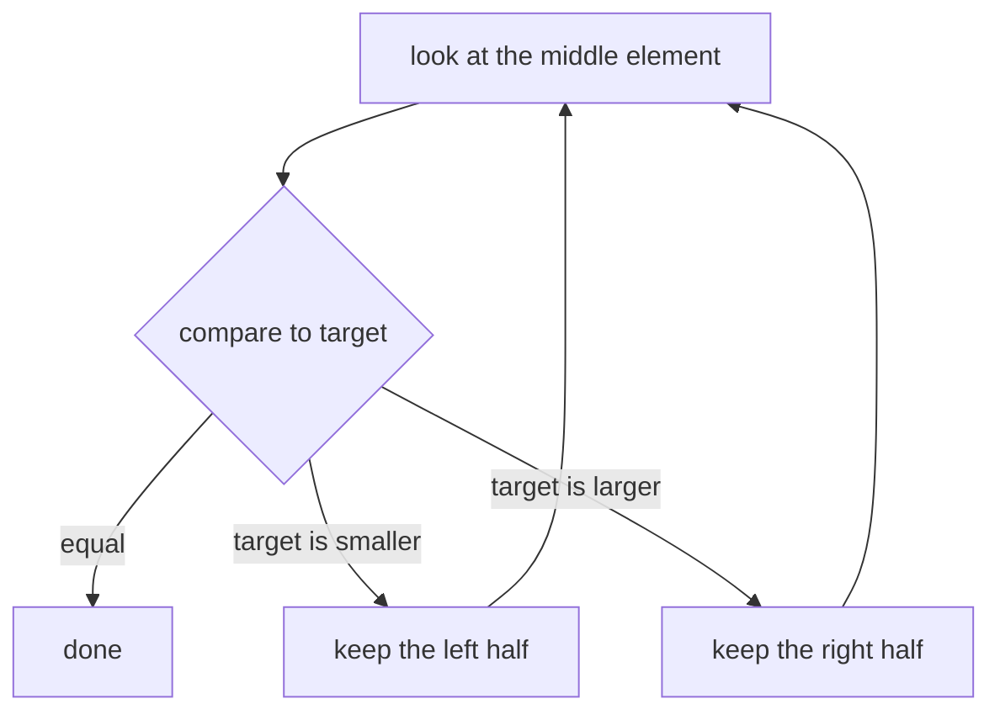

# Binary Search

---
## A needle in a sorted haystack

- **1,000,000** items — already sorted
- find `73,402` — present? where?
- naïve scan → up to **1,000,000** checks

::: narration
Here's the setup. You have a sorted list of a million numbers, and you want to know whether some particular value — say seventy-three thousand four hundred two — is in it, and if so, where. The obvious approach is to walk through from the start, checking each element in turn. In the worst case that's a million comparisons. We can do enormously better, and the trick is to exploit the one thing we were handed for free: the list is already sorted.
:::

---
## Halve the haystack



::: narration
The idea is to always look at the middle element. If the middle value is larger than our target, the target can only be in the left half, so we throw the entire right half away. If it's smaller, we throw the left half away. Then we repeat on whatever remains. The crucial part is that every single comparison lets us discard half of all the remaining candidates at once.
:::

---
## In code

```python
def binary_search(xs, target):
    lo, hi = 0, len(xs) - 1
    while lo <= hi:
        mid = (lo + hi) // 2
        if xs[mid] == target:
            return mid
        if xs[mid] < target:
            lo = mid + 1
        else:
            hi = mid - 1
    return -1
```

::: narration
Here it is in code. We keep two bookmarks, low and high, marking the stretch of the list that's still in play. We look at the midpoint between them. If it holds our target, we're done. If the midpoint value is too small, we move the low bookmark to just past it; if it's too big, we move the high bookmark to just below it. When the two bookmarks cross, the value simply isn't there.
:::

---
## Why it's fast

$$\frac{n}{2^{\,k}} = 1 \quad\Longrightarrow\quad k = \log_2 n$$

$$1{,}000{,}000 \;\longrightarrow\; \approx 20$$

::: narration
So why is this fast? You start with n items and halve the survivors at every step, so after k steps you have n divided by two to the k. You finish when that count reaches one, and solving for k gives k equals log base two of n. For a million items, log base two is about twenty. So a search that could have cost a million comparisons costs about twenty instead. That is the whole difference between linear time and logarithmic time.
:::

---
## Recap

- **sorted** input — the precondition
- every step **halves** the space
- cost: $O(\log n)$, not $O(n)$

> Why does it break the moment the list isn't sorted?

::: narration
To recap: binary search needs sorted input — that's the precondition the whole method rests on. Each comparison halves the remaining search space, which buys you logarithmic cost instead of linear. Before moving on, here's a question worth sitting with: why, exactly, does the method fall apart the moment the list isn't sorted? Think about the assumption we relied on when we decided it was safe to throw away an entire half.
:::
