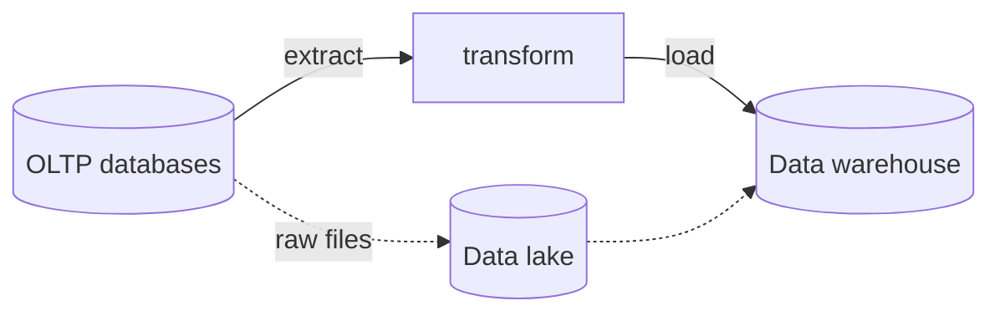
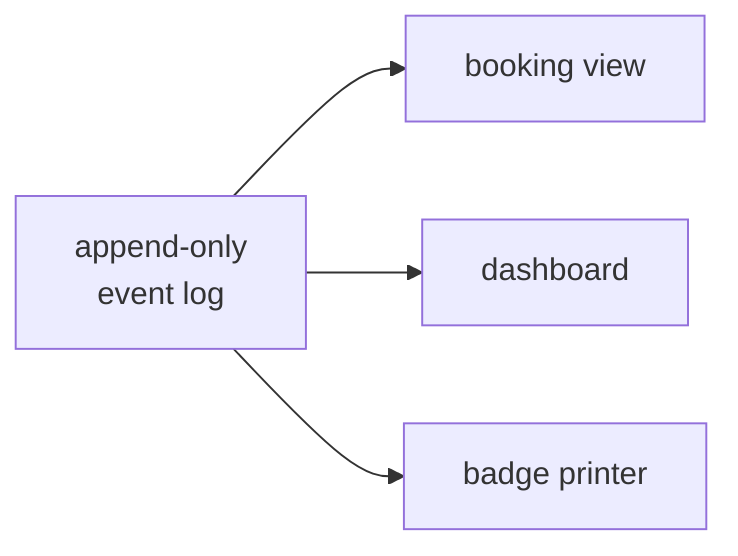
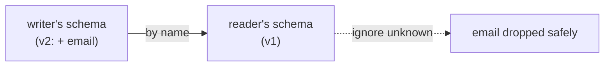
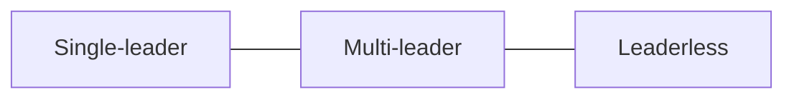
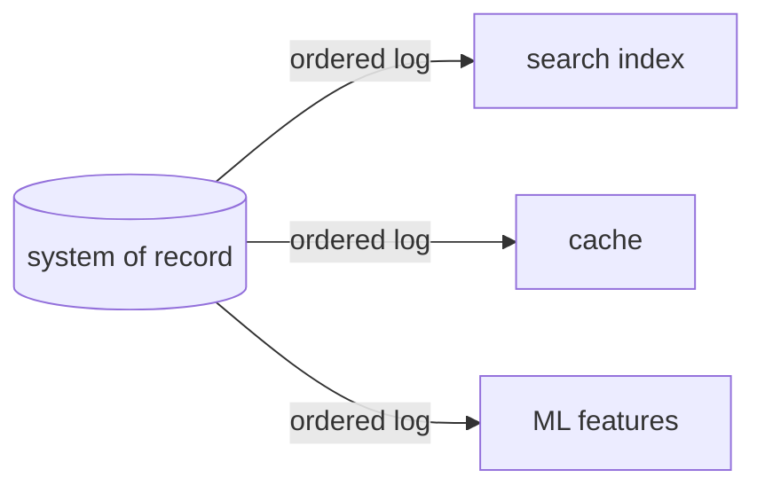

# Designing Data-Intensive Applications

---
## Designing Data-Intensive Applications

- the big ideas, end to end
- Kleppmann & Riccomini, 2nd edition

::: narration
This is a tour of the central ideas in Designing Data-Intensive Applications, the second edition by Martin Kleppmann and Chris Riccomini. The book is about the systems that store and process data — databases, caches, search indexes, batch and stream processors — and the principles that let us build them to be reliable, scalable, and maintainable. We'll move through the whole arc: the foundations of data-system design, the storage engines underneath, how data is modeled and encoded, and then the heart of the book — the distributed-systems material on replication, sharding, transactions, the things that go wrong across a network, and how consistency and consensus are achieved. We'll spend the most time where the book's reputation lives: replication, transactions, and consensus. Throughout, one theme recurs, and it's worth stating up front as the book's thesis.
:::

---
## The thesis: there are only trade-offs

> "There are no solutions; there are only trade-offs." — Thomas Sowell

- no approach is fundamentally best
- every choice has pros *and* cons

::: narration
Kleppmann opens the book with a line from Thomas Sowell: there are no solutions, there are only trade-offs. This is the spine of everything that follows. There is no single best database, no universally correct architecture, no consistency model that is simply superior. Each design buys you something and costs you something else: stronger consistency costs availability and latency; faster writes cost slower reads; richer guarantees cost operational complexity. The book's value is not in handing you answers but in teaching you to see the trade-off behind each choice clearly enough to make it deliberately, for your particular workload. So as we go, resist the urge to look for the winner in each comparison. The skill is naming what each side gives up.
:::

---
## The roadmap

<div class="viz wide">
<svg viewBox="0 0 1020 162">
<defs><marker id="arrRM" viewBox="0 0 10 10" refX="9" refY="5" markerWidth="7" markerHeight="7" orient="auto"><path d="M0,0L10,5L0,10Z" fill="#7A736C"/></marker></defs>
<line class="edge ghost" x1="104" y1="142" x2="908" y2="142"/>
<line class="edge" x1="192" y1="74" x2="215" y2="74" marker-end="url(#arrRM)"/>
<line class="edge" x1="393" y1="74" x2="416" y2="74" marker-end="url(#arrRM)"/>
<line class="edge" x1="594" y1="74" x2="617" y2="74" marker-end="url(#arrRM)"/>
<line class="edge" x1="795" y1="74" x2="818" y2="74" marker-end="url(#arrRM)"/>
<rect class="node accent" x="16" y="28" width="176" height="92" rx="8"/>
<text class="lbl on-fill" x="104" y="66">Foundations</text><text class="cap" x="104" y="92" fill="#DCE6F1">reliability · scale</text>
<rect class="node" x="217" y="28" width="176" height="92" rx="8"/>
<text class="lbl" x="305" y="66">Storage &amp; Models</text><text class="cap" x="305" y="92">engines · encoding</text>
<rect class="node" x="418" y="28" width="176" height="92" rx="8"/>
<text class="lbl" x="506" y="66">Distributed Data</text><text class="cap" x="506" y="92">replication · sharding</text>
<rect class="node" x="619" y="28" width="176" height="92" rx="8"/>
<text class="lbl" x="707" y="66">Consistency</text><text class="cap" x="707" y="92">clocks · consensus</text>
<rect class="node good" x="820" y="28" width="176" height="92" rx="8"/>
<text class="lbl" x="908" y="66">Derived Data</text><text class="cap" x="908" y="92">batch · stream</text>
<circle class="token" r="6"><animateMotion dur="5s" repeatCount="indefinite" calcMode="spline" keyTimes="0;0.2;0.25;0.45;0.5;0.7;0.75;0.95;1" keySplines="0.65 0 0.35 1;0 0 1 1;0.65 0 0.35 1;0 0 1 1;0.65 0 0.35 1;0 0 1 1;0.65 0 0.35 1;0 0 1 1" keyPoints="0;0.25;0.25;0.5;0.5;0.75;0.75;1;1" path="M104,142 L305,142 L506,142 L707,142 L908,142"/></circle>
</svg>
</div>

::: narration
Here's the path. We start with foundations: what reliability, scalability, and maintainability actually mean, defined precisely rather than as slogans. Then the single-node substrate — how storage engines lay bytes on disk, how data is modeled relationally, as documents, or as graphs, and how it's encoded for storage and transmission. The middle and largest part is distributed data: replication, sharding, and transactions. From there we confront what makes distribution genuinely hard — unreliable networks, clocks, and process pauses — and the precise notions of consistency and consensus that tame them. Finally, derived data: batch and stream processing, and a closing turn to the ethics of building systems that increasingly run on data about people. Let's begin with the foundations.
:::

---
## Operational vs analytical systems

| | OLTP (operational) | OLAP (analytical) |
|---|---|---|
| read | point query, by key | scan + aggregate |
| write | create/update/delete | bulk import / events |
| user | end user of an app | internal analyst |
| represents | latest state | history of events |
| size | GB–TB | TB–PB |

::: narration
The first distinction the book draws is between two access patterns. Operational systems — online transaction processing, OLTP — serve the live application: they look up a small number of records by key and create, update, or delete records as users act. The query volume is high, each query is small, and the data represents the current state of the world. Analytical systems — online analytical processing, OLAP — serve analysts: a single query scans over a huge number of records and computes an aggregate, like total revenue per store last month. Few queries, each enormous, over a history of events. These patterns are so different that we build separate systems for them — and we keep the analytical copy out of the operational database so heavy scans don't disturb live traffic. That separation introduces the next idea.
:::

---
## Warehouses, ETL, and the data lake



- **ETL** vs **ELT** · the lake holds raw files
- "sushi principle: raw data is better"

::: narration
To analyze data without hammering the operational databases, companies copy it into a data warehouse: a separate database holding a read-only copy of data from across the organization, optimized for big scans. The copying process is extract-transform-load — ETL — pulling data out of the source systems, reshaping it into an analysis-friendly schema, and loading it in. Swap the order and you get ELT, transforming after loading, inside the warehouse. A data lake is the looser cousin: it just holds raw files, with no imposed schema, often on cheap object storage — captured under what Kleppmann calls the sushi principle, that raw data is better, because each consumer can transform it to suit its own needs. The warehouse imposes structure up front; the lake defers it. Same trade-off shape as everything else.
:::

---
## Cloud-native: separating storage and compute

<div class="viz">
<svg viewBox="0 0 460 180">
<text class="tag" x="90" y="14">TRADITIONAL</text>
<rect class="node" x="34" y="30" width="112" height="64" rx="6"/>
<text class="lbl" x="90" y="54">disk + CPU</text><text class="cap" x="90" y="76">one machine</text>
<text class="tag" x="350" y="14">CLOUD-NATIVE</text>
<rect class="node good" x="292" y="30" width="116" height="42" rx="6"/><text class="lbl" x="350" y="51">object storage</text>
<rect class="node" x="292" y="112" width="116" height="42" rx="6"/><text class="lbl" x="350" y="133">compute</text>
<line class="edge ghost" x1="350" y1="72" x2="350" y2="112"/>
<circle class="token" r="5"><animateMotion dur="2.6s" repeatCount="indefinite" calcMode="spline" keyTimes="0;0.5;1" keySplines="0.65 0 0.35 1;0.65 0 0.35 1" keyPoints="0;1;0" path="M350,110 L350,74"/></circle>
<text class="cap" x="350" y="172">data crosses the network</text>
</svg>
</div>

- object storage · disaggregation · multitenancy

::: narration
Cloud-native architecture rearranges the physical assumptions. Traditionally one machine held both the disk and the CPU that processed it. Cloud-native systems separate storage and compute into independent services: durable data lives in object storage, like Amazon S3, while computation runs on separate, elastic machines that pull data over the network as needed. This disaggregation is why a warehouse like Snowflake can scale storage and compute independently and spin compute up and down on demand. It also means treating a machine's local disk as an ephemeral cache, not durable storage. The cost is that every read may now be a network call. The benefit is elasticity and the ability to share infrastructure across many tenants. Whether to use the cloud at all is the familiar build-or-buy trade-off: outsource the routine, keep your competitive advantage in-house.
:::

---
## Reliability: fault is not failure

<div class="viz">
<svg viewBox="0 0 380 160">
<line class="edge" x1="60" y1="75" x2="190" y2="40"/>
<line class="edge ghost" x1="60" y1="75" x2="190" y2="110"/>
<line class="edge" x1="190" y1="40" x2="320" y2="75"/>
<line class="edge ghost" x1="190" y1="110" x2="320" y2="75"/>
<circle class="node" cx="60" cy="75" r="17"/>
<circle class="node good" cx="190" cy="40" r="17"/>
<circle class="node danger m-dim" style="--d:1.6s" cx="190" cy="110" r="17"/>
<line class="edge danger m-in" style="--i:13" x1="180" y1="100" x2="200" y2="120"/>
<line class="edge danger m-in" style="--i:13" x1="200" y1="100" x2="180" y2="120"/>
<circle class="node" cx="320" cy="75" r="17"/>
<text class="cap m-in" style="--i:15" x="190" y="150">redundancy absorbs the fault — no failure</text>
</svg>
</div>

- **fault** = one part breaks · **failure** = whole system stops
- tolerate faults so they never become failures

::: narration
Reliability is defined as continuing to work correctly even when things go wrong, and the book draws a sharp line between two words that sound alike. A fault is when one part of the system deviates from spec — a disk dies, a node crashes, a dependency times out. A failure is when the system as a whole stops providing the service the user needs. The entire discipline of fault tolerance is keeping faults from escalating into failures. In the animation one node dies, but because the data was redundant, the system routes around it and keeps serving — a fault, but not a failure. A part that can't be tolerated this way is a single point of failure. And counterintuitively, the way you build confidence that fault tolerance works is to deliberately cause faults — chaos engineering — because the error-handling code is the part least exercised and most likely to be wrong.
:::

---
## Describing performance: tail latency

<div class="viz wide">
<svg viewBox="0 0 900 178">
<line class="axis" x1="40" y1="146" x2="862" y2="146"/>
<path d="M40,146 C130,146 165,48 236,48 C322,48 352,112 462,128 C622,142 722,143 862,145 L862,146 L40,146 Z" fill="#B5C5DC" fill-opacity="0.45" stroke="#1A3F70" stroke-width="2"/>
<line class="edge strong" x1="252" y1="62" x2="252" y2="146" stroke-dasharray="5 4"/><text class="tag" x="252" y="166">p50</text>
<line class="edge danger" x1="694" y1="92" x2="694" y2="146" stroke-dasharray="5 4"/><text class="tag" x="694" y="166" fill="#9D3A24">p99</text>
<line class="edge danger" x1="800" y1="110" x2="800" y2="146" stroke-dasharray="5 4"/><text class="tag" x="800" y="166" fill="#9D3A24">p999</text>
<text class="cap" x="150" y="40">most requests fast</text>
<text class="cap" x="700" y="74" fill="#9D3A24">the long tail →</text>
</svg>
</div>

- median (p50) = typical · **tail** (p99, p999) = worst-felt
- averaging percentiles is meaningless
- Amazon optimizes the **99.9th** — slowest = biggest customers

::: narration
To talk about performance precisely you need percentiles, not averages. Sort your response times from fastest to slowest. The median, the fiftieth percentile, is the typical experience — half of requests are faster, half slower. The tail — the ninety-fifth, ninety-ninth, and 99.9th percentiles — captures the worst experiences, and those matter disproportionately. Amazon famously specifies internal response times at the 99.9th percentile, affecting one request in a thousand, because the slowest requests often belong to the customers with the most data — the most valuable ones. Two warnings from the book. First, the mean hides how many users suffered, so don't lead with it. Second, you cannot average percentiles together — to combine them you must add the underlying histograms. Tail latency also amplifies: when one user request fans out to many backend calls, it waits for the slowest of them, so a single slow dependency drags a large fraction of requests into the tail.
:::

---
## Scalability: shared-nothing

<div class="viz">
<svg viewBox="0 0 420 130">
<rect class="node" x="30" y="40" width="54" height="48" rx="6"/>
<rect class="node" x="112" y="40" width="54" height="48" rx="6"/>
<rect class="node" x="194" y="40" width="54" height="48" rx="6"/>
<rect class="node m-in" style="--i:3" x="276" y="40" width="54" height="48" rx="6"/>
<rect class="node m-in" style="--i:4" x="358" y="40" width="54" height="48" rx="6"/>
<text class="cap" x="210" y="116">each node: own CPU + RAM + disk — add more to scale out</text>
</svg>
</div>

- vertical (scale up) vs **horizontal (scale out)**
- "there is no magic scaling sauce"

::: narration
Scalability is the ability to cope with increased load, and the book insists it's never a one-dimensional label — you must say scalable with respect to what load parameter. You can scale up, vertically, by buying a bigger machine — simple, but cost grows faster than linearly and there's a ceiling. Or you scale out, horizontally, across many machines in a shared-nothing architecture: each node has its own CPU, memory, and disk, and coordination happens in software over the network. Shared-nothing is the foundation of the entire distributed-data part of the book — it's what lets you add commodity machines to grow capacity. But it forces you to shard your data and take on all the complexity of distributed systems. Kleppmann's blunt warning: there is no magic scaling sauce, no generic architecture that scales every application. The right design is workload-specific, and you should expect to rethink it at every order of magnitude.
:::

---
## The timeline fan-out

<div class="viz">
<svg viewBox="0 0 460 180">
<circle class="node accent" cx="60" cy="90" r="16"/><text class="cap" x="60" y="120">post</text>
<rect class="node" x="320" y="20" width="104" height="24" rx="5"/><text class="lbl" x="372" y="32">follower 1</text>
<rect class="node" x="320" y="55" width="104" height="24" rx="5"/><text class="lbl" x="372" y="67">follower 2</text>
<rect class="node" x="320" y="90" width="104" height="24" rx="5"/><text class="lbl" x="372" y="102">follower 3</text>
<rect class="node muted" x="320" y="125" width="104" height="24" rx="5"/><text class="lbl" x="372" y="137">… ×200</text>
<circle class="token" r="5"><animateMotion dur="1.7s" repeatCount="indefinite" calcMode="spline" keyTimes="0;1" keySplines="0.5 0 0.4 1" path="M76,86 L318,32"/></circle>
<circle class="token" r="5"><animateMotion dur="1.7s" begin="0.2s" repeatCount="indefinite" calcMode="spline" keyTimes="0;1" keySplines="0.5 0 0.4 1" path="M78,90 L318,67"/></circle>
<circle class="token" r="5"><animateMotion dur="1.7s" begin="0.4s" repeatCount="indefinite" calcMode="spline" keyTimes="0;1" keySplines="0.5 0 0.4 1" path="M78,94 L318,102"/></circle>
<circle class="token" r="5"><animateMotion dur="1.7s" begin="0.6s" repeatCount="indefinite" calcMode="spline" keyTimes="0;1" keySplines="0.5 0 0.4 1" path="M76,98 L318,137"/></circle>
</svg>
</div>

- write-time fan-out: 5,800 posts/s × 200 ≈ **1M timeline writes/s**
- vs read-time: ~400M lookups/s · celebrities → hybrid

::: narration
The book's signature scalability case study is delivering a social-network home timeline, and it crystallizes the core trade-off. The read-time approach is lazy: when a user loads their timeline, you look up everyone they follow and merge those people's recent posts on the fly. Simple to write, but at ten million active users each following two hundred accounts, that's on the order of four hundred million lookups per second. The write-time approach is eager: when someone posts, you immediately fan the post out into a cached timeline — a mailbox — for each of their followers, shown here. Now reads are cheap, just read your mailbox; the work moved to write time, around a million timeline writes per second, far less. The catch is the celebrity with a hundred million followers, where fan-out explodes — so real systems go hybrid, fanning out ordinary users but merging celebrity posts at read time. Eager versus lazy, work-at-write versus work-at-read: this exact trade-off returns again and again.
:::

---
## Maintainability

- **Operability** — easy to keep running
- **Simplicity** — easy for new engineers to understand
- **Evolvability** — easy to change for tomorrow's needs

::: narration
The third nonfunctional requirement, after reliability and scalability, is maintainability — and Kleppmann breaks it into three principles, because most of the cost of software is not in building it but in living with it. Operability is making life easy for the operations team: good monitoring, predictable behavior, support for the routine work of keeping the system healthy. Simplicity is managing complexity so a new engineer can understand the system — fighting what the book calls the big ball of mud, using good abstractions to hide accidental complexity, the complexity that comes from our tools rather than from the problem itself. Evolvability is making it easy to change the system as requirements shift, which they always do. The recurring enemy is irreversibility — a migration you can't undo — and the recurring ally is abstraction. Every system that survives long enough becomes a legacy system, so build for the people who'll maintain it.
:::

---
## Relational vs document: the same résumé, two shapes

<div class="viz">
<svg viewBox="0 0 470 184">
<text class="cap" x="100" y="14">RELATIONAL — joins across tables</text>
<line class="edge" x1="102" y1="48" x2="62" y2="70"/>
<line class="edge" x1="102" y1="48" x2="142" y2="70"/>
<line class="edge" x1="62" y1="94" x2="85" y2="114"/>
<rect class="node accent" x="70" y="24" width="64" height="24" rx="5"/><text class="lbl on-fill" x="102" y="36">users</text>
<rect class="node" x="30" y="70" width="64" height="24" rx="5"/><text class="lbl" x="62" y="82">positions</text>
<rect class="node" x="110" y="70" width="64" height="24" rx="5"/><text class="lbl" x="142" y="82">education</text>
<rect class="node muted" x="38" y="114" width="96" height="24" rx="5"/><text class="lbl" x="86" y="126">contact_info</text>
<text class="cap" x="372" y="14">DOCUMENT — one JSON tree</text>
<rect class="node good" x="300" y="24" width="144" height="120" rx="6"/>
<text class="lbl mono" style="text-anchor:start" x="314" y="48">{ name,</text>
<text class="lbl mono" style="text-anchor:start" x="326" y="71">positions:[…],</text>
<text class="lbl mono" style="text-anchor:start" x="326" y="94">education:[…],</text>
<text class="lbl mono" style="text-anchor:start" x="326" y="117">contact:{…} }</text>
<text class="cap" x="372" y="168">locality: one read</text>
</svg>
</div>

- impedance mismatch · one-to-many = a tree · locality

::: narration
The relational and document models shape the same data differently. Take a résumé. The relational model shreds it across tables — a users table, a positions table, an education table, a contact-info table — linked by foreign keys, and reassembling the profile requires joining them. The document model stores the whole thing as one JSON tree, with positions and education nested inside. The document fits a one-to-many structure naturally — a person has many positions — and it has locality: the whole profile is one contiguous read, no joins. This also reduces the object-relational impedance mismatch, the awkward translation between application objects and relational tables. But the document model stumbles on many-to-many relationships and references, where the relational model's joins shine. Kleppmann's verdict isn't a winner — it's that relational-document hybrids are powerful, and most databases now support both.
:::

---
## Normalize or denormalize?

- **normalized**: store a fact once, reference by ID — fast writes
- **denormalized**: duplicate the fact — fast reads, costly writes
- resolving an ID = a **join** · hydrating IDs scales fine

::: narration
Closely related is the choice to normalize or denormalize. Normalized data stores each human-meaningful fact exactly once — a region is "Washington, DC" in one place, and everything else references it by an ID that's meaningless outside the database. The advantage is that there's one copy to update, so writes are cheap and consistent. Denormalized data duplicates the fact into every record that uses it: reads get faster because there's no join, but writes get more expensive and risk inconsistency, since every copy must be updated. Resolving an ID back into the human-readable value is exactly what a join does. Kleppmann stresses these aren't good or bad — they're a read-versus-write trade-off — and dismantles the myth that joins don't scale. The social-network timeline stores only post and sender IDs, then hydrates them in application code: a join on read, and it parallelizes perfectly.
:::

---
## Schema-on-read vs schema-on-write

```sql
-- schema-on-write (relational): enforced now
ALTER TABLE users ADD COLUMN first_name text;
UPDATE users SET first_name = split_part(name,' ',1);

-- schema-on-read (document): handle old shape in code
user.first_name ?? user.name.split(' ')[0]
```

- enforced-on-write ≈ static typing · assumed-on-read ≈ dynamic typing

::: narration
When the shape of your data changes — say you split a full name into first and last — the two models cope differently. The relational, schema-on-write approach enforces one schema at a time: you run an ALTER TABLE to add the column, then a migration to backfill it, which on a huge table means rewriting every row. The document, schema-on-read approach doesn't enforce a schema at all, so old and new shapes coexist; you just write the new field going forward and handle the old shape in application code at read time. Kleppmann frames this as the same debate as static versus dynamic typing — enforce-now versus interpret-later — with no universal winner. Schema-on-read wins when the data is heterogeneous or its structure is controlled by external systems you can't migrate; schema-on-write wins when you want the database to guarantee structure. And note "schemaless" is a misnomer: there's always a schema, just an implicit one the reader assumes.
:::

---
## When everything connects: graph models

<div class="viz narrow">
<svg viewBox="0 0 320 220">
<line class="edge good m-pulse" x1="64" y1="182" x2="64" y2="128"/>
<line class="edge good m-pulse" x1="64" y1="128" x2="160" y2="78"/>
<line class="edge good m-pulse" x1="160" y1="78" x2="160" y2="30"/>
<line class="edge" x1="160" y1="78" x2="256" y2="120"/>
<circle class="node" cx="64" cy="182" r="23"/><text class="lbl" x="64" y="182">Lucy</text>
<circle class="node" cx="64" cy="128" r="23"/><text class="lbl" x="64" y="128">Idaho</text>
<circle class="node accent" cx="160" cy="78" r="23"/><text class="lbl on-fill" x="160" y="78">USA</text>
<circle class="node" cx="160" cy="30" r="23"/><text class="lbl" x="160" y="30">N.Am</text>
<circle class="node" cx="256" cy="120" r="23"/><text class="lbl" x="256" y="120">Europe</text>
<text class="cap" x="30" y="158">born_in</text><text class="cap" x="100" y="96">within</text>
</svg>
</div>

- vertices + edges · variable-length traversal `WITHIN*0..`
- 4-line Cypher = 31-line recursive SQL

::: narration
When many-to-many relationships dominate and anything can connect to anything, the graph model fits best. Data is vertices and edges — in a property graph, each vertex has a label and properties, each edge has a type and connects a tail to a head. The book's running example asks: who emigrated from the United States to Europe, given people, cities, regions, and countries as vertices linked by born-in, lives-in, and within edges. The hard part is the variable-length traversal — following within edges zero or more times up a location hierarchy of unknown depth, shown climbing from Lucy through Idaho to the United States. In Cypher, the property-graph query language, this is four lines. The equivalent in SQL needs a recursive common table expression and runs thirty-one lines. Kleppmann's point lands hard: the right data model and query language can make an enormous difference. Declarative languages like Cypher, SPARQL, and Datalog say what you want; the optimizer decides how.
:::

---
## Beyond read-as-written: event sourcing



- immutable events = source of truth · CQRS
- delete & recompute a view to fix a bug

::: narration
Sometimes no single representation serves every read, so you write data in one form and derive the read-optimized forms from it. Event sourcing makes an append-only log of immutable events the source of truth: every state change is recorded as an event — "registration opened," "seat booked," "booking canceled" — named in the past tense, never modified or deleted. From that one log you derive multiple materialized views, also called read models or projections: a current booking-status view, a dashboard, a file for the badge printer. This separation of the write model from the read models is called command-query responsibility segregation, CQRS. The payoffs are large: views are reproducibly derived, so you can fix a bug by deleting a view and recomputing it from the log; you get an audit trail for free; and you can add new views anytime. The cost is that external effects must be made deterministic, and GDPR deletion fights immutability — handled by crypto-shredding, encrypting with a key you can throw away.
:::

---
## Storage: two jobs, an index trade-off

```python
db_set(key, value)   # append "key,value" to a log  → O(1) write
db_get(key)          # scan the log for key          → O(n) read
```

- an **index** = a structure derived from the data
- speeds reads · costs disk + slows writes

::: narration
Now beneath the data model: how does a storage engine actually put bytes on disk and find them again? Kleppmann starts with the world's simplest database — two functions over an append-only file. To set a key, append the key and value to a log; appending is the fastest possible write. To get a key, scan the whole file and take the last occurrence. Writes are constant time, but reads are linear — fine for a handful of records, hopeless at scale. The fix is an index: an additional structure derived from the primary data that speeds up reads. And here is the central trade-off of all storage engines: a well-chosen index speeds reads, but every index costs disk space and slows down writes, because the index must be updated on every write. That's why databases don't index everything by default — you, knowing your query patterns, choose. Two great families of indexes follow.
:::

---
## LSM-trees: memtable → SSTable

<div class="viz">
<svg viewBox="0 0 460 170">
<text class="tag" x="88" y="14">IN MEMORY</text>
<rect class="node good" x="36" y="26" width="104" height="60" rx="6"/><text class="lbl" x="88" y="50">memtable</text><text class="cap" x="88" y="72">(sorted tree)</text>
<text class="tag" x="340" y="14">ON DISK — IMMUTABLE</text>
<rect class="node" x="248" y="26" width="68" height="40" rx="5"/><text class="lbl" x="282" y="46">SSTable</text>
<rect class="node m-in" style="--i:4" x="324" y="26" width="68" height="40" rx="5"/><text class="lbl m-in" style="--i:4" x="358" y="46">SSTable</text>
<rect class="node muted" x="248" y="96" width="68" height="40" rx="5"/><text class="lbl" x="282" y="116">older</text>
<rect class="node muted" x="324" y="96" width="68" height="40" rx="5"/><text class="lbl" x="358" y="116">oldest</text>
<text class="cap" x="194" y="50">flush ▸</text>
<circle class="token" r="5"><animateMotion dur="3.4s" repeatCount="indefinite" calcMode="spline" keyTimes="0;0.5;1" keySplines="0.65 0 0.35 1;0.65 0 0.35 1" keyPoints="0;1;1" path="M140,54 L324,46"/></circle>
</svg>
</div>

- writes hit a sorted in-memory **memtable**, flush to immutable **SSTables**
- a durability log on disk survives crashes

::: narration
The first family is log-structured, built around the LSM-tree. Writes go first into an in-memory ordered structure — a balanced tree or skip list — called the memtable, kept sorted by key. When the memtable grows past a threshold, it's flushed to disk in sorted order as an immutable file called an SSTable, a sorted string table, and a fresh memtable takes over. So on disk you accumulate a series of immutable, sorted segments, newest to oldest. Because the memtable lives in volatile memory, every write is also appended to a separate durability log on disk, used only to rebuild the memtable after a crash and discarded once the flush completes. To read a key, you check the memtable, then the most recent SSTable, then older ones. The append-only, sequential nature of these writes is what makes LSM-trees so fast at ingesting data — disks love sequential writes. But those accumulating segments need housekeeping.
:::

---
## Compaction and Bloom filters

<div class="viz">
<svg viewBox="0 0 460 150">
<defs><marker id="arrCMP" viewBox="0 0 10 10" refX="9" refY="5" markerWidth="7" markerHeight="7" orient="auto"><path d="M0,0L10,5L0,10Z" fill="#7A736C"/></marker></defs>
<text class="cap" x="165" y="14">merge · keep latest · drop tombstones</text>
<rect class="node" x="30" y="26" width="92" height="30" rx="4"/><text class="lbl mono" x="76" y="41">1·3·9</text>
<rect class="node" x="30" y="68" width="92" height="30" rx="4"/><text class="lbl mono" x="76" y="83">2·9·12</text>
<line class="edge" x1="130" y1="62" x2="196" y2="62" marker-end="url(#arrCMP)"/>
<rect class="node good m-in" style="--i:5" x="205" y="46" width="122" height="32" rx="4"/><text class="lbl mono m-in" style="--i:5" x="266" y="62">1·2·3·9·12</text>
<text class="cap" x="392" y="40">Bloom filter:</text>
<text class="cap" x="392" y="60">a 0 bit ⇒ absent</text>
<text class="cap" x="392" y="80">skip the SSTable</text>
</svg>
</div>

- **compaction** = mergesort segments, discard overwritten + deleted
- size-tiered vs leveled · Bloom filters short-circuit absent keys

::: narration
The housekeeping is compaction: a background process that merges SSTables together, like a mergesort, reading several sorted segments in parallel, emitting the keys in order, keeping only the most recent value when a key appears in several, and dropping keys marked deleted by a special record called a tombstone. The result is a new, smaller, merged segment, and the inputs are discarded. There are two strategies: size-tiered, which cascades smaller segments into larger ones and suits write-heavy workloads, and leveled, which partitions segments into size-bounded levels and is more read-efficient and space-efficient. One more trick makes reads fast: a Bloom filter per segment, a compact probabilistic structure that answers "is this key possibly here?" If any of the hashed bits is zero, the key is definitely absent and you skip that segment entirely — which is what makes lookups of nonexistent keys cheap. A Bloom filter never gives a false negative, only occasional false positives.
:::

---
## The LSM read path

<div class="viz wide">
<svg viewBox="0 0 560 140">
<defs><marker id="arrLR" viewBox="0 0 10 10" refX="9" refY="5" markerWidth="7" markerHeight="7" orient="auto"><path d="M0,0L10,5L0,10Z" fill="#7A736C"/></marker></defs>
<circle class="node accent" cx="42" cy="68" r="20"/><text class="lbl on-fill sm" x="42" y="68">get x</text>
<line class="edge" x1="64" y1="68" x2="86" y2="68" marker-end="url(#arrLR)"/>
<rect class="node good" x="88" y="48" width="92" height="40" rx="6"/><text class="lbl sm" x="134" y="68">memtable</text>
<line class="edge" x1="182" y1="68" x2="204" y2="68" marker-end="url(#arrLR)"/>
<rect class="node" x="206" y="48" width="92" height="40" rx="6"/><text class="lbl sm" x="252" y="68">SSTable</text><text class="cap" x="252" y="36">newest · check</text>
<line class="edge ghost" x1="300" y1="68" x2="322" y2="68" marker-end="url(#arrLR)"/>
<rect class="node muted m-dim" style="--d:1.2s" x="324" y="48" width="92" height="40" rx="6"/><text class="lbl sm" x="370" y="68">SSTable</text><text class="cap" x="370" y="36">bloom 0 → skip</text>
<line class="edge" x1="418" y1="68" x2="440" y2="68" marker-end="url(#arrLR)"/>
<rect class="node warn" x="442" y="48" width="92" height="40" rx="6"/><text class="lbl sm" x="488" y="68">found</text>
</svg>
</div>

- check **memtable → SSTables newest-first** (newer value wins)
- a per-segment **Bloom filter** says "definitely absent" → skip the disk read

::: narration
We saw how an LSM-tree writes — into the memtable, flushed to immutable SSTables. Reading is the other half, and it shows why the structure stays fast even with data scattered across many segments. To read a key you check the memtable first, since it holds the most recent writes; if it is not there you check the SSTables from newest to oldest, because a newer segment's value supersedes an older one. The danger is a key that does not exist, which would force you to check every segment — the slowest possible path. The Bloom filter is what prevents that. Each SSTable carries a small Bloom filter, a probabilistic set-membership structure that can say with certainty "this key is definitely not here," letting you skip that segment's disk read entirely. It never gives a false negative, only occasional false positives, so a "maybe" still costs a lookup but a "no" is free. The read path is therefore: memtable, then newest SSTable, then older ones, skipping every segment whose Bloom filter rules the key out — which is exactly what keeps reads of absent or rarely-touched keys cheap despite the log-structured layout.
:::

---
## B-trees: pages, splits, the WAL

<div class="viz">
<svg viewBox="0 0 420 160">
<line class="edge" x1="200" y1="44" x2="112" y2="70"/>
<line class="edge" x1="220" y1="44" x2="308" y2="70"/>
<line class="edge" x1="95" y1="96" x2="72" y2="118"/>
<line class="edge" x1="130" y1="96" x2="150" y2="118"/>
<rect class="node accent" x="170" y="18" width="80" height="26" rx="5"/><text class="lbl on-fill" x="210" y="31">root</text>
<rect class="node" x="70" y="70" width="84" height="26" rx="5"/><text class="lbl" x="112" y="83">100–200</text>
<rect class="node" x="266" y="70" width="84" height="26" rx="5"/><text class="lbl" x="308" y="83">200–300</text>
<rect class="node muted" x="38" y="118" width="68" height="26" rx="5"/><text class="lbl" x="72" y="131">leaf</text>
<rect class="node danger m-in" style="--i:5" x="116" y="118" width="68" height="26" rx="5"/><text class="lbl m-in" style="--i:5" x="150" y="131">split!</text>
<text class="cap" x="320" y="135">balanced: O(log n), 3–4 levels</text>
</svg>
</div>

- fixed-size **pages**, overwritten **in place**
- full page → **split**; a write-ahead log makes it crash-safe

::: narration
The second family is the B-tree, the structure behind almost every relational database, introduced in 1970 and still dominant. Where LSM-trees append immutable segments, B-trees break the database into fixed-size pages — four, eight, or sixteen kilobytes — and overwrite them in place. The pages form a balanced tree: a root page whose keys point to child pages, each responsible for a key range, down to leaf pages holding the values. With a branching factor of several hundred, a tree only three or four levels deep can index hundreds of terabytes. To update a key you overwrite its leaf page; to insert into a full page you split it into two half-full pages and update the parent — a split that can cascade to the root. Because a split touches multiple pages and a crash mid-split could corrupt the tree, every modification is first written to a write-ahead log, so the tree can be restored to consistency on restart. Overwrite-in-place versus append-only: the defining contrast.
:::

---
## LSM-trees vs B-trees

| | B-tree | LSM-tree |
|---|---|---|
| writes | in-place, random | append-only, sequential |
| write throughput | lower | **higher** |
| reads | fast, predictable | check several SSTables |
| write amplification | WAL + page | compaction rewrites |
| space | can fragment | compresses better |

::: narration
The rule of thumb: LSM-trees are better for write-heavy workloads, B-trees faster and more predictable for reads — but benchmarks are workload-sensitive, so test your own. B-trees scatter writes randomly across pages and write each change at least twice — to the write-ahead log and to the page — and a full page may be rewritten for a few changed bytes. LSM-trees turn writes into large sequential segment writes, which disks handle far faster, giving higher write throughput. Both suffer write amplification — bytes written to disk exceeding the logical data — but from different causes: the B-tree from its log-plus-page double write, the LSM-tree from rewriting data repeatedly during compaction. On reads, the B-tree wins predictability — one page per level — while the LSM-tree may consult several segments, mitigated by Bloom filters. And LSM segments compress better and fragment less, though a tombstoned deletion lingers until it propagates through compaction. As always: no winner, a trade-off.
:::

---
## Decision: storage engine by workload

| if your workload is… | reach for | because |
|---|---|---|
| **write-heavy** — ingest, logs, time-series | **LSM-tree** | sequential segment appends, high write throughput |
| **read-latency-sensitive** — OLTP | **B-tree** | one page per level, predictable, no segment fan-out |
| range scans / sorted access | either | both keep keys in order |
| storage cost matters | LSM-tree | compresses better, fragments less |

- starting bias: **LSM for ingest, B-tree for latency** — then benchmark *your* workload

::: narration
We compared LSM-trees and B-trees mechanism by mechanism; here is the decision boiled down. If your workload is write-heavy — high-volume ingestion, logs, time-series — reach for an LSM-tree, because it turns writes into fast sequential segment appends and sustains far higher write throughput. If you need predictable, low-latency reads, each lookup touching exactly one page per level with no chance of consulting several segments, a B-tree is the safer choice, which is why it remains the default in transactional relational databases. Both preserve key order, so both handle range scans well. And where storage cost matters, LSM-trees usually win, compressing better and fragmenting less. But the honest answer the book insists on is to benchmark your own workload, because the crossover depends on your read-write ratio, value sizes, and access skew in ways no rule of thumb captures. As a starting bias: LSM for write-amplification-sensitive ingest, B-tree for latency-sensitive transactional reads — and then measure.
:::

---
## Indexes beyond the primary key

- **secondary index** — search by non-key column (values not unique)
- **clustered** (row in the index) vs **heap file** (a reference) vs **covering**
- in-memory DBs win by *avoiding disk-encoding overhead*

::: narration
The primary-key index maps a key to its record, but applications need to search by other columns too — a secondary index, created with CREATE INDEX. The wrinkle is that secondary-index values aren't unique — many rows can be red — so each index entry points to a list of matching rows, a postings list, or appends a row identifier to make the entry unique. Where the actual row lives is another choice. A clustered index stores the whole row inside the index, like MySQL's InnoDB primary key. A heap file stores rows separately and the index holds a reference, like PostgreSQL. A covering index stores just enough extra columns to answer common queries from the index alone. And when data fits in RAM, in-memory databases like Redis get their speed not, as you might think, from avoiding disk reads — the OS caches those anyway — but from avoiding the overhead of encoding in-memory structures into a disk-writable form.
:::

---
## Analytics: column-oriented storage

<div class="viz">
<svg viewBox="0 0 460 160">
<text class="tag" x="100" y="14">ROW-ORIENTED</text>
<rect class="cell on" x="40" y="26" width="120" height="16"/>
<rect class="cell on" x="40" y="42" width="120" height="16"/>
<rect class="cell on" x="40" y="58" width="120" height="16"/>
<rect class="cell on" x="40" y="74" width="120" height="16"/>
<text class="cap" x="100" y="108">reads all 100+ columns</text>
<text class="tag" x="356" y="14">COLUMN-ORIENTED</text>
<rect class="cell off" x="280" y="26" width="20" height="64"/>
<rect class="cell sel" x="306" y="26" width="20" height="64"/>
<rect class="cell off" x="332" y="26" width="20" height="64"/>
<rect class="cell sel" x="358" y="26" width="20" height="64"/>
<rect class="cell off" x="384" y="26" width="20" height="64"/>
<rect class="cell off" x="410" y="26" width="20" height="64"/>
<text class="cap" x="356" y="108">touch only the 4–5 query columns</text>
</svg>
</div>

- compress columns (bitmap · run-length) · sort order
- query execution: compilation vs **vectorization**

::: narration
Analytical workloads have a different shape: a fact table may be a hundred columns wide, but a typical query touches only four or five — yet a row-oriented store, laying each row's values contiguously, must load every column of every row and discard the rest. Column-oriented storage instead lays all the values of each column together, so a query reads only the columns it uses. It relies on every column storing rows in the same order, so the twenty-third entry of each column reassembles row twenty-three. Columns full of repetition compress beautifully — bitmap encoding plus run-length encoding can crush a billion-row column to a few kilobytes — and you can impose a sort order to crush it further and to scan ranges efficiently. Then queries run fast through one of two techniques: compiling the query to machine code, or vectorized processing, which pushes batches of column values through tight loops using the CPU's SIMD instructions, operating directly on the compressed bitmaps with bitwise AND and OR.
:::

---
## Multidimensional, full-text & vector search

<div class="viz narrow">
<svg viewBox="0 0 300 210">
<text class="cap" x="150" y="14">HNSW: hop down layers toward the query vector</text>
<line class="edge" x1="60" y1="48" x2="200" y2="48"/>
<line class="edge" x1="60" y1="48" x2="60" y2="98"/>
<line class="edge" x1="50" y1="108" x2="130" y2="118"/>
<line class="edge" x1="130" y1="118" x2="210" y2="103"/>
<line class="edge" x1="130" y1="118" x2="120" y2="168"/>
<line class="edge good m-pulse" x1="60" y1="48" x2="60" y2="98"/>
<line class="edge good m-pulse" x1="60" y1="98" x2="130" y2="118"/>
<line class="edge good m-pulse" x1="130" y1="118" x2="120" y2="168"/>
<circle class="node" cx="60" cy="48" r="8"/><circle class="node" cx="200" cy="48" r="8"/>
<circle class="node" cx="50" cy="108" r="7"/><circle class="node" cx="130" cy="118" r="7"/><circle class="node" cx="210" cy="103" r="7"/>
<circle class="node" cx="120" cy="168" r="7"/>
<circle class="node danger" cx="120" cy="186" r="7"/><text class="cap" x="120" y="206">query</text>
</svg>
</div>

- inverted index (Lucene) · embeddings → nearest-neighbor
- vector indexes: flat · IVF · **HNSW** (for RAG)

::: narration
Finally, three specialized index types. Multidimensional indexes answer queries over several dimensions at once — a geospatial box query over latitude and longitude — which a simple concatenated index can't do; specialized structures like R-trees handle it. Full-text search uses an inverted index: a map from each term to the postings list of documents containing it, the same bitmap-and-bitwise-AND mechanism as the column store; Lucene, behind Elasticsearch, stores these in SSTable-like files merged exactly as an LSM-tree does. And new in this edition, vector search powers semantic search and retrieval-augmented generation for AI. An embedding model turns a document into a vector of floating-point numbers — a point in high-dimensional space where semantically similar things land near each other. A vector index finds the nearest neighbors to a query's embedding. The flat index checks every vector; HNSW, shown here, builds layered proximity graphs and hops greedily downward toward the query — approximate, but fast.
:::

---
## Encoding: data outlives code

- in-memory (pointers) ⇄ bytes (self-contained) = **encode/decode**
- rolling upgrades → old & new code AND data coexist
- **backward** compat: new reads old · **forward** compat: old reads new

::: narration
Data in memory is objects and pointers; data on disk or on the wire is a self-contained sequence of bytes. Converting between them is encoding, also called serialization, and decoding the reverse. This matters because applications change, and they don't change instantaneously: during a rolling upgrade, some servers run new code while others still run old code, and old clients linger for years. So old and new versions of both code and data coexist, and you must maintain compatibility in two directions. Backward compatibility means newer code can read data written by older code — usually easy, since you know the old format. Forward compatibility means older code can read data written by newer code — trickier, because the old code must gracefully ignore additions it doesn't understand. Kleppmann's framing: data outlives code. You deploy new code in minutes, but five-year-old rows stay in their original encoding, so your formats must be built to evolve.
:::

---
## From text to schema-driven binary

```
{"userName":"Martin","favoriteNumber":1337,"interests":["…"]}
```

| format | size | how |
|---|---|---|
| JSON | 81 B | text, field names inline |
| MessagePack | 66 B | binary, names inline |
| Protocol Buffers | 33 B | **field tags**, varints |
| Avro | 32 B | values only, writer+reader schema |

::: narration
Text formats — JSON, XML, CSV — are human-readable and ubiquitous, which makes them excellent for data interchange between organizations, where agreement matters more than efficiency. But they have problems: numbers above two-to-the-fifty-three lose precision, which is why X returns tweet IDs as both a number and a string; there's no binary type, so you Base64-encode and inflate by a third. Binary formats shrink things. The same record is eighty-one bytes as JSON. MessagePack, a binary JSON, gets it to sixty-six but still embeds the field names. Protocol Buffers, from Google, requires a schema and replaces field names with numeric field tags plus variable-length integers — thirty-three bytes. Avro goes furthest at thirty-two: the encoding is just the values concatenated, with nothing identifying the fields, so it decodes correctly only if the reader uses a schema compatible with the writer's. The schema becomes compact, self-documenting, and the basis for evolution.
:::

---
## Decision: which encoding format?

| use | when | why |
|---|---|---|
| **JSON / CSV** | interchange *between* organizations | human-readable, universal; agreement beats size |
| **Avro** | big-data pipelines, dynamic schemas | smallest; schema generated from data; easy evolution |
| **Protocol Buffers** | service RPC, typed messages | compact, code-gen, stable numeric field tags |

- text for *interop*, binary+schema for *scale & evolution* — never hand-roll a format

::: narration
The formats divide cleanly by purpose. Reach for a text format — JSON or CSV — when data crosses organizational boundaries, because human-readability and universal tooling matter more than size, and you cannot assume the other side shares your schema; agreement is worth more than efficiency there. Reach for Avro in big-data pipelines and anywhere schemas are numerous or generated dynamically: it produces the most compact encoding, its schema can be generated straight from a database's structure, and its match-by-name evolution makes adding and removing fields painless across a fleet. Reach for Protocol Buffers for service-to-service RPC and typed internal messages, where you want a compact wire format, generated typed code in every language, and the discipline of stable numeric field tags. The one rule that spans all three: never hand-roll your own ad-hoc format with no schema and no evolution story — that is how you end up unable to read your own five-year-old data. Pick a schema-driven binary format for anything internal and at scale, and a text format for anything you have to hand to someone else.
:::

---
## Schema evolution



- protobuf: add a field with a new **tag**, never reuse one
- Avro: match fields **by name**, defaults fill the gaps

::: narration
Schemas inevitably change, and the two formats evolve differently. Protocol Buffers uses field tags: you can rename a field freely, since names aren't in the data, but you must never change or reuse a tag number. Add a field with a new tag, and old code reading new data sees an unknown tag and skips it using the embedded type annotation — forward compatible; new code reading old data finds the field missing and fills a default — backward compatible. Avro instead matches the writer's schema against the reader's schema by field name, regardless of order: a field present in the writer but not the reader is ignored, and a field the reader expects but the writer omitted is filled from a default in the reader's schema. Because Avro has no tag numbers, you can generate schemas dynamically from, say, a database's schema — its real advantage. Either way, the schema doubles as guaranteed-current documentation and lets you check compatibility before you deploy.
:::

---
## What actually breaks a rolling upgrade

| change to the schema | old code reads new (forward) | new code reads old (backward) |
|---|---|---|
| **add** an optional field | ✓ ignores the unknown field | ✓ default fills the gap |
| **remove** an optional field | ✓ | ✓ |
| **change** a field's type | ✗ misreads the bytes | ✗ |
| **reuse / renumber** a tag | ✗ silently mismapped | ✗ |

- during a rollout, old + new code coexist → you need **both** directions at once
- only ever add/remove *optional* fields · a tag number is **permanent**

::: narration
During a rolling upgrade — the normal way to deploy without downtime — some nodes run new code while others still run old, and both read and write the same data, so you need compatibility in both directions simultaneously. The rule of thumb for what is safe falls out of that. You can always add a new optional field: old code is forward-compatible because it ignores the field it doesn't recognize, and new code is backward-compatible because it fills a default when the field is absent. You can remove an optional field for the same two reasons. What breaks is changing the meaning of an existing wire-level slot. Changing a field's data type can make old code misread the bytes. And in Protocol Buffers, reusing or renumbering a tag number is the classic disaster, because the tag is the only identity a field has on the wire — a reused tag silently maps new data onto an old meaning, with no error. The discipline is therefore strict: only ever add or remove optional fields, never repurpose an existing one, and never reuse a retired tag number. This is exactly why schema-based formats keep a permanent registry of field numbers — the schema is a contract that has to hold across every version deployed at the same instant.
:::

---
## Modes of dataflow

- **databases** — write now, read later ("message to your future self")
- **services** — REST vs RPC's flawed "location transparency"
- **async messaging** — brokers; queue (one) vs topic (all)
- **durable execution** — replay a WAL for exactly-once workflows

::: narration
Encoded data flows between processes in several modes, each with its own compatibility demands. Through a database, the writer encodes and a later reader decodes — sometimes a future version of yourself, so you need backward compatibility, and during rolling upgrades forward compatibility too. Through services, a client calls a server: the dominant philosophy is REST, building on HTTP, which Kleppmann contrasts with RPC's pursuit of location transparency — making a remote call look like a local one — which he calls fundamentally flawed, because a network call can time out, retry, and vary wildly in latency in ways a local call never does. Through asynchronous messaging, a broker sits between sender and receiver, buffering and decoupling them, delivering to one consumer in a queue or all subscribers in a topic. And new in this edition, durable execution engines like Temporal give workflows exactly-once semantics by logging every step to a write-ahead log and, on failure, replaying it — skipping the calls already made. The benediction that closes the chapter: may your deployments be frequent and your application's evolution rapid.
:::

---

## Replication: why, and three ways



- **why** — latency · availability · read throughput
- the hard part is *handling changes*; replication ≠ backups

::: narration
We now enter the largest part of the book: distributed data. The first reason to spread data across machines is replication — keeping a copy of the same data on several nodes. Three motivations: keep data geographically near users to cut latency, tolerate failures for availability, and scale out read throughput. If data never changed, replication would be trivial — just copy it once. All the difficulty lies in handling changes. There are three families of algorithm, and nearly every distributed database uses one of them: single-leader, where all writes go through one node; multi-leader, where several nodes accept writes; and leaderless, where any replica does. One caution before we start: replication is not backup. Replicas move forward in lockstep, so if you accidentally delete data, replication faithfully propagates the deletion to every copy — only a backup, a snapshot of the past, can bring it back.
:::

---
## Replication ≠ backup

<div class="viz wide">
<svg viewBox="0 0 540 160">
<defs><marker id="arrRB" viewBox="0 0 10 10" refX="9" refY="5" markerWidth="7" markerHeight="7" orient="auto"><path d="M0,0L10,5L0,10Z" fill="#9D3A24"/></marker></defs>
<line class="edge danger" x1="92" y1="64" x2="196" y2="40" marker-end="url(#arrRB)"/>
<line class="edge danger" x1="92" y1="84" x2="196" y2="108" marker-end="url(#arrRB)"/>
<circle class="node accent" cx="64" cy="74" r="22"/><text class="lbl on-fill sm" x="64" y="74">leader</text>
<text class="cap" x="64" y="112" fill="#9D3A24">DELETE *</text>
<circle class="node danger m-dim" style="--d:1.4s" cx="222" cy="40" r="18"/>
<circle class="node danger m-dim" style="--d:1.6s" cx="222" cy="108" r="18"/>
<text class="olbl" x="290" y="40">replica</text><text class="olbl" x="290" y="108">replica</text>
<line class="edge ghost" x1="360" y1="74" x2="404" y2="74"/>
<path class="store good" d="M408,46 V102 A30 10 0 0 0 468,102 V46 Z"/><ellipse class="store good" cx="438" cy="46" rx="30" ry="10"/>
<text class="olbl" x="438" y="122">backup · last night</text>
</svg>
</div>

- a destructive write **replicates faithfully** to every copy — nothing left to restore
- only a frozen snapshot (or a replayable log) recovers corruption / human error

::: narration
One correction worth making loudly, because it costs companies their data. Replication keeps copies on several nodes and faithfully applies every write to all of them — which is exactly why it is not a backup. If you run a wrong migration or an application bug issues a destructive delete, replication does its job perfectly and propagates that destruction to every replica within milliseconds; no copy is left holding the old state. Replicas protect you against a machine dying, not against a mistake in the data itself. Recovering from corruption or human error requires a backup: a snapshot frozen at a point in the past, deliberately not kept in sync, so it still holds the world as it was before the bad write. Mature setups go further with point-in-time recovery — a base snapshot plus the write-ahead log — letting you restore to any moment, including the instant before the disaster. The same insight returns in the derived-data chapters: because an immutable log lets you rebuild any state by replaying it, keeping the log is itself a form of recoverability a mutable replica can never provide. Replication is for availability; backups and logs are for getting your data back.
:::

---
## Single-leader: leader, followers, the log

<div class="viz">
<svg viewBox="0 0 420 160">
<line class="edge" x1="106" y1="70" x2="312" y2="42"/>
<line class="edge" x1="106" y1="90" x2="312" y2="120"/>
<circle class="node accent" cx="82" cy="80" r="24"/><text class="lbl on-fill" x="82" y="80">leader</text>
<circle class="node" cx="330" cy="40" r="17"/>
<circle class="node" cx="330" cy="120" r="17"/>
<text class="cap" x="374" y="44">follower</text>
<text class="cap" x="374" y="124">follower</text>
<circle class="token" r="5"><animateMotion dur="2s" repeatCount="indefinite" calcMode="spline" keyTimes="0;1" keySplines="0.5 0 0.4 1" path="M106,70 L312,42"/></circle>
<circle class="token" r="5"><animateMotion dur="2s" begin="0.3s" repeatCount="indefinite" calcMode="spline" keyTimes="0;1" keySplines="0.5 0 0.4 1" path="M106,90 L312,120"/></circle>
<text class="cap" x="82" y="128">all writes</text>
</svg>
</div>

- writes → leader only · reads → any replica
- leader streams a **replication log** to followers

::: narration
Single-leader replication is the most common scheme. One replica is designated the leader; all writes go to it. The leader records each change to a replication log and streams it to the followers, which apply the same changes in the same order. Reads can go to the leader or any follower. The key design choice is how the log is built. Statement-based replication ships the SQL statements, but breaks on nondeterministic functions like NOW. Write-ahead-log shipping sends the storage engine's low-level log, which is simple but couples leader and follower so tightly you can't even run different versions during an upgrade. Logical, or row-based, replication ships row-level change records, decoupled from the storage internals — which enables both zero-downtime upgrades and change data capture, a hook we'll return to. PostgreSQL, MySQL, MongoDB, and consensus systems like Raft are all single-leader at heart.
:::

---
## Synchronous vs asynchronous

<div class="viz">
<svg viewBox="0 0 420 152">
<line class="edge good m-pulse" x1="136" y1="68" x2="286" y2="42"/>
<line class="edge danger ghost" x1="136" y1="84" x2="286" y2="114"/>
<circle class="node accent" cx="120" cy="76" r="18"/><text class="cap" x="120" y="110">leader</text>
<circle class="node good" cx="300" cy="42" r="15"/><text class="cap" x="300" y="20">sync</text>
<circle class="node" cx="300" cy="114" r="15"/><text class="cap" x="300" y="144">async</text>
<text class="cap" x="206" y="44" fill="#0F5D5D">wait for ack</text>
<text class="cap" x="210" y="112" fill="#9D3A24">fire &amp; forget</text>
</svg>
</div>

- sync: durable + fresh, but one slow follower **blocks writes**
- async: leader never blocks, but failover can **lose writes**
- semisync = one sync follower

::: narration
For each follower the leader can replicate synchronously or asynchronously, and this is one of the sharpest trade-offs in the book. Synchronous means the leader waits for the follower to confirm it received the write before reporting success. The upside: that follower is guaranteed up to date, so if the leader dies the data is safe. The downside is severe: if the synchronous follower is slow or unreachable, the leader cannot complete any writes — it must block until the follower recovers. Asynchronous means the leader sends the change and doesn't wait. The leader keeps serving even when followers lag, but if the leader fails permanently, any writes not yet replicated are simply lost — writes you believed committed turn out not to be durable. Making all followers synchronous is impractical, since any one outage halts everything. The usual compromise is semisynchronous: one synchronous follower guaranteeing an up-to-date second copy, the rest asynchronous.
:::

---
## When the leader dies: failover

<div class="viz">
<svg viewBox="0 0 360 134">
<circle class="node muted m-dim" style="--d:1.4s" cx="80" cy="62" r="20"/>
<line class="edge danger m-in" style="--i:11" x1="69" y1="51" x2="91" y2="73"/>
<line class="edge danger m-in" style="--i:11" x1="91" y1="51" x2="69" y2="73"/>
<circle class="node accent m-pulse" cx="262" cy="62" r="20"/>
<text class="cap" x="80" y="100">old leader</text>
<text class="cap" x="262" y="100">promoted ▸ leader</text>
</svg>
</div>

- detect (timeout) → elect (highest log position) → reconfigure
- dangers: **lost writes**, **split brain**, timeout tuning

::: narration
When the leader fails, failover promotes a follower. Automatic failover has three steps: detect the failure, usually by timeout, since there's no foolproof signal; choose a new leader, ideally the follower with the most recent data, which is itself a consensus problem; and reconfigure clients to write to the new leader. Failover is fraught. Under asynchronous replication the new leader may be missing the old leader's last writes, and the usual fix — discarding them — means committed writes silently vanish; GitHub once promoted a stale follower whose autoincrement counter lagged, reused primary keys, and leaked private data to the wrong users. Worse is split brain, where two nodes both believe they're leader and both accept writes. And the timeout must be tuned: too long and recovery drags; too short and a brief slowdown triggers needless failovers that make a struggling system worse. Some teams prefer to do failover manually for exactly these reasons.
:::

---
## Replication lag: three read guarantees

- **read-your-writes** — see your *own* updates after reload
- **monotonic reads** — never see time go backward
- **consistent prefix** — see causally-ordered writes in order

::: narration
With asynchronous followers, reading from a follower can return stale data — eventual consistency, where if you stop writing the followers eventually catch up, with no upper bound on how long. Three anomalies and their fixes are worth knowing. Read-your-writes consistency guarantees you see your own submitted update after a reload — otherwise it looks like your write was lost; you get it by reading your own data from the leader for a while after writing. Monotonic reads guarantees you don't see time go backward — reading a fresh value, then an older one because a second query hit a more-lagged replica; you get it by pinning each user to one replica. Consistent-prefix reads guarantees that if writes happened in a causal order, every reader sees them in that order — the famous Mr. Poons and Mrs. Cake example where an answer arrives before its question because two shards lagged differently. Each is a partial guarantee, weaker than strong consistency, that fixes one specific surprise.
:::

---
## The three replication-lag anomalies, shown

<div class="viz wide">
<svg viewBox="0 0 580 160">
<circle class="node accent" cx="44" cy="40" r="11"/>
<text class="cap left" x="70" y="40"><tspan fill="#1A3F70" font-weight="600">read-your-writes</tspan>  —  you write X, reload — <tspan fill="#9D3A24" font-weight="600">your write is gone</tspan></text>
<circle class="node accent" cx="44" cy="86" r="11"/>
<text class="cap left" x="70" y="86"><tspan fill="#1A3F70" font-weight="600">monotonic reads</tspan>  —  read v2, read again — <tspan fill="#9D3A24" font-weight="600">v1, time ran backward</tspan></text>
<circle class="node accent" cx="44" cy="132" r="11"/>
<text class="cap left" x="70" y="132"><tspan fill="#1A3F70" font-weight="600">consistent prefix</tspan>  —  you see <tspan fill="#9D3A24" font-weight="600">the answer before the question</tspan></text>
</svg>
</div>

- each is a **partial** guarantee patching one surprise — cheaper than strong consistency
- fixes: read from leader after writing · pin to one replica · order causal writes together

::: narration
With asynchronous replication, reading from a follower can hand you stale data, and three specific surprises follow — each worth recognizing by its shape, not just its name. Read-your-writes: you submit an update, reload, and your own change is missing because the read hit a follower that hasn't caught up — it looks like the write was lost, alarming in a way generic staleness is not; the fix is to read your own data from the leader for a while after writing. Monotonic reads: you read a fresh value, then a moment later read an older one because a second query landed on a more-lagged replica, so time appears to run backward; the fix is to pin each user to one replica so they never jump to a staler one. Consistent-prefix reads: if writes happened in a causal order — a question, then its answer — a reader can see them out of order, the answer arriving before the question, because two shards lagged by different amounts; the fix is to route causally-related writes through the same partition or order them together. Each is a partial guarantee, weaker and cheaper than full strong consistency, that patches exactly one surprise. Knowing the three failure shapes is what lets you recognize which guarantee a given bug is actually asking for.
:::

---
## Multi-leader & local-first

- a leader per region/device · writes locally, replicates async
- topologies: all-to-all · circular · star
- sync engines (Figma, Automerge) · *much weaker consistency*

::: narration
Multi-leader replication lets more than one node accept writes, each forwarding its changes to the others. The usual setting is geographically distributed: a leader per region, so each region's writes commit locally and replicate asynchronously, hiding inter-region latency and surviving network partitions between regions. Taken to the extreme, every device or browser tab becomes a leader — this is how offline-capable and real-time collaborative apps work, from Google Docs to Figma, coordinated by a sync engine, and at its most ambitious, local-first software that keeps working even if the vendor disappears. The price is much weaker consistency: two leaders can each accept a write that's individually fine but jointly violates an invariant — you can't guarantee a username is unique or a balance stays positive. Multi-leader is often called dangerous territory, retrofitted with subtle pitfalls around autoincrement keys and constraints. Its defining problem is what happens when two leaders accept conflicting writes.
:::

---
## Write conflicts: LWW, siblings, CRDTs

<div class="viz">
<svg viewBox="0 0 400 150">
<line class="edge" stroke="#6B2C5E" x1="188" y1="42" x2="104" y2="96"/>
<line class="edge danger" x1="212" y1="42" x2="296" y2="96"/>
<circle class="node" cx="200" cy="30" r="17"/><text class="lbl" x="200" y="30">A</text>
<circle class="node plum" cx="90" cy="110" r="19"/><text class="lbl" x="90" y="110">→ B</text>
<circle class="node danger" cx="310" cy="110" r="19"/><text class="lbl" x="310" y="110">→ C</text>
<text class="cap" x="200" y="140">concurrent = neither knew of the other</text>
</svg>
</div>

- LWW = converges by **silently discarding** writes
- siblings (kept) · CRDT/OT auto-merge → "strong eventual consistency"

::: narration
A conflict happens when two leaders concurrently write the same record — and concurrent here doesn't mean at the same instant; it means neither write was aware of the other, regardless of physical time. Three ways to resolve them. Last-write-wins attaches a timestamp and keeps the highest, which is trivial but means the other writes are silently discarded — convergence at the cost of data loss, and it's sensitive to clock skew. Keeping siblings stores all conflicting versions and returns them on the next read for the application or user to merge — but naive merging causes the famous Amazon shopping-cart bug, where an item you removed reappears because the merge took a set union. Automatic merge using conflict-free replicated data types, CRDTs, or operational transformation gives each edit enough structure to converge deterministically regardless of arrival order — strong eventual consistency — which is how collaborative text editors merge concurrent edits without losing anyone's keystrokes.
:::

---
## Leaderless: quorums

$$w + r > n \;\Rightarrow\; \text{read and write sets overlap}$$

- any replica accepts writes · read/write *several* in parallel
- read repair · hinted handoff · anti-entropy

::: narration
Leaderless replication, revived by Amazon's Dynamo and used by Cassandra and Riak, drops the leader entirely: the client, or a coordinator on its behalf, sends each write to several replicas in parallel, and reads several in parallel too, taking the value with the newest version. The consistency knob is the quorum condition: with n replicas, if every write is acknowledged by w nodes and every read queries r nodes, and w plus r is greater than n, then the read set and write set must overlap in at least one node holding the latest value. A typical choice is n equals three, w and r both two. Stale replicas catch up through three mechanisms: read repair, where a client noticing a stale response writes the fresh value back; hinted handoff, where a stand-in stores writes for a downed node; and anti-entropy, a background sync. The system tolerates node failures gracefully and cuts tail latency through request hedging, since one slow replica barely matters.
:::

---
## Why quorums still return stale data

- restored-from-old-replica · rebalancing · concurrent read+write
- partial write that failed overall isn't rolled back
- ⇒ quorums tune the *probability* of freshness, not a guarantee

::: narration
Here's the catch that the book is careful to make: even when w plus r is greater than n, a quorum read can still return stale data. If a node holding a new value fails and is restored from an old replica, the count of up-to-date nodes drops below w. During rebalancing, nodes can disagree about which n nodes hold a key, so the read and write sets stop overlapping. A read concurrent with a write may see either value. A write that succeeded on some replicas but failed to reach w overall is not rolled back on the nodes where it landed. And with last-write-wins on real clocks, a write can be silently dropped by a node with a faster clock. So the quorum condition appears to guarantee the latest value but in practice does not. The honest framing: w and r tune the probability of reading fresh data — they are not absolute guarantees. Leaderless systems are built for use cases that tolerate eventual consistency.
:::

---
## Decision: single-leader, multi-leader, or leaderless?

| choose | when | the cost |
|---|---|---|
| **single-leader** | one region, want simplicity & no write conflicts — *the default* | leader is a write bottleneck + failover |
| **multi-leader** | multi-region writes, offline / collaborative apps | conflict resolution; much weaker consistency |
| **leaderless** | maximum availability, tunable staleness (Dynamo-style) | quorum tuning; read repair; no strong order |

- start single-leader · go multi/leaderless only when geography or availability forces it

::: narration
Three replication schemes, and the choice is usually clear once you name the constraint. Single-leader is the default and the right starting point for almost everything: all writes go through one node, so there are no write conflicts to resolve and the consistency model is simple. You pay for it with a write bottleneck at the leader and the need to handle failover, but for a single-region system that is a good trade. Reach for multi-leader only when geography or disconnection forces your hand — when each region must accept writes locally to hide inter-region latency, or when every device and browser tab is effectively a leader in an offline-capable or collaborative app. The price is steep and specific: concurrent writes to different leaders conflict, you must resolve them, and you give up the ability to enforce invariants like uniqueness. Reach for leaderless — the Dynamo style — when availability is paramount and you can tolerate tunable staleness: any replica takes writes, quorums give you a consistency knob, and read repair and anti-entropy heal divergence, at the cost of no strong ordering and real operational subtlety. The decision rule: start single-leader, and move to multi-leader or leaderless only when geography or availability genuinely demands it.
:::

---
## Sharding: split data across nodes

<div class="viz">
<svg viewBox="0 0 400 130">
<rect class="node danger m-dim" style="--d:1.9s" x="160" y="34" width="80" height="62" rx="6"/>
<rect class="node m-in" style="--i:6" x="40" y="44" width="44" height="42" rx="4"/>
<rect class="node m-in" style="--i:7" x="110" y="44" width="44" height="42" rx="4"/>
<rect class="node m-in" style="--i:8" x="180" y="44" width="44" height="42" rx="4"/>
<rect class="node m-in" style="--i:9" x="250" y="44" width="44" height="42" rx="4"/>
<rect class="node m-in" style="--i:10" x="320" y="44" width="44" height="42" rx="4"/>
<text class="cap" x="200" y="116">one overloaded node → many shards</text>
</svg>
</div>

- for **scalability** — data or write volume beyond one node
- each record → one shard via a **partition key** · heavyweight

::: narration
Replication copies data; sharding splits it. When the data volume or the write throughput exceeds what one machine can handle, you divide the dataset into shards — also called partitions — and put different shards on different nodes. It's the main tool for horizontal scale-out, and it's usually combined with replication, so each shard is itself replicated across several nodes. Every record belongs to exactly one shard, determined by its partition key, and each shard is effectively a small database of its own. But sharding is heavyweight and mostly for large scale: it forces you to choose a partition key that's hard to change later, it makes secondary-index searches and joins across shards painful, and a write touching several shards needs a distributed transaction. If you only need more read throughput, you don't shard — you add read replicas. The goal of sharding is to spread both data and load evenly, and the central design question is how to assign keys to shards.
:::

---
## Range vs hash sharding

<div class="viz">
<svg viewBox="0 0 460 160">
<text class="tag" x="106" y="14">BY KEY RANGE</text>
<rect class="node" x="30" y="28" width="44" height="34" rx="4"/>
<rect class="node" x="84" y="28" width="44" height="34" rx="4"/>
<rect class="node danger" x="138" y="28" width="44" height="34" rx="4"/>
<circle class="token accent" r="4"><animateMotion dur="1.5s" repeatCount="indefinite" calcMode="spline" keyTimes="0;1" keySplines="0.5 0 0.5 1" path="M160,6 L160,30"/></circle>
<circle class="token accent" r="4"><animateMotion dur="1.5s" begin="0.4s" repeatCount="indefinite" calcMode="spline" keyTimes="0;1" keySplines="0.5 0 0.5 1" path="M160,6 L160,30"/></circle>
<text class="cap" x="106" y="84">range scans easy · hot spot</text>
<text class="tag" x="356" y="14">BY HASH</text>
<rect class="node" x="280" y="28" width="44" height="34" rx="4"/>
<rect class="node" x="334" y="28" width="44" height="34" rx="4"/>
<rect class="node" x="388" y="28" width="44" height="34" rx="4"/>
<circle class="token accent" r="4"><animateMotion dur="1.5s" repeatCount="indefinite" calcMode="spline" keyTimes="0;1" keySplines="0.5 0 0.5 1" path="M302,6 L302,30"/></circle>
<circle class="token accent" r="4"><animateMotion dur="1.5s" begin="0.5s" repeatCount="indefinite" calcMode="spline" keyTimes="0;1" keySplines="0.5 0 0.5 1" path="M410,6 L410,30"/></circle>
<circle class="token accent" r="4"><animateMotion dur="1.5s" begin="0.9s" repeatCount="indefinite" calcMode="spline" keyTimes="0;1" keySplines="0.5 0 0.5 1" path="M356,6 L356,30"/></circle>
<text class="cap" x="356" y="84">load spread evenly</text>
</svg>
</div>

- range: sorted, range scans — **hot-spot risk**
- hash (MD5/Murmur3): even load — no range queries

::: narration
There are two main sharding schemes. By key range, you assign each shard a contiguous range of keys, like volumes of an encyclopedia. Keys stay sorted within a shard, so range scans are efficient — fetch all of a sensor's readings for a month in one query. The danger is a hot spot: if the key is a timestamp, all current writes pile onto the one current-month shard while the others sit idle. By hash of key, you hash the partition key first — MongoDB uses MD5, Cassandra uses Murmur3 — and distribute by the hash, which spreads load evenly even for sequential keys, but destroys ordering, so range queries over the key become inefficient. Whatever you do, never shard by hash modulo the number of nodes, because changing the node count moves almost every key. Use a fixed large number of shards, or hash ranges that can be split on demand, so rebalancing moves as little data as possible.
:::

---
## Hot spots & the celebrity problem

- consistent hashing spreads *keys* evenly — **not load**
- relief: dedicate a shard to a hot key · or salt it across 100 keys
- salting splits **writes** only — reads must gather all 100

::: narration
Even hash sharding doesn't save you from a skewed workload, because consistent hashing distributes keys uniformly but not load. The classic case is the celebrity problem: a single hot key — a celebrity's user ID, or the ID of a viral post everyone is commenting on — draws a storm of activity to one shard, no matter how evenly the keys are spread. The book's footnote: three percent of Twitter's servers once dedicated to Justin Bieber. There are two relief strategies. You can give the hot key its own dedicated shard, even its own machine. Or, at the application level, you can salt the key — append a random number from, say, one to a hundred, spreading the writes across a hundred keys and a hundred shards. But salting splits only the write load; reads must now query all hundred keys and combine them, and you need bookkeeping to track which keys are split. Cloud systems like DynamoDB automate this under names like adaptive capacity.
:::

---
## Secondary indexes: local vs global

<div class="viz">
<svg viewBox="0 0 460 160">
<text class="tag" x="105" y="14">LOCAL — SCATTER / GATHER</text>
<line class="edge" x1="72" y1="74" x2="108" y2="43"/>
<line class="edge" x1="72" y1="80" x2="108" y2="79"/>
<line class="edge" x1="72" y1="86" x2="108" y2="115"/>
<circle class="node accent" cx="60" cy="80" r="13"/>
<rect class="node" x="110" y="30" width="54" height="26" rx="4"/>
<rect class="node" x="110" y="66" width="54" height="26" rx="4"/>
<rect class="node" x="110" y="102" width="54" height="26" rx="4"/>
<text class="cap" x="105" y="148">cheap writes · costly reads</text>
<text class="tag" x="356" y="14">GLOBAL — ONE SHARD OWNS THE TERM</text>
<line class="edge accent" x1="292" y1="80" x2="338" y2="79"/>
<circle class="node accent" cx="280" cy="80" r="13"/>
<rect class="node warn" x="340" y="66" width="70" height="28" rx="4"/><text class="lbl" x="375" y="80">color:red</text>
<text class="cap" x="362" y="148">cheap reads · multi-shard writes</text>
</svg>
</div>

- local (document-partitioned): write one shard, **read all**
- global (term-partitioned): read one shard, **write many**

::: narration
Secondary indexes break the assumption that you know the partition key, because they search by a value — all the red cars, all articles containing a word. They don't map neatly onto shards, and there are two approaches with opposite cost profiles. A local, document-partitioned index keeps each shard's index over only its own records. Writes are cheap — only the one shard holding the record is touched — but a query that doesn't know the partition key must scatter to every shard and gather the results, which is expensive and prone to tail-latency amplification. A global, term-partitioned index instead organizes the index by the search term itself, sharded separately, so a single-value query reads from just the one shard owning that term. Reads are cheap, but now a single record's write may touch many index shards, often handled asynchronously, so the index can be stale. The write-versus-read cost is simply moved across the local-global boundary — the same trade-off shape yet again.
:::

---
## Decision: when to shard (and when not)

<div class="viz wide">
<svg viewBox="0 0 560 150">
<defs><marker id="arrSH" viewBox="0 0 10 10" refX="9" refY="5" markerWidth="7" markerHeight="7" orient="auto"><path d="M0,0L10,5L0,10Z" fill="#7A736C"/></marker></defs>
<rect class="node accent" x="30" y="56" width="150" height="40" rx="7"/><text class="lbl on-fill sm" x="105" y="76">scaling pressure?</text>
<line class="edge" x1="182" y1="66" x2="250" y2="44" marker-end="url(#arrSH)"/><text class="cap" x="216" y="36">reads</text>
<line class="edge" x1="182" y1="86" x2="250" y2="110" marker-end="url(#arrSH)"/><text class="cap" x="210" y="122">data / writes</text>
<rect class="node good" x="252" y="26" width="150" height="36" rx="6"/><text class="lbl sm" x="327" y="44">add read replicas</text>
<rect class="node warn" x="252" y="96" width="150" height="36" rx="6"/><text class="lbl sm" x="327" y="114">shard (last resort)</text>
<text class="olbl" x="470" y="44">cheap</text>
<text class="olbl" x="478" y="114">heavyweight</text>
</svg>
</div>

- more **reads** → replicas, *not* shards · shard only past one node's **data/write** ceiling
- partition key is **hard to change** — pick for even load + your main access path

::: narration
Sharding is the heaviest tool in the replication-and-partitioning toolbox, so the first decision is whether you need it at all. The most common mistake is sharding to handle read load — if you only need more read throughput, you add read replicas, which is far cheaper and keeps a single, simple write path. You shard only when the data volume or the write throughput genuinely exceeds what one node, even a big one, can hold or sustain. And when you do, the partition key is the decision that haunts you, because it is painful to change later: choose it to spread both data and load evenly, and to keep your most important queries on a single shard, since anything that has to scatter across shards — a join, a secondary-index lookup that does not know the key, a write spanning shards needing a distributed transaction — is slow and complex. So the rule is: add replicas for reads, shard only when data or write volume forces it, choose the partition key for even load and your dominant access pattern, and keep cross-shard operations out of the hot path. Sharding well is mostly about not needing to cross shards.
:::

---
## Transactions: why, and ACID

- group reads+writes into one unit: **commit or abort**, then retry
- **A**tomicity (abortability) · **C**onsistency (the app's invariant)
- **I**solation (serializability) · **D**urability (survives crashes)

::: narration
A transaction groups several reads and writes into one logical unit that either wholly succeeds — commits — or wholly fails — aborts — letting the application safely retry. The point is to simplify the programming model by letting the application ignore certain faults and concurrency problems, which the database handles. The guarantees are summarized by ACID, though Kleppmann warns the term has become mostly a marketing label. Atomicity is really abortability: if a fault occurs partway, the database discards the partial writes. Consistency is the application's invariant — credits balancing debits — and is largely the application's responsibility, not the database's; it's the odd one out. Isolation means concurrent transactions don't step on each other, ideally as if they ran serially. Durability means a committed write survives crashes. The technical cause behind the Post Office Horizon scandal, where hundreds were wrongly convicted on false accounting shortfalls, was probably a lack of these guarantees.
:::

---
## Read committed & the dirty read

<div class="viz">
<svg viewBox="0 0 460 130">
<rect class="node accent" x="24" y="20" width="92" height="30" rx="5"/><text class="lbl on-fill" x="70" y="35">writer</text>
<text class="cap" style="text-anchor:start" x="132" y="39">sets x = 3, uncommitted</text>
<rect class="node" x="24" y="74" width="92" height="30" rx="5"/><text class="lbl" x="70" y="89">reader</text>
<text class="cap" style="text-anchor:start" x="132" y="82">get(x) → <tspan fill="#1A3F70" font-weight="600">2</tspan>   — still the old, committed value</text>
<text class="cap" style="text-anchor:start" x="132" y="100">→ flips to <tspan fill="#0F5D5D" font-weight="600">3</tspan> the instant the writer commits</text>
</svg>
</div>

- see only committed data; overwrite only committed data
- does **not** stop lost updates

::: narration
Serializable isolation is expensive, so databases offer weaker levels — and understanding exactly what each prevents is the heart of the chapter. The most basic is read committed, with two guarantees. No dirty reads: you only ever see data that has been committed, so while a writer has set x to three but not committed, every reader still sees the old value two, and they all flip to three at once the instant the writer commits — preventing users from seeing half-finished updates and avoiding cascading aborts. No dirty writes: you only overwrite committed data, which stops two transactions from interleaving their writes — the used-car example where the sale record goes to one buyer but the invoice to another. Read committed is the default in many databases and is usually implemented by remembering both the old and new value of each row. But it does not stop a lost update, where two read-modify-write cycles race — a different and subtler problem.
:::

---
## Snapshot isolation & MVCC

- read skew: "$100 vanished" between two account reads
- each txn reads a **consistent snapshot** (state at its start)
- MVCC: keep many versions · "readers never block writers"

::: narration
The next level up fixes a problem read committed allows: read skew, also called a nonrepeatable read. Aaliyah has a thousand dollars split across two accounts and a transfer moves a hundred between them; if she reads at the wrong moment she catches one account already debited and the other not yet credited, and a hundred dollars appears to vanish into thin air. Both values were committed, so read committed permits it — but it's intolerable for backups and analytical queries that scan large parts of the database. Snapshot isolation fixes it by giving each transaction a consistent snapshot: it sees all the data as of the moment it began, and later changes by others are invisible. It's implemented with multi-version concurrency control, MVCC, where the database keeps several committed versions of each row side by side, tagged with transaction IDs, an update being a delete plus an insert. The guiding principle: readers never block writers, and writers never block readers.
:::

---
## How MVCC actually works

<div class="viz wide">
<svg viewBox="0 0 540 150">
<defs><marker id="arrMV" viewBox="0 0 10 10" refX="9" refY="5" markerWidth="7" markerHeight="7" orient="auto"><path d="M0,0L10,5L0,10Z" fill="#7A736C"/></marker></defs>
<text class="tag" x="160" y="14">VERSIONS OF KEY x</text>
<rect class="node good" x="60" y="40" width="118" height="40" rx="6"/><text class="lbl" x="119" y="60">v = 1</text><text class="cap" x="119" y="98">committed @ txn 3</text>
<rect class="node muted" x="206" y="40" width="118" height="40" rx="6"/><text class="lbl" x="265" y="60">v = 2</text><text class="cap" x="265" y="98">in-flight @ txn 8</text>
<circle class="node accent" cx="440" cy="60" r="24"/><text class="lbl on-fill sm" x="440" y="60">reader</text><text class="cap" x="440" y="98">snapshot @ txn 5</text>
<line class="edge accent" x1="414" y1="60" x2="182" y2="60" marker-end="url(#arrMV)"/>
<line class="edge ghost" x1="414" y1="68" x2="328" y2="68"/>
</svg>
</div>

- each txn reads a **snapshot** = state committed before it began
- update = delete old + insert new · **readers never block writers** · old versions GC'd

::: narration
Snapshot isolation says every transaction sees a consistent picture of the database as of the moment it began, and the mechanism that delivers it is multi-version concurrency control. Instead of overwriting a row, the database keeps several committed versions of it side by side, each tagged with the ID of the transaction that created it; an update is implemented as a delete of the old version plus an insert of a new one. When a transaction starts it is handed a snapshot — essentially the set of transaction IDs that had already committed at that instant. Reading a row then follows one visibility rule: show the most recent version that was committed before this transaction's snapshot, and ignore both versions still in flight and versions created by transactions that started later. In the picture, a reader whose snapshot is transaction five sees the value committed by transaction three and is entirely unaware of transaction eight's in-flight update. Two consequences fall out. Readers never block writers and writers never block readers, because they touch different versions rather than contending for one row. And old versions accumulate, so a background process garbage-collects any version no live snapshot can still see. This is the engine under PostgreSQL's MVCC, and it is why a long analytical query can scan a consistent snapshot without ever freezing the live write workload.
:::

---
## Lost updates & write skew

<div class="viz">
<svg viewBox="0 0 420 150">
<circle class="node danger" cx="120" cy="52" r="20"/><text class="lbl" x="120" y="52">off</text>
<circle class="node danger" cx="300" cy="52" r="20"/><text class="lbl" x="300" y="52">off</text>
<text class="cap" x="120" y="92">Aaliyah: ≥2 on call? → off</text>
<text class="cap" x="300" y="92">Bryce: ≥2 on call? → off</text>
<text class="cap m-in" style="--i:8" x="210" y="128" fill="#9D3A24">…zero doctors on call — invariant broken</text>
</svg>
</div>

- lost update: two read-modify-writes, one clobbers the other
- **write skew**: each checks a premise, both write, premise breaks
- only **serializable** prevents write skew

::: narration
Two harder anomalies remain. A lost update is the read-modify-write race: two transactions each read a counter, increment it, and write back, and one increment is lost because the second write doesn't include the first. Fixes include atomic operations, explicit locking with SELECT FOR UPDATE, automatic detection, or compare-and-set — and ORMs make it dangerously easy to write the unsafe version by accident. Write skew is the subtle generalization, and the canonical example is unforgettable. A hospital requires at least one doctor on call. Two doctors, both on call, both feeling unwell, both click to go off call at nearly the same moment. Each transaction checks "are at least two doctors on call?", and under snapshot isolation both see two, so both proceed, each updating their own separate record — and the result is zero doctors on call, the invariant violated. Because the two transactions touch different objects, atomic ops and lost-update detection don't help. Only true serializable isolation prevents write skew.
:::

---
## The anomaly ladder

| level | dirty read | read skew | lost update | write skew |
|---|---|---|---|---|
| read committed | ✓ | ✗ | ✗ | ✗ |
| snapshot isolation | ✓ | ✓ | ~ | ✗ |
| serializable | ✓ | ✓ | ✓ | ✓ |

::: narration
Here is the table that ties the isolation levels together — the single most useful summary in the chapter. Read uncommitted, the weakest, prevents almost nothing. Read committed adds protection against dirty reads and dirty writes, but still allows read skew, lost updates, and write skew. Snapshot isolation, often confusingly called repeatable read, additionally prevents read skew and phantoms, and depending on the implementation may catch lost updates — PostgreSQL's does, MySQL's does not — but it still allows write skew. Only serializable isolation, at the top, prevents every anomaly, behaving as if transactions ran one at a time. The naming is a genuine mess across vendors: PostgreSQL's repeatable read is actually snapshot isolation, Oracle's serializable is actually snapshot isolation, and as Kleppmann quotes, nobody really knows what repeatable read means. The lesson: don't trust the level's name, check exactly which anomalies your database prevents.
:::

---
## Decision: which isolation level?

| level | stops | still allows | cost |
|---|---|---|---|
| **read committed** | dirty read & write | read skew · lost update · write skew | cheap — common default |
| **snapshot (RC)** | + read skew | lost update~ · write skew | cheap (MVCC) |
| **serializable** | **everything** | — | serial · 2PL · **SSI** |

- pick the **weakest level that rules out the anomaly you actually have**
- write skew / phantoms → only serializable will save you

::: narration
Isolation is a dial, and the engineering decision is to turn it exactly as far as the workload requires and no further, because stronger isolation costs throughput. Read committed, the common default, stops dirty reads and dirty writes — you never see or overwrite uncommitted data — but it still allows read skew, lost updates, and write skew. Snapshot isolation adds a consistent snapshot per transaction, which eliminates read skew, and most implementations catch lost updates too, but it still permits write skew, where two transactions each check a premise, both proceed, and jointly break it. Serializable isolation stops everything, at the cost of either serial execution, two-phase locking, or serializable snapshot isolation. The decision rule is simple to state and easy to get wrong: choose the weakest level that rules out the specific anomaly your application can actually suffer. If your transactions never have a read-then-write race or a cross-row invariant, read committed is fine. The moment you have write skew or phantoms — a constraint enforced across rows, like "at least one doctor on call" or "this username is unique" — nothing below serializable will save you, and you should reach for it deliberately rather than discover the violation in production.
:::

---
## Implementing serializability

- **serial execution** — one thread, stored procedures, shard (VoltDB)
- **2PL** — pessimistic locks; writers block readers; slow
- **SSI** — optimistic; a no-blocking tripwire, abort at commit

::: narration
There are three ways to actually achieve serializability. Actual serial execution removes concurrency entirely: run one transaction at a time on a single thread, which became feasible once RAM grew large enough to hold the dataset and transactions were kept short. It requires submitting transactions as stored procedures rather than interactively, and scales beyond one core only by sharding — VoltDB works this way, though cross-shard transactions are slow. Two-phase locking, 2PL, was the standard for decades: it's pessimistic, taking shared and exclusive locks so that writers block readers and readers block writers — the inverse of snapshot isolation — which makes it correct but slow, with unpredictable latency under contention. Serializable snapshot isolation, SSI, is the modern approach, used by PostgreSQL's serializable level and CockroachDB: it's optimistic, letting transactions run without blocking and then, at commit time, checking whether anyone acted on a premise that another transaction invalidated — a tripwire — and aborting the loser. No blocking, predictable latency, but it degrades under high contention.
:::

---
## SSI: optimistic serializability

<div class="viz wide">
<svg viewBox="0 0 540 162">
<defs><marker id="arrSSI" viewBox="0 0 10 10" refX="9" refY="5" markerWidth="7" markerHeight="7" orient="auto"><path d="M0,0L10,5L0,10Z" fill="#7A736C"/></marker></defs>
<rect class="node" x="34" y="32" width="146" height="38" rx="6"/><text class="lbl sm" x="107" y="51">T1 · read, write</text>
<rect class="node" x="34" y="96" width="146" height="38" rx="6"/><text class="lbl sm" x="107" y="115">T2 · read, write</text>
<line class="edge" x1="182" y1="51" x2="234" y2="72" marker-end="url(#arrSSI)"/>
<line class="edge" x1="182" y1="115" x2="234" y2="92" marker-end="url(#arrSSI)"/>
<rect class="node warn" x="236" y="62" width="112" height="40" rx="6"/><text class="lbl sm" x="292" y="82">commit check</text>
<line class="edge" x1="350" y1="74" x2="404" y2="55" marker-end="url(#arrSSI)"/>
<line class="edge" x1="350" y1="90" x2="404" y2="112" marker-end="url(#arrSSI)"/>
<circle class="node good" cx="430" cy="52" r="18"/><text class="lbl on-fill sm" x="430" y="52">T1 ✓</text>
<circle class="node danger" cx="430" cy="116" r="18"/><text class="lbl on-fill sm" x="430" y="116">T2 ✗</text>
<path class="edge ghost" fill="none" d="M430,134 C430,152 107,152 107,138" marker-end="url(#arrSSI)"/>
<text class="cap" x="270" y="150">abort + retry T2</text>
</svg>
</div>

- run concurrently, **no locks** (like snapshot isolation) on per-txn snapshots
- detect a read-write conflict **at commit** → abort & retry · scales when contention is low

::: narration
True serializable isolation prevents every anomaly, including write skew — the question is how to get it without destroying performance. There are three implementations. Actual serial execution literally runs transactions one at a time on a single thread, viable now that memory is large and used by VoltDB and Redis, but it demands short stored-procedure transactions and caps throughput at one core. Two-phase locking is the classic answer: take a shared lock to read, an exclusive lock to write, hold them to commit, and let readers and writers block each other — correct but slow, deadlock-prone, and pessimistic, assuming conflict and preventing it up front. The modern default is serializable snapshot isolation, and it is optimistic. Transactions run concurrently with no locks at all, exactly as under snapshot isolation, each on its own snapshot. The database tracks what each one read and wrote, and only at commit time checks whether the premise a transaction relied on — the data it read — was changed by another transaction that committed in the meantime. If so, that is a serialization conflict, and one transaction is aborted and retried. The bet is that conflicts are rare, so most transactions commit without ever blocking, and SSI pays the cost only when contention is real — which is why it scales far better than two-phase locking on normal workloads. The price is the wasted work of aborted transactions and the need for the application to be willing to retry.
:::

---
## Distributed transactions & 2PC

<div class="viz">
<svg viewBox="0 0 420 162">
<line class="edge" x1="196" y1="54" x2="118" y2="102"/>
<line class="edge" x1="224" y1="54" x2="302" y2="102"/>
<circle class="node accent m-dim" style="--d:1.6s" cx="210" cy="40" r="22"/><text class="lbl on-fill" x="210" y="40">coord</text>
<line class="edge danger m-in" style="--i:11" x1="198" y1="28" x2="222" y2="52"/>
<line class="edge danger m-in" style="--i:11" x1="222" y1="28" x2="198" y2="52"/>
<circle class="node good" cx="100" cy="116" r="20"/>
<circle class="node warn" cx="320" cy="116" r="20"/>
<text class="cap" x="100" y="150">committed</text>
<text class="cap" x="320" y="150">in doubt — holds locks</text>
</svg>
</div>

- prepare → "yes" = surrender the right to abort → commit
- coordinator crash → **in-doubt**, holding locks · idempotence is the escape

::: narration
When a transaction spans multiple nodes, the new challenge is atomicity — all nodes must commit or all must abort. The classic solution is two-phase commit, 2PC, coordinated by a new component, the coordinator. In phase one, the coordinator sends a prepare request asking every participant "can you commit?" A participant that answers yes is making a promise: it has written everything to disk and surrendered its right to abort. Once the coordinator has all the yeses, it writes its decision to its own disk — the commit point, the moment of no return — and in phase two tells everyone to commit. The fatal weakness: if the coordinator crashes after a participant voted yes but before sending the decision, that participant is stuck in doubt — it can't unilaterally commit or abort, and it holds its locks the whole time, blocking other transactions, until the coordinator recovers. This is why 2PC across heterogeneous systems, via XA, has such a poor reputation. The modern escape is to avoid distributed transactions where you can and get exactly-once through idempotence: a unique request ID and a uniqueness constraint.
:::

---

## The trouble with distributed systems

- single computer: deterministic, fails totally
- distributed: **partial failure** + **nondeterminism**
- "in a large enough system, one-in-a-million events happen every day"

::: narration
We now turn pessimism up to maximum. A single computer is a deterministic, idealized machine: the same operation gives the same result, and when hardware fails it usually fails totally — a crash — because we prefer a clean crash to a wrong answer. Distributed systems are fundamentally different, and two terms capture why. Partial failure: some parts of the system are broken in unpredictable ways while others work fine. And nondeterminism: an operation involving the network may sometimes work and sometimes fail, and — the disorienting part — you may not even know whether it succeeded. In a large enough system, one-in-a-million events happen every day. The reason we accept this difficulty is that fault tolerance lets us build a reliable system from unreliable components, more reliable than any single machine. But to do that we must change our mindset and focus relentlessly on what can go wrong. Suspicion, pessimism, and paranoia pay off.
:::

---
## The network can't be trusted

<div class="viz">
<svg viewBox="0 0 420 150">
<line class="edge ghost" x1="84" y1="70" x2="316" y2="70"/>
<circle class="node" cx="62" cy="70" r="20"/><text class="lbl" x="62" y="70">you</text>
<circle class="node" cx="338" cy="70" r="20"/><text class="lbl" x="338" y="70">node</text>
<circle class="token" r="5"><animateMotion dur="3.5s" repeatCount="indefinite" keyTimes="0;0.4;1" keyPoints="0;0.5;0.5" calcMode="linear" path="M84,70 L316,70"/></circle>
<text class="cap m-in" style="--i:9" x="210" y="50" fill="#9D3A24">lost? dead? reply lost?</text>
<text class="cap" x="210" y="112">no response = you cannot tell which</text>
</svg>
</div>

- request lost · node dead · response lost — **indistinguishable**
- timeouts are the only tool; delays are **unbounded**

::: narration
The first thing you can't trust is the network. It's an asynchronous packet network: it gives no guarantee about when, or whether, a packet arrives. When you send a request and get no response, there are several indistinguishable possibilities — your request was lost, the remote node is down, or the node processed it but the response was lost. You cannot tell which; the only fact you have is that you haven't heard back. The only tool for handling this is a timeout, but a timeout creates its own dilemma: too long and you wait forever on a dead node; too short and you wrongly declare a healthy-but-slow node dead, perform its work twice, and risk a cascading failure as its load shifts onto already-strained nodes. And there's no correct timeout value, because delays are unbounded — driven mostly by queueing — and the network gives no upper bound. As Kleppmann puts it: variable delay is not a law of nature, but the result of a cost-benefit trade-off — packet switching trades guaranteed latency for utilization.
:::

---
## Clocks lie

<div class="viz">
<svg viewBox="0 0 440 132">
<rect class="node accent" x="24" y="22" width="176" height="32" rx="5"/><text class="lbl mono on-fill" x="112" y="38">x=1 @ 42.004s</text>
<rect class="node danger" x="232" y="22" width="184" height="32" rx="5"/><text class="lbl mono" x="324" y="38">x=2 @ 42.003s ⟵ later</text>
<text class="cap" x="220" y="76">LWW keeps the greater timestamp ▸</text>
<text class="cap m-in" style="--i:9" x="220" y="104" fill="#9D3A24">x=2 silently discarded — the increment is lost</text>
</svg>
</div>

- time-of-day (can jump back) vs monotonic (durations only)
- quartz drift, NTP, leap seconds · use a **logical clock** to order

::: narration
The second thing you can't trust is the clock. There are two kinds, and confusing them causes bugs. A time-of-day clock gives calendar time, synced by NTP — but it can jump backward when NTP corrects it, so it's unsafe for measuring elapsed time. A monotonic clock only ever moves forward and is right for durations, but its absolute value is meaningless and you must never compare it across machines. Clocks drift — Google budgets two hundred parts per million, seventeen seconds a day if unsynced — NTP is fickle, and leap seconds have crashed systems. The danger is silent: a node with a skewed clock keeps working while its data quietly goes wrong. The killer example: with last-write-wins on physical timestamps, a write that's causally later — x equals two, the increment — gets a slightly earlier timestamp than x equals one because of clock skew, so the database keeps the wrong one and the increment is silently lost. For ordering events, use a logical clock that counts events, not a physical clock. Spanner's answer is to treat a clock reading as a confidence interval and wait it out.
:::

---
## A node can't trust its own timing

```
while (true) {
  if (lease.expiry - now() < 10s) lease = renew();
  if (lease.isValid())            // ← what if we pause 15s HERE?
    process(request);             //   the lease expired under us
}
```

- GC pauses (minutes!), VM suspend, paging, SIGSTOP
- "paused without noticing it was asleep"

::: narration
The third thing you can't trust is a node's own sense of time passing. Consider a leader holding a lease — a lock with a timeout — that it must renew. This loop looks fine, but a thread can pause for a long time at any point, even in the middle of a function: a stop-the-world garbage-collection pause can last minutes; a virtual machine can be suspended for a live migration; the OS can preempt; paging can thrash; someone can send SIGSTOP. If the thread pauses for fifteen seconds right after checking that the lease is valid, the lease expires, another node becomes leader — and the paused node wakes up and processes the request anyway, with no idea it was ever asleep, because the rest of the world kept moving. The lesson Kleppmann states starkly: a node must assume its execution can be paused for a significant time at any point, and during the pause it may be declared dead while it sleeps unaware. Single-machine tools like mutexes don't survive the jump to a network of unreliable, independently-pausing nodes.
:::

---
## Knowledge, truth & fencing tokens

<div class="viz">
<svg viewBox="0 0 440 152">
<line class="edge ghost" x1="86" y1="50" x2="316" y2="72"/>
<line class="edge accent" x1="86" y1="112" x2="316" y2="86"/>
<circle class="node muted" cx="64" cy="48" r="20"/><text class="lbl" x="64" y="48">33</text>
<text class="cap" x="64" y="82">paused zombie</text>
<circle class="node" cx="64" cy="112" r="20"/><text class="lbl" x="64" y="112">34</text>
<rect class="node good" x="320" y="56" width="96" height="46" rx="5"/><text class="lbl" x="368" y="74">storage</text><text class="cap" x="368" y="93">seen: 34</text>
<text class="cap m-in" style="--i:10" x="214" y="40" fill="#9D3A24">write 33 → REJECTED (34 &gt; 33)</text>
</svg>
</div>

- a quorum (majority) decides — a node must abide
- fencing token = ever-increasing #; storage rejects stale ones

::: narration
So a node can't know anything for sure about other nodes — only guess from messages. The resolution is that the majority decides: don't trust any single node's judgment; require a quorum, a majority vote, even to declare a node dead — and a node outvoted must step down, even if it feels perfectly alive. The funeral imagery in the book is vivid: a falsely-declared-dead node kicking and screaming "I'm not dead!" while the procession continues. But a paused leader can revive as a zombie, still believing it holds the lease. We can't prevent zombies, so we fence them off. A fencing token is a number that increases every time the lock is granted; every write must carry its token, and the storage service remembers the highest token it has seen and rejects any lower one. The paused client with token thirty-three returns to write, but the storage has already seen thirty-four, so thirty-three is rejected. This assumes honest nodes; a node that deliberately lies is a Byzantine fault, which most datacenter systems reasonably choose not to defend against.
:::

---
## System models: safety vs liveness

- timing: **synchronous · partially synchronous · asynchronous**
- faults: **crash-stop · crash-recovery · Byzantine**
- safety always holds; liveness holds "eventually" (a majority up)

::: narration
To reason about all this rigorously, you state a system model — your assumptions — and prove the algorithm correct within it. There are three timing models: synchronous, with bounded delay, which is unrealistic; asynchronous, with no timing assumptions at all, which is very restrictive; and partially synchronous, which behaves synchronously most of the time but occasionally not — the realistic choice. And three node-failure models: crash-stop, where a failed node never returns; crash-recovery, where nodes restart with stable storage intact but memory lost — the realistic choice; and Byzantine, where nodes may do anything. Correctness properties split into two kinds. Safety properties say nothing bad ever happens — they must hold in all situations, even if every node crashes; a violation is permanent and pinpointable. Liveness properties say something good eventually happens — they include the word eventually and are allowed caveats, like requiring that a majority stay up and the network eventually recover. We verify these with formal methods like TLA-plus and with fault injection — Jepsen, chaos engineering, and deterministic simulation testing.
:::

---
## Linearizability: one up-to-date copy

<div class="viz">
<svg viewBox="0 0 440 150">
<text class="cap" x="112" y="26">Aaliyah reads → final score</text>
<circle class="node accent" cx="112" cy="58" r="16"/>
<text class="cap" x="330" y="26">Bryce reads later (lagging)</text>
<circle class="node" cx="330" cy="58" r="16"/>
<text class="cap m-in" style="--i:8" x="330" y="100" fill="#9D3A24">…still "game ongoing"</text>
<text class="cap" x="220" y="136">a later read must never go backward in time</text>
</svg>
</div>

- a **recency guarantee**: as if one copy, all ops atomic
- ≠ serializability (that's about transaction *isolation*)

::: narration
Now we sharpen the vague phrase strong consistency into a precise definition: linearizability. A linearizable system behaves as if there were only a single copy of the data and every operation on it were atomic — so as soon as one client completes a write, every subsequent read, by any client, must see that value. It's a recency guarantee: no stale reads. The football-score example shows a violation: Aaliyah refreshes, sees the final score, says it aloud; Bryce, hearing her, reloads and hits a lagging replica that still shows the game in progress. The recency arrow ran backward — a later read returned an older value. Crucially, linearizability is not serializability. Serializability is about isolating multi-object transactions into some serial order; linearizability is about the recency of reads and writes on a single object, tied to real time. They're independent axes — combine both and you get strict serializability, which Spanner and FoundationDB provide.
:::

---
## What needs it, and why quorums don't give it

- locks / **leader election** (no split brain), uniqueness, cross-channel timing
- single-leader: maybe · consensus: yes · multi-leader/leaderless: **no**
- $w+r>n$ does *not* imply linearizability

::: narration
What actually needs linearizability? Three things. Locking and leader election — there must be exactly one leader, and electing one via a lease must be linearizable or you get split brain. Uniqueness constraints — claiming a username is essentially an atomic compare-and-set that all nodes must agree on. And cross-channel timing dependencies — the video-transcoder race, where a server writes a file then queues a transcode job, and if the file storage isn't linearizable the job outruns the file and the transcoder reads stale data. Which replication methods are linearizable? Single-leader potentially, if you truly know who the leader is. Consensus algorithms, yes — they're single-leader done safely. Multi-leader, no, by construction. And leaderless, probably not — the quorum condition, w plus r greater than n, does not guarantee linearizability: a reader can hit a quorum that returns the new value while a later reader hits a different quorum returning the old one. Recency needs more than overlap.
:::

---
## The cost: CAP, restated

> Not "pick two of three" — **either Consistent or Available when partitioned.**

- a partition is a *fault you suffer*, not a choice
- linearizability is slower *always* (network-delay-bound), not just in faults

::: narration
Linearizability has a cost, and the famous shorthand for it is the CAP theorem — though Kleppmann spends real effort correcting how it's usually stated. The honest version is not "pick two of three." A network partition is a fault you suffer, not a property you choose. So the real statement is: when a partition occurs, you must choose to be either consistent — refusing to serve on the disconnected side, becoming unavailable — or available — serving independently and giving up linearizability. He calls CAP of mostly historical interest now: it considers exactly one consistency model and exactly one fault, ignoring everything else, including the fact that network partitions cause under eight percent of incidents. And there's a deeper cost CAP misses: linearizable systems are slower all the time, not just during faults, because, by a result of Attiya and Welch, their response time is proportional to the uncertainty in network delays. Even multicore RAM isn't linearizable without a memory fence — and there the reason is pure performance, not fault tolerance.
:::

---
## Ordering, causality & logical clocks

- single-node ID generator is linearizable — but a SPOF
- **Lamport timestamp** (counter, node-ID): total order *consistent with causality*
- but NOT linearizable; vector clocks can *detect* concurrency

::: narration
This connects surprisingly to how you generate IDs. A single-node autoincrement counter is linearizable — later IDs are always greater — but it's a single point of failure and a bottleneck. Distributing it weakens ordering: sharded blocks and random UUIDs lose the time order. Logical clocks recover a useful middle ground. A Lamport timestamp is a pair — a counter plus a node ID to break ties — where each node bumps its counter to match any greater one it sees. Lamport timestamps give a total order consistent with causality: if A happened before B, then A's timestamp is less than B's. But they do not give linearizability — a node's timestamp only exceeds those it has seen, so nothing constrains the timestamps it hasn't. The private-photo leak shows why this matters: a privacy change and a photo upload on separate shards get mis-ordered, and a reader sees the photo with the account still public. Hybrid logical clocks combine physical time with Lamport ordering; vector clocks go further and can actually detect whether two events were concurrent.
:::

---
## Causal consistency: the cheaper "almost-linearizable"

<div class="viz wide">
<svg viewBox="0 0 540 150">
<rect class="node muted" x="40" y="50" width="120" height="44" rx="6"/><text class="lbl sm" x="100" y="72">eventual</text>
<rect class="node accent" x="200" y="44" width="132" height="54" rx="7"/><text class="lbl on-fill" x="266" y="72">causal</text>
<rect class="node warn" x="372" y="50" width="128" height="44" rx="6"/><text class="lbl sm" x="436" y="72">linearizable</text>
<line class="axis" x1="40" y1="120" x2="500" y2="120"/>
<text class="cap" x="100" y="138">weaker</text><text class="cap" x="436" y="138">stronger · costlier</text>
<text class="cap" x="266" y="32">strongest model still available under a partition</text>
</svg>
</div>

- causal preserves **cause → effect**; genuinely concurrent ops stay unordered
- linearizable needs coordination (locks, uniqueness) · **causal survives partitions**

::: narration
Linearizability is the strongest single-object consistency — every operation appears to take effect at one instant, and once a new value is read no one ever reads the old one again — but it is expensive and, by the CAP theorem, impossible to keep while staying available during a network partition. The point the book is careful to make is that most applications do not actually need it. The next rung down is causal consistency, and it is special. It preserves the order of operations that are causally related — if B was written after seeing A, then everyone sees A before B — while leaving genuinely concurrent operations unordered. That weaker promise is still enough to rule out the confusing anomalies, like an answer appearing before its question, yet it can be maintained while remaining fully available under a partition, which linearizability cannot. In fact causal consistency is provably the strongest consistency model that stays available during a partition. It is implemented by tracking causal dependencies — version vectors, or Lamport timestamps carried with the writes they depended on — rather than by funneling everything through one coordinator. The practical lesson for an engineer: reach for linearizability only where you genuinely need it — a uniqueness constraint, a lock, leader election — and prefer causal consistency, which is cheaper and keeps working under partition, for everything else.
:::

---
## Consensus: the grand equivalence

<div class="viz">
<svg viewBox="0 0 460 150">
<line class="edge" x1="178" y1="66" x2="132" y2="46"/>
<line class="edge" x1="178" y1="86" x2="132" y2="114"/>
<line class="edge" x1="282" y1="66" x2="328" y2="46"/>
<line class="edge" x1="282" y1="86" x2="328" y2="114"/>
<rect class="node accent" x="178" y="56" width="104" height="40" rx="8"/><text class="lbl on-fill" x="230" y="76">consensus</text>
<rect class="node" x="20" y="32" width="112" height="28" rx="5"/><text class="lbl" x="76" y="46">atomic CAS</text>
<rect class="node" x="20" y="100" width="120" height="28" rx="5"/><text class="lbl" x="80" y="114">fetch-and-add</text>
<rect class="node" x="328" y="32" width="120" height="28" rx="5"/><text class="lbl" x="388" y="46">total-order log</text>
<rect class="node" x="328" y="100" width="120" height="28" rx="5"/><text class="lbl" x="388" y="114">atomic commit</text>
</svg>
</div>

- agreement · integrity · validity · **termination** (the hard part)
- FLP: can't guarantee termination — solved by timeouts/randomness
- a shared log = total order broadcast = consensus

::: narration
Logical clocks still can't enforce a uniqueness constraint fault-tolerantly: a node can't know its timestamp is the lowest without hearing from every other node, so one unreachable node halts everything. What we need is consensus — getting nodes to agree on a single value despite failures. Its required properties are uniform agreement, integrity, validity, and the hard one, termination — every non-crashed node eventually decides, which is what makes it fault-tolerant. The FLP result proves you can't guarantee termination in a purely asynchronous model, but allowing timeouts or randomness makes consensus solvable in practice. The profound insight is the grand equivalence: single-value consensus, an atomic compare-and-set, a shared append-only log — formalized as total order broadcast — and atomic commitment are all the same problem; solve one and you solve them all. Most real systems expose consensus as a shared log: every replica applies the same writes in the same order, which is state machine replication, the principle behind both replicated databases and event sourcing.
:::

---
## You already use consensus — as a log

<div class="viz wide">
<svg viewBox="0 0 540 156">
<defs><marker id="arrSMR" viewBox="0 0 10 10" refX="9" refY="5" markerWidth="7" markerHeight="7" orient="auto"><path d="M0,0L10,5L0,10Z" fill="#7A736C"/></marker></defs>
<path class="store accent" d="M36,50 V106 A30 10 0 0 0 96,106 V50 Z"/><ellipse class="store accent" cx="66" cy="50" rx="30" ry="10"/>
<text class="olbl" x="66" y="126">ordered log</text>
<line class="edge" x1="98" y1="72" x2="214" y2="40" marker-end="url(#arrSMR)"/>
<line class="edge" x1="98" y1="78" x2="214" y2="78" marker-end="url(#arrSMR)"/>
<line class="edge" x1="98" y1="84" x2="214" y2="116" marker-end="url(#arrSMR)"/>
<rect class="node" x="216" y="24" width="180" height="32" rx="6"/><text class="lbl mono sm" x="306" y="40">replica · apply 1·2·3</text>
<rect class="node" x="216" y="62" width="180" height="32" rx="6"/><text class="lbl mono sm" x="306" y="78">replica · apply 1·2·3</text>
<rect class="node" x="216" y="100" width="180" height="32" rx="6"/><text class="lbl mono sm" x="306" y="116">replica · apply 1·2·3</text>
</svg>
</div>

- total-order broadcast = a **replicated log** = consensus
- same writes, same order, every replica → **state-machine replication** (ZK, etcd, Kafka, Raft)

::: narration
The grand equivalence said single-value consensus, atomic compare-and-set, atomic commit, and total-order broadcast are all the same problem. The most useful face of that, for a working engineer, is total-order broadcast — because it is just a replicated log: a way to deliver the same sequence of messages to every node, in the same order, with none lost. And if every replica starts from the same state and applies the same writes in the same order, they stay identical. That is state-machine replication, and it is the principle under replicated databases, event sourcing, and consensus systems alike. So you rarely invoke consensus as such; you use a system that hands you an ordered, replicated log and let it do the agreeing. ZooKeeper and etcd expose exactly this — a small, strongly-ordered log you can append to and watch. Kafka's partitions are ordered logs, with a consensus protocol electing the leader that owns each one. And Raft is literally an algorithm for keeping a replicated log consistent. The takeaway is freeing: you almost never implement consensus, you consume it, and the shape it arrives in is an append-only log whose order everyone agrees on. Learn to recognize that shape and you can see exactly where consensus is already carrying the weight in your own stack.
:::

---
## How consensus works (and ≠ 2PC)

- **epoch numbers**: at most one leader per epoch; higher epoch wins
- two overlapping quorum votes: elect, then per-entry
- 2PC: one coordinator, needs *all* yes · consensus: any node, needs a *quorum*

::: narration
Consensus algorithms — Raft, Paxos, Zab, Viewstamped Replication — are essentially single-leader replication done right: automatic, safe leader election and failover with no split brain, even under the faults of the previous chapter. They break the chicken-and-egg problem — you need a leader to run consensus but consensus to elect a leader — using epoch numbers, called terms in Raft: there is at most one leader per epoch, and when a node suspects the leader is gone it starts an election with a higher epoch, and the higher epoch wins. There are two rounds of voting — electing the leader, then voting to commit each log entry — and the two quorums must overlap, so a successful entry vote proves no higher-epoch leader exists. This looks like two-phase commit but differs fundamentally: in 2PC a single coordinator, a single point of failure, needs a yes from every participant; in consensus any node can start an election and needs only a majority quorum. That difference is exactly why consensus is fault-tolerant and 2PC blocks. The costs: a strict majority, sensitivity to timeouts, and no throughput gain from adding nodes.
:::

---
## Why 2PC blocks but consensus doesn't

<div class="viz wide">
<svg viewBox="0 0 560 168">
<text class="tag" x="132" y="14">2PC — BLOCKS</text>
<line class="edge" x1="120" y1="66" x2="86" y2="100" marker-end="url(#arr2P)"/>
<line class="edge" x1="144" y1="66" x2="178" y2="100" marker-end="url(#arr2P)"/>
<defs><marker id="arr2P" viewBox="0 0 10 10" refX="9" refY="5" markerWidth="7" markerHeight="7" orient="auto"><path d="M0,0L10,5L0,10Z" fill="#7A736C"/></marker></defs>
<circle class="node muted m-dim" style="--d:1.4s" cx="132" cy="50" r="20"/>
<line class="x-mark" x1="121" y1="39" x2="143" y2="61"/><line class="x-mark" x1="143" y1="39" x2="121" y2="61"/>
<circle class="node warn" cx="80" cy="116" r="18"/><circle class="node warn" cx="184" cy="116" r="18"/>
<text class="cap" x="132" y="150">1 coordinator · needs <tspan font-weight="600">all</tspan> yes → stuck</text>
<line class="edge ghost" x1="290" y1="20" x2="290" y2="152"/>
<text class="tag" x="430" y="14">CONSENSUS — SURVIVES</text>
<circle class="node muted m-dim" style="--d:1.4s" cx="388" cy="50" r="20"/>
<line class="x-mark" x1="377" y1="39" x2="399" y2="61"/><line class="x-mark" x1="399" y1="39" x2="377" y2="61"/>
<line class="edge good" x1="436" y1="116" x2="500" y2="116"/>
<circle class="node good" cx="436" cy="116" r="18"/><circle class="node good" cx="500" cy="116" r="18"/>
<text class="cap" x="466" y="150">any node · <tspan font-weight="600">majority</tspan> quorum → proceeds</text>
</svg>
</div>

- 2PC: one coordinator, **all** must say yes — its crash freezes everyone
- consensus: any node proposes, a **quorum** decides — a minority can fail and it carries on

::: narration
This looks like two-phase commit but behaves in the opposite way, and the difference is the whole reason consensus is fault-tolerant. In 2PC there is a single coordinator, and to commit it needs a yes from every participant; if the coordinator crashes at the wrong moment, the participants that already voted yes are stuck in doubt, holding their locks, unable to commit or abort until it recovers — one node's failure freezes the system. A consensus algorithm like Raft or Paxos replaces "one coordinator, all must agree" with "any node may propose, a majority must agree." Because it needs only a quorum — a strict majority — it tolerates the failure of a minority of nodes: if the leader dies, the remaining majority simply elects a new one with a higher epoch and carries on, with no one left blocked. The two overlapping quorums, one to elect a leader and one to commit each entry, guarantee a committed decision can never be lost or contradicted by a later leader. So the operational contrast is stark: 2PC has a single point of failure and blocks on it, while consensus has no single point of failure and makes progress as long as a majority is alive. That is precisely why you build leader election and fault-tolerant agreement on consensus, and why 2PC is confined to the narrower job of cross-system atomic commit, tolerated there despite its blocking nature.
:::

---
## Coordination services

- ZooKeeper / etcd / Consul — consensus you don't write yourself
- locks & leases · fencing tokens (zxid) · ephemeral nodes · notifications
- "outsource consensus to 3–5 nodes" (K8s → etcd)

::: narration
Because consensus is hard to implement correctly, you rarely write it yourself — you use a coordination service: ZooKeeper, etcd, or Consul, modeled on Google's Chubby. These hold a small amount of slow-changing data in memory, replicated by a built-in consensus algorithm, and package the useful operations on top: fault-tolerant locks and leases via atomic compare-and-set; fencing tokens, the ever-increasing IDs ZooKeeper calls zxids, to stop zombies; failure detection through client sessions and heartbeats, with ephemeral nodes that vanish when a client dies; and change notifications so clients learn of membership changes without polling. The pattern is to outsource consensus to a fixed set of three or five nodes, which then coordinate thousands of others — assigning shards to nodes, electing leaders, managing configuration. Kubernetes stores all its cluster state in etcd this way. Service discovery, though, often doesn't need consensus at all — it prizes availability over linearizability, so a cache with a TTL, DNS-style, is usually the better fit.
:::

---
## Decision: do you actually need linearizability?

<div class="viz wide">
<svg viewBox="0 0 560 150">
<defs><marker id="arrLZ" viewBox="0 0 10 10" refX="9" refY="5" markerWidth="7" markerHeight="7" orient="auto"><path d="M0,0L10,5L0,10Z" fill="#7A736C"/></marker></defs>
<rect class="node accent" x="24" y="54" width="186" height="44" rx="7"/><text class="lbl on-fill sm" x="117" y="76">lock · uniqueness · leader?</text>
<line class="edge" x1="212" y1="64" x2="280" y2="44" marker-end="url(#arrLZ)"/><text class="cap" x="246" y="34">yes</text>
<line class="edge" x1="212" y1="88" x2="280" y2="112" marker-end="url(#arrLZ)"/><text class="cap" x="246" y="124">no</text>
<rect class="node warn" x="282" y="26" width="200" height="36" rx="6"/><text class="lbl sm" x="382" y="44">linearizable → coordination svc</text>
<rect class="node good" x="282" y="96" width="200" height="36" rx="6"/><text class="lbl sm" x="382" y="114">causal / eventual — cheaper</text>
</svg>
</div>

- **yes**: a lock/lease · a uniqueness constraint · leader election → ZooKeeper / etcd
- **no** (most reads & writes): prefer causal/eventual — available under partition, lower latency

::: narration
Linearizability is the most expensive consistency guarantee, so the decision is to spend it only where you genuinely need it. You need it for a small set of operations that depend on a single, up-to-the-instant value being agreed across nodes: a distributed lock or lease, where two holders would be a disaster; a uniqueness constraint, like a username or an account number that must be claimed exactly once; and leader election or any other case of agreeing on one current truth. For those, do not invent it yourself — get it from a coordination service like ZooKeeper or etcd, which provides linearizable operations backed by consensus. For everything else, which is the overwhelming majority of reads and writes, you do not need it, and paying for it costs you latency and, under a network partition, availability — the CAP tax. Prefer causal consistency, which preserves cause-and-effect order, rules out the confusing anomalies, stays available during a partition, and is markedly cheaper. The senior-engineer instinct the book is cultivating is to treat linearizability as a scarce, deliberately-requested resource for locks, uniqueness, and leadership — and to reach for weaker, partition-tolerant consistency by default.
:::

---
## Batch processing: bounded data

<div class="viz">
<svg viewBox="0 0 440 160">
<text class="tag" x="50" y="14">MAP</text><text class="cap" x="220" y="14">shuffle — sort by key</text><text class="tag" x="388" y="14">REDUCE</text>
<line class="edge" x1="84" y1="44" x2="356" y2="54"/>
<line class="edge" x1="84" y1="80" x2="356" y2="54"/>
<line class="edge" x1="84" y1="116" x2="356" y2="106"/>
<line class="edge" x1="84" y1="44" x2="356" y2="106"/>
<rect class="node" x="20" y="32" width="64" height="24" rx="4"/>
<rect class="node" x="20" y="68" width="64" height="24" rx="4"/>
<rect class="node" x="20" y="104" width="64" height="24" rx="4"/>
<rect class="node good" x="356" y="42" width="64" height="24" rx="4"/>
<rect class="node good" x="356" y="94" width="64" height="24" rx="4"/>
<circle class="token" r="4"><animateMotion dur="2s" repeatCount="indefinite" calcMode="spline" keyTimes="0;1" keySplines="0.5 0 0.5 1" path="M84,44 L356,54"/></circle>
<circle class="token" r="4"><animateMotion dur="2s" begin="0.6s" repeatCount="indefinite" calcMode="spline" keyTimes="0;1" keySplines="0.5 0 0.5 1" path="M84,116 L356,106"/></circle>
</svg>
</div>

- immutable input, output from scratch → **human fault tolerance**
- MapReduce → dataflow engines (Spark/Flink); shuffle is *sorted*, not random

::: narration
The last part of the book covers derived data — building search indexes, caches, and recommendations from a system of record — and it splits by whether the input is bounded or unbounded. Batch processing handles bounded input: a known, finite dataset, processed to produce output generated from scratch every run. Because the inputs are immutable and there are no side effects, you get human fault tolerance — roll back buggy code and just rerun — and time travel. The foundational model is MapReduce: a stateless mapper emits key-value pairs from each record, the framework sorts them by key in a step called the shuffle — which, despite the name, produces sorted order, not random — and a reducer processes all the values for each key. The mapper prepares data for sorting; the reducer processes sorted data. MapReduce is now largely obsolete, replaced by dataflow engines like Spark and Flink that treat the whole workflow as one job, fuse operators, keep intermediate state in memory, and recover via lineage recomputation or checkpoints rather than writing every stage to disk.
:::

---
## The Unix philosophy of data

<div class="viz wide">
<svg viewBox="0 0 560 140">
<defs><marker id="arrUX" viewBox="0 0 10 10" refX="9" refY="5" markerWidth="7.5" markerHeight="7.5" orient="auto"><path d="M0,0L10,5L0,10Z" fill="#7A736C"/></marker></defs>
<path class="store" d="M28,46 V104 A30 10 0 0 0 88,104 V46 Z"/><ellipse class="store" cx="58" cy="46" rx="30" ry="10"/>
<text class="olbl" x="58" y="124">log</text>
<line class="edge" x1="92" y1="78" x2="150" y2="78" marker-end="url(#arrUX)"/>
<rect class="node" x="152" y="58" width="90" height="40" rx="6"/><text class="lbl mono" x="197" y="78">grep</text>
<line class="edge" x1="244" y1="78" x2="288" y2="78" marker-end="url(#arrUX)"/>
<rect class="node" x="290" y="58" width="90" height="40" rx="6"/><text class="lbl mono" x="335" y="78">sort</text>
<line class="edge" x1="382" y1="78" x2="426" y2="78" marker-end="url(#arrUX)"/>
<rect class="node accent" x="428" y="58" width="104" height="40" rx="6"/><text class="lbl mono on-fill" x="480" y="78">uniq -c</text>
<circle class="token" r="5"><animateMotion dur="3.6s" repeatCount="indefinite" calcMode="spline" keyTimes="0;0.3;0.4;0.6;0.7;1" keySplines="0.65 0 0.35 1;0 0 1 1;0.65 0 0.35 1;0 0 1 1;0.65 0 0.35 1" keyPoints="0;0.33;0.33;0.66;0.66;1" path="M92,78 L197,78 L335,78 L480,78"/></circle>
</svg>
</div>

- uniform interface — a stream of records · each tool does one thing
- immutable inputs · no side effects → **composable, testable, re-runnable**

::: narration
Before the specific engines, the mindset — and it comes straight from Unix. A pipeline that greps a log, sorts it, and counts uniques works because of a few disciplines. Every tool speaks one uniform interface: a stream of bytes, by convention lines of text, so any tool's output feeds any other's input. Each program does one thing well and is composed with others rather than growing features. And critically, inputs are immutable — a tool reads its input and writes a fresh output, never modifying the original — with no side effects beyond that output. Those properties are exactly what make a pipeline safe to experiment with: you can rerun it, inspect any stage, and you cannot corrupt the source. Batch processing on a cluster inherits all of it. The distributed filesystem replaces the pipe, files of records are the uniform interface, and a job reads immutable input files and writes new output files. Everything else in this part of the book is this one idea scaled out: build derived data by transforming immutable inputs into fresh outputs, composably.
:::

---
## Joins in a batch world

<div class="viz wide">
<svg viewBox="0 0 540 160">
<defs><marker id="arrJ" viewBox="0 0 10 10" refX="9" refY="5" markerWidth="7" markerHeight="7" orient="auto"><path d="M0,0L10,5L0,10Z" fill="#7A736C"/></marker></defs>
<text class="tag" x="86" y="14">EVENTS · PROFILES</text>
<rect class="cell sel" x="44" y="28" width="34" height="26"/><rect class="cell on" x="44" y="60" width="34" height="26"/><rect class="cell hot" x="44" y="92" width="34" height="26"/>
<rect class="cell sel" x="86" y="28" width="34" height="26"/><rect class="cell on" x="86" y="60" width="34" height="26"/><rect class="cell hot" x="86" y="92" width="34" height="26"/>
<line class="edge" x1="150" y1="74" x2="232" y2="74" marker-end="url(#arrJ)"/>
<text class="cap" x="191" y="60">partition + sort</text>
<text class="tag" x="380" y="14">SAME KEY, ADJACENT</text>
<rect class="cell sel" x="300" y="28" width="34" height="26"/><rect class="cell sel" x="342" y="28" width="34" height="26"/>
<rect class="cell on" x="300" y="60" width="34" height="26"/><rect class="cell on" x="342" y="60" width="34" height="26"/>
<rect class="cell hot" x="300" y="92" width="34" height="26"/><rect class="cell hot" x="342" y="92" width="34" height="26"/>
<text class="cap" x="338" y="138">→ joined per group</text>
</svg>
</div>

- can't random-access per record · **bring related records together**
- sort-merge · broadcast-hash (small side) · partitioned-hash · **skew = a hot key**

::: narration
A join means combining records that share a key — every click event with the profile of the user who made it. On one machine you would look each up in an index, but over billions of records that is far too many random accesses. So the batch trick is the opposite: instead of fetching the related record for each input, you bring all records with the same key together, then join them locally. The workhorse is the sort-merge join: both datasets are mapped to emit the join key, the shuffle partitions and sorts by it, and the reducer then sees every record for a given key adjacent and joins them in one pass. When one side is small enough to fit in memory, a broadcast hash join skips the shuffle and ships that side to every node as a hash table; when both are large but already partitioned the same way, a partitioned hash join works per partition. The recurring idea is locality through partitioning and sorting. And the recurring hazard is skew: one hot key — a celebrity, a null — sends a single reducer all the work while the rest sit idle, so hot keys are detected and split out specially.
:::

---
## Beyond MapReduce: dataflow engines

<div class="viz wide">
<svg viewBox="0 0 540 160">
<defs><marker id="arrDF" viewBox="0 0 10 10" refX="9" refY="5" markerWidth="7" markerHeight="7" orient="auto"><path d="M0,0L10,5L0,10Z" fill="#7A736C"/></marker></defs>
<line class="edge" x1="78" y1="80" x2="150" y2="52" marker-end="url(#arrDF)"/>
<line class="edge" x1="78" y1="80" x2="150" y2="108" marker-end="url(#arrDF)"/>
<line class="edge" x1="246" y1="52" x2="318" y2="80" marker-end="url(#arrDF)"/>
<line class="edge" x1="246" y1="108" x2="318" y2="80" marker-end="url(#arrDF)"/>
<line class="edge" x1="414" y1="80" x2="470" y2="80" marker-end="url(#arrDF)"/>
<circle class="node accent" cx="56" cy="80" r="20"/><text class="lbl on-fill sm" x="56" y="80">in</text>
<rect class="node" x="152" y="34" width="92" height="36" rx="6"/><text class="lbl sm" x="198" y="52">map</text>
<rect class="node" x="152" y="90" width="92" height="36" rx="6"/><text class="lbl sm" x="198" y="108">filter</text>
<rect class="node" x="320" y="62" width="94" height="36" rx="6"/><text class="lbl sm" x="367" y="80">aggregate</text>
<circle class="node good" cx="492" cy="80" r="20"/><text class="lbl on-fill sm" x="492" y="80">out</text>
<circle class="token" r="5"><animateMotion dur="3s" repeatCount="indefinite" calcMode="spline" keyTimes="0;0.4;0.5;0.9;1" keySplines="0.65 0 0.35 1;0 0 1 1;0.65 0 0.35 1;0 0 1 1" keyPoints="0;0.5;0.5;1;1" path="M76,80 L198,52 L367,80 L492,80"/></circle>
</svg>
</div>

- one **DAG** of operators, not rigid map→reduce→disk
- fused & pipelined · state in memory · recover by **recomputing lineage**

::: narration
MapReduce was robust but slow, and the reason is materialization: it writes every intermediate result to the distributed filesystem between each map-reduce step, so a workflow of ten steps writes and re-reads the whole dataset ten times, and each step waits for the previous to fully finish. Dataflow engines — Spark, Flink, Tez — fix this by modeling the entire workflow as one directed acyclic graph of operators rather than a chain of separate jobs. They are not locked into the rigid map-then-reduce shape; they fuse adjacent operators so records are pipelined straight from one to the next instead of round-tripping through disk; and they keep intermediate state in memory. Failure recovery changes too: rather than re-reading materialized intermediates, the engine recomputes just the lost partitions by replaying their lineage — the deterministic chain of operations that produced them — or restores from a periodic checkpoint. The payoff is often an order-of-magnitude speedup. The cost is that recomputation-based recovery leans on operators being deterministic and cheap to replay; when they are not, a single failure can trigger an expensive cascade of recomputation.
:::

---
## Batch output is immutable

<div class="viz wide">
<svg viewBox="0 0 540 160">
<defs><marker id="arrBO" viewBox="0 0 10 10" refX="9" refY="5" markerWidth="7" markerHeight="7" orient="auto"><path d="M0,0L10,5L0,10Z" fill="#7A736C"/></marker></defs>
<path class="store" d="M30,40 V108 A30 11 0 0 0 90,108 V40 Z"/><ellipse class="store" cx="60" cy="40" rx="30" ry="11"/>
<text class="olbl" x="60" y="128">input (untouched)</text>
<line class="edge" x1="94" y1="74" x2="172" y2="74" marker-end="url(#arrBO)"/>
<rect class="node accent" x="174" y="52" width="96" height="44" rx="7"/><text class="lbl on-fill" x="222" y="74">job v2</text>
<line class="edge" x1="272" y1="74" x2="350" y2="74" marker-end="url(#arrBO)"/>
<path class="store good" d="M352,40 V108 A30 11 0 0 0 412,108 V40 Z"/><ellipse class="store good" cx="382" cy="40" rx="30" ry="11"/>
<text class="olbl" x="382" y="128">fresh output</text>
<path class="edge ghost" fill="none" d="M222,100 C222,140 60,140 60,116" marker-end="url(#arrBO)"/>
<text class="cap" x="150" y="150">bug? fix code, rerun</text>
</svg>
</div>

- input never mutated → a bad run harms nothing
- **human fault tolerance** · rebuild any derived dataset by reprocessing

::: narration
The immutability of inputs and outputs is not a technicality — it is what makes the whole approach forgiving. Because a job never modifies its input, only writes a new output, a buggy run breaks nothing permanent: you fix the code and rerun, and the output is regenerated from scratch as if the bad version never happened. Kleppmann calls this human fault tolerance — the system tolerates not just crashed machines but mistaken engineers, which are far more common. The same property buys cheap experimentation: run a new version of the job beside the old one and diff the outputs before switching over. And it is what lets you rebuild any piece of derived data — a search index, a recommendation model, a cache — simply by reprocessing the inputs, which is exactly what you do when you find a bug in how a derived view was computed. This is the opposite of mutating state in place, where a wrong write is destructive and often unrecoverable. Treat derived data as a pure, repeatable function of immutable inputs and an entire class of operational disasters disappears.
:::

---
## Stream processing & two kinds of broker

| | AMQP/JMS broker | log-based (Kafka) |
|---|---|---|
| storage | transient, delete on ack | durable, append-only |
| replay | no | **yes** (by offset) |
| parallelism | per-message | per-partition |

::: narration
Stream processing handles unbounded data — events that arrive gradually and never complete — by processing each event as it appears. Events flow from producers to consumers through a message broker, and there are two fundamentally different kinds. The traditional AMQP or JMS style — RabbitMQ, ActiveMQ — treats messages as transient: a message is assigned to a consumer, acknowledged, and deleted, which is great for task queues where order doesn't matter but means you can't replay. The log-based style — Kafka, Kinesis — is a hybrid of a database and a message queue: an append-only log on disk, sharded into partitions, where each message gets a monotonically increasing offset, messages are totally ordered within a partition, and consumers track their position by offset. Reading doesn't delete, so fan-out is free and you can replay history by resetting the offset — which makes the same infrastructure serve both live processing and reprocessing. The trade-off: parallelism is limited to the number of partitions, and a slow message causes head-of-line blocking.
:::

---
## The log unifies messaging and storage

<div class="viz wide">
<svg viewBox="0 0 540 156">
<defs><marker id="arrLOG" viewBox="0 0 10 10" refX="9" refY="5" markerWidth="7" markerHeight="7" orient="auto"><path d="M0,0L10,5L0,10Z" fill="#7A736C"/></marker></defs>
<text class="tag" x="186" y="14">APPEND-ONLY LOG · ONE PARTITION</text>
<rect class="cell off" x="40" y="36" width="40" height="34"/>
<rect class="cell off" x="82" y="36" width="40" height="34"/>
<rect class="cell on" x="124" y="36" width="40" height="34"/>
<rect class="cell on" x="166" y="36" width="40" height="34"/>
<rect class="cell on" x="208" y="36" width="40" height="34"/>
<rect class="cell sel" x="250" y="36" width="40" height="34"/>
<rect class="cell sel" x="292" y="36" width="40" height="34"/>
<text class="cap" x="60" y="86">0</text><text class="cap" x="102" y="86">1</text><text class="cap" x="144" y="86">2</text><text class="cap" x="186" y="86">3</text><text class="cap" x="228" y="86">4</text><text class="cap" x="270" y="86">5</text><text class="cap" x="312" y="86">6</text>
<line class="edge" x1="384" y1="53" x2="338" y2="53" marker-end="url(#arrLOG)"/><text class="olbl" x="430" y="53">producer ▸ append</text>
<line class="edge ghost" x1="144" y1="92" x2="144" y2="112"/><circle class="node good" cx="144" cy="120" r="8"/><text class="olbl" x="144" y="142">consumer B · 2</text>
<line class="edge ghost" x1="270" y1="92" x2="270" y2="112"/><circle class="node accent" cx="270" cy="120" r="8"/><text class="olbl" x="290" y="142">consumer A · 5</text>
</svg>
</div>

- offset = a **position, not a deletion** · many consumers, own pace, can replay
- ordered *within* a partition · partition = unit of parallelism · slow msg blocks it

::: narration
The log-based broker deserves a closer look, because it quietly dissolves the line between a message queue and a database. A log is an append-only sequence of records on disk, split into partitions; every record gets a monotonically increasing offset, and order is guaranteed within a partition but not across them. Producers append to the end. A consumer reads sequentially and records its own offset — a bookmark, a position, not a deletion — so reading consumes nothing. That one change has large consequences. Many independent consumer groups can read the same log at their own pace without interfering, so fan-out to a search index, a cache, and a warehouse is free. And a consumer can replay history simply by rewinding its offset to zero, which is what makes reprocessing and bootstrapping a new derived store trivial. The partition is the unit of both parallelism and ordering: add partitions for more parallel consumers, but ordering then only holds within each one. The cost of that ordering is head-of-line blocking — one message that is slow to process stalls everything behind it in its partition — so if order does not matter, the classical per-message queue is sometimes still the better fit.
:::

---
## Processing streams: the three uses

<div class="viz wide">
<svg viewBox="0 0 540 160">
<defs><marker id="arrUSE" viewBox="0 0 10 10" refX="9" refY="5" markerWidth="7" markerHeight="7" orient="auto"><path d="M0,0L10,5L0,10Z" fill="#7A736C"/></marker></defs>
<path class="store warn" d="M30,46 V104 A26 9 0 0 0 82,104 V46 Z"/><ellipse class="store warn" cx="56" cy="46" rx="26" ry="9"/>
<text class="olbl" x="56" y="124">stream</text>
<line class="edge" x1="86" y1="60" x2="196" y2="36" marker-end="url(#arrUSE)"/>
<line class="edge" x1="86" y1="75" x2="196" y2="78" marker-end="url(#arrUSE)"/>
<line class="edge" x1="86" y1="90" x2="196" y2="120" marker-end="url(#arrUSE)"/>
<rect class="node" x="198" y="20" width="200" height="32" rx="6"/><text class="lbl" x="298" y="36">search for patterns (CEP)</text>
<rect class="node" x="198" y="62" width="200" height="32" rx="6"/><text class="lbl" x="298" y="78">windowed aggregation</text>
<rect class="node good" x="198" y="104" width="200" height="32" rx="6"/><text class="lbl" x="298" y="120">maintain a materialized view</text>
</svg>
</div>

- a **long-lived operator holding state**, updated per event (vs batch run-to-done)
- the hard parts are all about that state: window it · complete it · recover it

::: narration
Once events are flowing, there are three things you actually do with them. The first is complex event processing: search the stream for a pattern — a sequence like three failed logins followed by a success — and emit a match. It inverts the database: instead of running a query once over stored data, you register the query and run it continuously over data as it arrives. The second is streaming analytics: compute aggregations over windows of time — a rolling count, a moving average, a rate per minute — maintaining running state for each window. The third, and the one that ties this chapter to the rest of the book, is maintaining materialized views: keeping a derived dataset — a cache, a search index, a read model — continuously current as events arrive, which is exactly the streaming face of change data capture and event sourcing. What all three share, and what makes streaming harder than batch, is long-lived state: an operator that lives indefinitely and is updated by every event, rather than a job that runs to completion. So the genuinely hard questions are all about that state — how to bound it into windows, how to know when a window is complete, and how to recover it after a crash — which the next slides take in turn.
:::

---
## The log is the source of truth: CDC

<div class="viz">
<svg viewBox="0 0 460 160">
<line class="edge" x1="76" y1="80" x2="150" y2="80"/>
<line class="edge" x1="234" y1="80" x2="328" y2="34"/>
<line class="edge" x1="234" y1="80" x2="328" y2="80"/>
<line class="edge" x1="234" y1="80" x2="328" y2="126"/>
<circle class="node accent" cx="54" cy="80" r="22"/><text class="lbl on-fill" x="54" y="80">DB</text><text class="cap" x="54" y="116">leader</text>
<rect class="node warn" x="150" y="64" width="84" height="32" rx="5"/><text class="lbl" x="192" y="80">change log</text>
<rect class="node" x="330" y="20" width="118" height="28" rx="4"/><text class="lbl" x="389" y="34">search index</text>
<rect class="node" x="330" y="66" width="118" height="28" rx="4"/><text class="lbl" x="389" y="80">cache</text>
<rect class="node" x="330" y="112" width="118" height="28" rx="4"/><text class="lbl" x="389" y="126">warehouse</text>
<circle class="token" r="4"><animateMotion dur="2s" repeatCount="indefinite" calcMode="spline" keyTimes="0;1" keySplines="0.5 0 0.5 1" path="M234,80 L328,34"/></circle>
<circle class="token" r="4"><animateMotion dur="2s" begin="0.5s" repeatCount="indefinite" calcMode="spline" keyTimes="0;1" keySplines="0.5 0 0.5 1" path="M234,80 L328,126"/></circle>
</svg>
</div>

- dual writes race → permanent divergence
- CDC makes the DB the **leader**, derived systems followers — same order

::: narration
Streams and databases turn out to be two sides of one coin. Every database write is an event, and a replication log is exactly a stream of write events — it's just another case of event streams. This solves a real problem: keeping a database, a cache, a search index, and a warehouse in sync. The naive approach, dual writes — having the application write to each system directly — is broken: two concurrent writes can reach the systems in different orders, leaving them permanently divergent, and one write can succeed while another fails. Change data capture, CDC, fixes it by making the database the single leader and the derived systems followers: it taps the database's change log and streams every change, in order, to each derived system, which applies them in that same order. State and an immutable changelog are duals — Kleppmann's calculus analogy is that state is the integral of the event stream and the changelog is its derivative. Log compaction, keeping only the latest value per key, lets you rebuild a derived system from the very beginning.
:::

---
## State and streams are dual

<div class="viz">
<svg viewBox="0 0 460 94">
<defs><marker id="arrDUAL" viewBox="0 0 10 10" refX="9" refY="5" markerWidth="7" markerHeight="7" orient="auto"><path d="M0,0L10,5L0,10Z" fill="#7A736C"/></marker></defs>
<rect class="cell on" x="40" y="30" width="30" height="30"/><rect class="cell on" x="72" y="30" width="30" height="30"/><rect class="cell sel" x="104" y="30" width="30" height="30"/><rect class="cell on" x="136" y="30" width="30" height="30"/>
<text class="olbl" x="103" y="80">changelog</text>
<line class="edge" x1="180" y1="45" x2="250" y2="45" marker-end="url(#arrDUAL)"/><text class="cap" x="215" y="32">fold / replay</text>
<path class="store good" d="M272,22 V64 A33 11 0 0 0 338,64 V22 Z"/><ellipse class="store good" cx="305" cy="22" rx="33" ry="11"/>
<text class="olbl" x="305" y="84">current state</text>
</svg>
</div>

$$\text{state} = \int \text{changes} \qquad \text{changelog} = \frac{d(\text{state})}{dt}$$

- a table is a **cache of the latest value per key** in its log
- log compaction keeps newest-per-key → rebuild any consumer from offset 0

::: narration
The deepest idea in this part of the book is a duality between tables and streams. Take any database table — its current state, one value per key. Now take the ordered log of every write that produced it — its changelog. Either one fully determines the other. Replay the changelog from empty and you reconstruct the exact state, which is precisely what event sourcing and change data capture do; and the changelog is nothing but the sequence of changes to the state. Kleppmann states it as calculus: the current state is the integral of the change stream accumulated over time, and the change stream is the derivative of the state. This is why streams and databases are not separate worlds — a table is simply a cache of the latest value of each key in its underlying log, and you can always discard the table and rebuild it. What makes this practical at scale is log compaction: the broker keeps only the most recent value for each key and drops superseded entries, so the log stays bounded yet a brand-new consumer can still rebuild full state from offset zero. Once you see state and stream as two views of one thing, the whole architecture of derived data follows — keep the log as the source of truth, and treat every table, index, and cache as a replayable projection of it.
:::

---
## Stream joins

| join | matches | needs |
|---|---|---|
| **stream–stream** | two event streams within a **time window** | recent events of both sides, expired as the window passes |
| **stream–table** | each event with a **table row** (enrichment) | a local copy of the table, kept fresh by its CDC stream |
| **table–table** | two changing tables → a **materialized view** | re-evaluated as either side changes |

- the catch is *time*: join against the table value **now**, or as-of the event?

::: narration
Joins are subtler on streams than in batch, because the data never stops — "all the records for a key" is never complete, so you are always joining against a moving target. There are three kinds. A stream-stream join matches two event streams that fall within a time window of each other — ad impressions with the clicks that follow in the next minute — and it requires state holding the recent events of both sides, expired as the window slides past. A stream-table join, by far the most common in practice, enriches each event with data from a table — tagging every click with the user's current profile — and is implemented by keeping a local copy of the table inside the stream processor, continuously updated by that table's change-data-capture stream so the enrichment always uses fresh data. A table-table join maintains a materialized view that is itself the join of two changing tables, re-evaluated whenever either side changes — a home timeline that is the join of who-you-follow and their-posts. The recurring trap is time. In a stream-table join, which version of the table do you join against — its value right now, or its value as of the event's timestamp? Choosing wrong corrupts results silently, which is exactly why event-time handling, next, is worth getting right.
:::

---
## Exactly-once, honestly

<div class="viz wide">
<svg viewBox="0 0 540 150">
<defs><marker id="arrEO" viewBox="0 0 10 10" refX="9" refY="5" markerWidth="7" markerHeight="7" orient="auto"><path d="M0,0L10,5L0,10Z" fill="#7A736C"/></marker></defs>
<rect class="cell on" x="30" y="44" width="30" height="30"/><rect class="cell sel" x="62" y="44" width="30" height="30"/><rect class="cell on" x="94" y="44" width="30" height="30"/>
<text class="olbl" x="77" y="92">events (+ dup)</text>
<line class="edge" x1="128" y1="59" x2="196" y2="59" marker-end="url(#arrEO)"/>
<circle class="node accent" cx="240" cy="59" r="26"/><text class="lbl on-fill sm" x="240" y="59">dedup</text>
<rect class="node muted" x="196" y="100" width="88" height="30" rx="5"/><text class="lbl sm" x="240" y="115">seen: a,b,c</text>
<line class="edge ghost" x1="240" y1="86" x2="240" y2="100"/>
<line class="edge good" x1="270" y1="55" x2="430" y2="55" marker-end="url(#arrEO)"/><text class="cap" x="350" y="44">new id → apply</text>
<line class="x-mark" x1="296" y1="74" x2="320" y2="92"/><line class="x-mark" x1="320" y1="74" x2="296" y2="92"/><text class="cap" x="330" y="100" fill="#9D3A24">dup id → skip</text>
<circle class="node good" cx="462" cy="55" r="22"/><text class="lbl on-fill sm" x="462" y="55">sink</text>
</svg>
</div>

- can't get exactly-once *delivery* → aim for exactly-once **effect**
- idempotence (unique id + dedup) **+** atomic checkpoint of state & offsets

::: narration
Everyone wants exactly-once processing, and the honest version is subtle. You cannot guarantee a message crosses a network exactly once — the acknowledgement can always be lost, forcing a retry — so at-least-once delivery, with possible duplicates, is the realistic floor. What you can guarantee is exactly-once effect, which Kleppmann calls effectively-once: even if a message is processed more than once, the result is as if it were processed exactly once. Two mechanisms get you there. The first is idempotence: make reprocessing a no-op by attaching a unique ID to each message and having the consumer remember which IDs it has applied, skipping repeats — or by using operations that are naturally idempotent, like setting a key rather than incrementing it. The second is atomic commit with checkpointing: the stream processor periodically checkpoints its state together with its input offsets, atomically, so after a crash it restarts from a consistent point and any partial work done past the last checkpoint is simply discarded and redone deterministically. Combine an idempotent sink with checkpointed offsets and you get the exactly-once semantics that Flink and Kafka advertise — not magic, just deduplication plus atomic restart.
:::

---
## Time is hard: event time vs processing time

<div class="viz">
<svg viewBox="0 0 440 150">
<line class="axis" x1="30" y1="110" x2="410" y2="110"/>
<rect class="bar accent" x="50" y="80" width="16" height="30"/>
<rect class="bar accent" x="80" y="78" width="16" height="32"/>
<rect class="bar accent" x="110" y="82" width="16" height="28"/>
<rect class="bar muted" x="140" y="104" width="16" height="6"/>
<rect class="bar muted" x="170" y="104" width="16" height="6"/>
<rect class="bar danger m-pulse" x="200" y="30" width="16" height="80"/>
<rect class="bar accent" x="240" y="80" width="16" height="30"/>
<rect class="bar accent" x="270" y="82" width="16" height="28"/>
<text class="cap" x="208" y="24" fill="#9D3A24">false "spike"</text>
<text class="cap" x="180" y="134">consumer paused, then drained the backlog</text>
</svg>
</div>

- event time (in the data) vs processing time (the clock) · Star Wars
- windows: tumbling/hopping/sliding/session · stragglers & watermarks

::: narration
Reasoning about time in streams is genuinely hard. There are two clocks: event time, the timestamp embedded in the event when it occurred, and processing time, the system clock when the event is handled. Confusing them corrupts data: if a stream processor windows by processing time, then goes down for a minute and drains its backlog, it reports a huge false spike even though the true event rate was steady — the spike is an artifact of the catch-up, not the data. The book's mnemonic is the Star Wars release order versus episode order. You also can't know when a window is complete, because of straggler events delayed in the network — handled by watermarks, a signal that says no more events earlier than time t are coming, or by publishing corrections. And there are several window types — tumbling, hopping, sliding, session — and three kinds of stream join — stream-stream, stream-table enrichment via a local copy kept fresh by CDC, and table-table for materialized views. Fault tolerance aims for exactly-once, which is really effectively-once, achieved through idempotence and checkpointing.
:::

---
## Windows & watermarks

<div class="viz wide">
<svg viewBox="0 0 540 150">
<defs><marker id="arrWM" viewBox="0 0 10 10" refX="9" refY="5" markerWidth="7" markerHeight="7" orient="auto"><path d="M0,0L10,5L0,10Z" fill="#9D3A24"/></marker></defs>
<line class="axis" x1="30" y1="96" x2="510" y2="96"/>
<line class="edge ghost" x1="200" y1="40" x2="200" y2="104"/>
<line class="edge ghost" x1="370" y1="40" x2="370" y2="104"/>
<text class="cap" x="115" y="32">window 1</text><text class="cap" x="285" y="32">window 2</text><text class="cap" x="455" y="32">window 3</text>
<circle class="node accent" cx="70" cy="96" r="5"/><circle class="node accent" cx="120" cy="96" r="5"/><circle class="node accent" cx="165" cy="96" r="5"/>
<circle class="node accent" cx="240" cy="96" r="5"/><circle class="node accent" cx="300" cy="96" r="5"/>
<circle class="node accent" cx="440" cy="96" r="5"/><circle class="node accent" cx="480" cy="96" r="5"/>
<line class="edge accent" x1="392" y1="40" x2="392" y2="104" stroke-dasharray="5 4"/><text class="olbl" x="392" y="120">watermark</text>
<circle class="node danger" cx="330" cy="130" r="6"/><line class="edge danger" x1="330" y1="122" x2="330" y2="102" marker-end="url(#arrWM)"/><text class="cap" x="330" y="148" fill="#9D3A24">straggler — window already closed</text>
</svg>
</div>

- windows: **tumbling** · hopping · sliding · **session** (gap-bounded)
- watermark = "no event earlier than *t* is still coming" · completeness vs latency

::: narration
Aggregating an unbounded stream means cutting it into finite windows, and there are four shapes worth knowing. A tumbling window chops time into fixed, non-overlapping blocks — counts per minute. A hopping window is fixed-length but overlapping — a five-minute count emitted every minute. A sliding window covers a fixed duration around each event continuously. And a session window groups a burst of activity bounded by gaps of inactivity, with no fixed size — a user's session. The harder problem is knowing when a window is finished. Because events can be delayed in transit, a straggler carrying an old timestamp can arrive after you have already closed and reported its window. The tool for this is a watermark: a marker threaded into the stream asserting that no event with a timestamp earlier than t will still arrive, which lets the processor finalize every window up to t. A watermark forces an unavoidable trade-off — wait longer before declaring t and you catch more stragglers but report later; advance it eagerly and you are fast but must publish corrections when a late event slips in behind it. There is no clean answer, only the explicit choice of how much completeness to trade for how much latency.
:::

---
## Lambda → Kappa

<div class="viz wide">
<svg viewBox="0 0 540 168">
<defs><marker id="arrLK" viewBox="0 0 10 10" refX="9" refY="5" markerWidth="7" markerHeight="7" orient="auto"><path d="M0,0L10,5L0,10Z" fill="#7A736C"/></marker></defs>
<text class="tag" x="120" y="14">LAMBDA</text>
<line class="edge" x1="52" y1="84" x2="76" y2="58" marker-end="url(#arrLK)"/>
<line class="edge" x1="52" y1="84" x2="76" y2="116" marker-end="url(#arrLK)"/>
<line class="edge" x1="176" y1="58" x2="198" y2="78" marker-end="url(#arrLK)"/>
<line class="edge" x1="176" y1="116" x2="198" y2="92" marker-end="url(#arrLK)"/>
<circle class="node accent" cx="36" cy="84" r="14"/><text class="lbl on-fill sm" x="36" y="84">in</text>
<rect class="node" x="78" y="42" width="98" height="32" rx="6"/><text class="lbl sm" x="127" y="58">batch · accurate</text>
<rect class="node" x="78" y="100" width="98" height="32" rx="6"/><text class="lbl sm" x="127" y="116">speed · fast</text>
<circle class="node good" cx="216" cy="84" r="16"/><text class="lbl on-fill sm" x="216" y="84">merge</text>
<text class="cap" x="135" y="158">two systems, two codebases</text>
<line class="edge ghost" x1="270" y1="20" x2="270" y2="150"/>
<text class="tag" x="430" y="14">KAPPA</text>
<path class="store warn" d="M306,64 V104 A26 9 0 0 0 358,104 V64 Z"/><ellipse class="store warn" cx="332" cy="64" rx="26" ry="9"/>
<text class="olbl" x="332" y="124">log</text>
<line class="edge" x1="362" y1="84" x2="396" y2="84" marker-end="url(#arrLK)"/>
<rect class="node" x="398" y="66" width="92" height="34" rx="6"/><text class="lbl sm" x="444" y="84">stream job</text>
<line class="edge" x1="492" y1="84" x2="510" y2="84"/>
<text class="cap" x="430" y="158">one system · replay the log</text>
</svg>
</div>

- **lambda**: batch layer (accurate) + speed layer (fast), merged — *duplicated logic*
- **kappa**: one stream system on a replayable log; reprocess = re-run from offset 0

::: narration
How do you get both the low latency of streaming and the correctness and reprocessability of batch? The first influential answer was the lambda architecture: run two parallel systems — a batch layer that recomputes accurate results from the full immutable dataset on a schedule, and a speed layer that produces approximate, low-latency results from the live stream — and merge them at read time, the batch results eventually correcting the stream's approximations. It works, but the cost is duplication: the same logic maintained twice, in two different systems, with two sets of bugs. The reaction was the kappa architecture, made possible by log-based streaming: keep only the stream system, but back it with a durable, replayable log, so reprocessing becomes simply running a second copy of the streaming job from offset zero over the retained history and switching over once it catches up. One codebase, one system, and history stays reprocessable because the log kept it. The broader trend the book describes is the convergence of batch and stream — the same engines, like Flink, and the same dataflow model handling bounded and unbounded inputs alike — until the old distinction becomes mostly a question of whether the input happens to be finite.
:::

---
## Decision: batch, stream, or request/response?

| mode | input | latency | use it for |
|---|---|---|---|
| **request/response** | one query | milliseconds | serve a user *now* (OLTP, APIs) |
| **stream** | unbounded, continuous | seconds | react to events, keep views fresh |
| **batch** | bounded, finite | minutes–hours | reprocess history, heavy analytics |

- same logic, three latencies — and they're **converging** (one engine, bounded or not)

::: narration
The three processing modes differ mainly in the shape of their input and the latency you can accept, and the decision follows from those. Request-response is synchronous and interactive: a client asks, the server answers in milliseconds, blocking until it does — this is your application serving a live user, an API call, an OLTP query. Stream processing handles an unbounded input that never completes, reacting to each event as it arrives with a latency of seconds — use it to respond to events as they happen and to keep derived data, caches and search indexes and materialized views, continuously fresh. Batch processing handles a bounded, finite input, producing output from scratch with a latency of minutes to hours — use it for reprocessing the full history after a bug or a new requirement, and for heavy analytics that scan everything. The unifying insight the book closes on is that these are converging: the same dataflow model and increasingly the same engines, like Flink, handle bounded and unbounded inputs alike, so the practical question is shifting from "which system" to simply "is my input finite, and how fresh must the answer be." Pick the mode by latency tolerance and input shape, and lean on a log so you can reprocess in batch what you also serve as a stream.
:::

---
## The trade-off cheat sheet

| you want | you pay with |
|---|---|
| stronger **consistency** | latency + availability (the CAP tax) |
| faster **reads** | slower / duplicated writes (denormalize, index, fan-out) |
| faster **writes** | slower reads (LSM segments, normalized joins) |
| horizontal **scale** | distributed-systems complexity (shard, replicate, agree) |
| schema **flexibility** | guarantees the DB no longer enforces (schema-on-read) |
| low **latency** | weaker freshness (async replication, caching) |

- *"there are no solutions, only trade-offs"* — name what each choice gives up

::: narration
This is the book in one table, and it is the thing worth carrying out of it. Almost every decision in data systems is one of a handful of recurring trades. Stronger consistency buys correctness at the cost of latency and availability — the CAP tax, paid every time you choose linearizability over causal or eventual. Faster reads are bought with slower or duplicated writes: denormalize, add an index, fan out a timeline, and every write now does more work. Faster writes are bought back with slower reads: an LSM-tree's sequential appends mean a read may consult several segments; normalized data means a read must join. Horizontal scale buys capacity at the cost of all the distributed-systems complexity in the middle of this book — sharding, replication, consensus, partial failure. Schema flexibility on read buys agility at the cost of guarantees the database no longer enforces for you. And low latency is often bought with weaker freshness — asynchronous replication, a cache with a time-to-live. Sowell's line, which opened the book, is the through-line of every row: there are no solutions, only trade-offs. The whole job of the senior engineer is to name, for the workload in front of them, which side of each of these to buy — and to be able to say out loud what they are giving up to get it.
:::

---
## The "what to reach for" map

| the problem | reach for |
|---|---|
| store & retrieve by key | a storage engine — B-tree or LSM index |
| search by another column | a secondary index (local / global) |
| analytics over many rows | a column store + warehouse |
| copies near users / survive a node dying | replication |
| more data/writes than one node holds | sharding |
| group reads+writes atomically | a transaction (at the right isolation level) |
| agree across nodes / elect a leader | consensus (ZooKeeper · etcd · Raft) |
| keep cache, index & warehouse in sync | CDC streaming an ordered log |
| react to events / keep views fresh | stream processing |
| reprocess history | a batch job / replay the log |

::: narration
A closing index — the deck as a lookup table. When you hit a real problem, this is the map from symptom to the part of the book that addresses it. Need to store and retrieve records by a key: a storage engine, a B-tree or an LSM index. Search by some other column: a secondary index, local or global. Analytics scanning huge numbers of rows: a column-oriented store in a warehouse. Keep data near users, or survive a node dying: replication, in one of its three shapes. More data or write volume than a single machine can hold: sharding. Group several reads and writes so they commit or abort together: a transaction at the weakest isolation level that rules out your anomaly. Get several nodes to agree, or elect a leader, with no single point of failure: consensus, which you consume as an ordered log from ZooKeeper, etcd, or Raft. Keep a cache, a search index, and a warehouse consistent with your database: change data capture, streaming an ordered log to each. React to events as they happen, or keep a materialized view fresh: stream processing. And reprocess all of history after a bug or a new requirement: a batch job, or replaying the log from the beginning. Every row is a chapter of the book, and recognizing which row you are standing in is most of the skill it is trying to teach.
:::

---
## Unbundling the database



- one ordered log wires specialized tools (the Unix philosophy)
- federation unifies *reads* · unbundling unifies *writes*

::: narration
The book's penultimate chapter draws a philosophy from all this. No single tool serves every access pattern, so applications compose several — and the way to compose them is to designate a system of record and derive everything else from its ordered change log. Kleppmann calls this unbundling the database: taking the index-maintenance machinery that lives inside a monolithic database and spreading it across separate, specialized tools wired together by an event log — the Unix philosophy of small composable pieces, applied to data systems. There are two complementary moves: federation unifies reads, putting one query interface over many engines; unbundling unifies writes, keeping many systems in sync via the log. The big win is loose coupling — at the system level, asynchronous streams contain faults locally rather than amplifying them as distributed transactions do; at the human level, teams develop components independently. The goal isn't to beat a single database on its own workload — it's breadth, combining tools to cover a wider range than any one product can.
:::

---
## Aiming for correctness: integrity over timeliness

- end-to-end argument: dedup via a **unique request ID** + idempotence
- uniqueness constraints require consensus → total-order log
- **timeliness** (temporary) vs **integrity** (permanent)

::: narration
For correctness, Kleppmann reaches for the end-to-end argument: a guarantee like exactly-once can only be implemented with the cooperation of the application at the endpoints — low-level mechanisms like TCP's deduplication aren't enough, because they only cover one connection. The money-transfer example shows a client retrying after a timeout and charging twice; the fix is a unique request ID, threaded end to end and enforced by a uniqueness constraint, making the operation idempotent. He then separates two things that "consistency" usually conflates. Timeliness means users see up-to-date state; a violation is a stale read that self-heals by waiting — temporary. Integrity means the absence of corruption — no lost or contradictory data; a violation is permanent and requires explicit repair. The slogan: violations of timeliness are allowed under eventual consistency, whereas violations of integrity are perpetual. And his judgment: in most applications integrity matters far more than timeliness — a slightly stale bank balance is fine; a wrong one is catastrophic. This enables coordination-avoiding systems: strong integrity through deterministic, idempotent, log-based derivation, without the cost of synchronous coordination, fixing loose constraints later with compensating transactions.
:::

---
## Doing the right thing: data as power

- predictive analytics → the "algorithmic prison"; bias amplified
- tracking as a side effect = **surveillance**; privacy = a *decision right*
- data is a **toxic asset** — "the pollution problem of the information age"

::: narration
The book closes not on a mechanism but on ethics, because these systems increasingly run on data about people. Predictive analytics can quietly exclude someone from jobs, housing, and credit with little chance of appeal — an algorithmic prison — and because models extrapolate from the past, a discriminatory past gets codified and amplified; machine learning, in one quoted line, is money laundering for bias. Engineers can't evade responsibility by blaming the algorithm. When a system tracks behavior as a side effect rather than storing what users deliberately entered, the relationship becomes surveillance — we have built the greatest mass-surveillance infrastructure ever seen, and largely accepted it voluntarily. Consent is hollow when you can't understand what's collected or opt out of services essential for social participation. Privacy, properly understood, isn't secrecy — it's a decision right, the freedom to choose what to reveal to whom, and that right is being transferred from individuals to corporations. Kleppmann's framing, borrowing from Schneier: data is a toxic asset, the pollution problem of the information age — and our grandchildren will judge how we handled it. So minimize what you collect: data you don't have can't be leaked, stolen, or abused.
:::

---
## The whole arc

- **foundations** — reliability, scalability, maintainability; only trade-offs
- **storage & models** — LSM vs B-tree; relational/document/graph; encoding
- **distributed data** — replication, sharding, transactions
- **consistency** — partial failure → linearizability → consensus
- **derived data** — batch, stream, unbundling; integrity over timeliness

::: narration
Step back and the whole book is one connected argument. It begins with the foundations — reliability as fault tolerance, scalability as a workload-specific question, maintainability as the long cost — under the banner that there are only trade-offs. Beneath that sit the storage engines, log-structured versus B-tree, the data models, relational, document, and graph, and the encodings that let data outlive code. The large middle is distributed data: replicating it for availability, sharding it for scale, and wrapping it in transactions for correctness — each buying something and costing something. Then the hard truth of distribution — partial failure, unreliable networks and clocks — forces the precise notions of linearizability and the consensus that achieves it. And finally derived data ties it together: batch and stream processing building views from a system of record, unbundling the database into composable pieces, and choosing integrity over timeliness. Underneath every chapter is the same discipline Kleppmann teaches: name the trade-off, and choose it deliberately. That is what it means to design a data-intensive application.
:::


