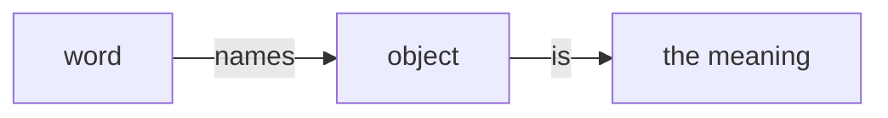
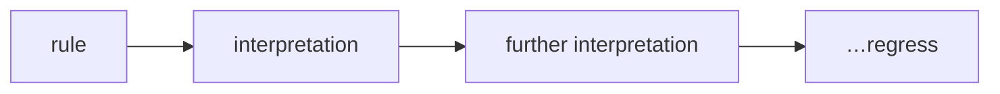

# Wittgenstein — Philosophical Investigations

---
## Wittgenstein's *Philosophical Investigations*

- meaning · use · rules · the inner
- a technical reading

::: narration
Wittgenstein's Philosophical Investigations, published posthumously in 1953, is the central text of his later philosophy and a sustained repudiation of the picture of language he had himself defended in the Tractatus. We will work through its principal movements in order: the attack on the referential picture of meaning, the thesis that meaning is use, the rule-following considerations, the private language argument, and finally the remarks on aspect perception. Keep one thing in view throughout. The target is almost never a rival theory that Wittgenstein means to refute with a better theory of his own. The target is a picture — a way of seeing language so deeply built into our forms of expression that it does not look like a picture at all, but simply like the way things are.
:::

---
## From the *Tractatus* to the *Investigations*

- against system, against theses
- remarks, examples, "an album"
- the philosopher as assembler of reminders

::: narration
The method is as much the message as any doctrine. Where the Tractatus offered a single crystalline theory of how language pictures the world, the Investigations proceeds by remarks, examples, and questions, which Wittgenstein in the preface compares to an album of sketches. He insists he is advancing no theses, and that if one tried to advance theses in philosophy everyone would agree to them, because they would be trivial. The work is therapeutic rather than constructive: it does not build a doctrine of meaning but tries to loosen the grip of a misleading one. So when we extract arguments from it, as we are about to, we should remember we are reconstructing pressures and reminders, not premises in a proof.
:::

---
## The Augustinian picture (§1)

> "the individual words in language name objects … the meaning is the object for which the word stands."

::: narration
Wittgenstein opens by quoting Augustine's account of learning language: elders point at things and utter sounds, the child grasps that the sounds name the things, and so comes to express its desires. Embedded in this homely description is a whole philosophy of language. Words are names; naming is the fundamental semantic relation; the meaning of a word is the object it stands for; and sentences are combinations of such names. Wittgenstein does not call this false. He calls it a picture — and his complaint is that it takes one special case, the labelling of objects, and silently inflates it into the essence of language as such.
:::

---
## What the picture distorts (§§1–2)

- generalizes *one* function of words
- "five red apples": *five*, *red* — names of what?
- assimilates all words to nouns-for-objects

::: narration
The first cracks appear immediately. Consider the shopkeeper handed a slip reading "five red apples." He matches "apples" to a drawer, "red" to a colour sample, and counts out to "five." But what does "five" name? What object does "red" stand for, prior to the practice of comparing and counting? The Augustinian picture has no good answer, because it models every word on the proper name of a middle-sized object. The diversity of what words do — counting, describing, ordering, comparing — gets flattened into a single relation of standing-for. Wittgenstein's strategy is not to refute the picture head-on but to set beside it examples it cannot comfortably absorb.
:::

---
## The builders (§2)

- A calls "Block!", "Pillar!", "Slab!", "Beam!"
- B brings the stone
- a *complete* primitive language

::: narration
So he constructs one. Imagine a language meant to serve communication between a builder A and an assistant B. A calls out "Block," "Pillar," "Slab," "Beam," and B brings the stone he has been trained to bring at that call. Wittgenstein says we may regard this as a complete primitive language. Notice what has happened to "meaning." The word "Slab" does not function here primarily by designating an object in the abstract; it functions as a move that gets a certain stone fetched. Meaning has been relocated from a word-object relation into a role within a shared, rule-governed activity. That relocation is the seed of everything that follows.
:::

---
## Language-games and forms of life (§§7, 19, 23)

- language woven into activity
- "to imagine a language is to imagine a form of life" (§19)
- the multiplicity is open-ended (§23)

::: narration
Wittgenstein names the whole — the language and the activity into which it is woven — a language-game. The term is deliberately broad: it covers the builders' calls, but also reporting an event, speculating, making a joke, thanking, cursing, praying. In section twenty-three he stresses that the number of such games is not fixed; new types come into existence and others become obsolete. And in section nineteen comes the slogan that to imagine a language is to imagine a form of life. Language is not a free-floating system of names hooked onto the world; it is an activity embedded in the patterned practices of a living community. This is why he says elsewhere that speaking a language is part of a natural history.
:::

---
## The limits of ostensive definition (§§27–35)

> "an ostensive definition can be variously interpreted in *every* case."

- pointing presupposes a "post" in grammar
- "this is *tove*" — colour? shape? number? wood?

::: narration
The Augustinian might retreat to ostensive definition: we fix meaning by pointing and saying "this is red." Wittgenstein's reply is that ostension only works once a great deal is already in place. If I point at a pencil and say "this is tove," you cannot know whether I have given the word for the colour, the shape, the number, the material, or the direction — unless you already grasp what kind of word "tove" is meant to be, what Wittgenstein calls its place, or post, in grammar. Pointing does not by itself confer that role; it can be construed in indefinitely many ways. So ostensive definition cannot be the bedrock on which meaning rests. It already presupposes mastery of a technique.
:::

---
## Family resemblance (§§65–67)

> "Don't think, but look!" (§66)

- games: board, card, ball, Olympic, solitaire
- no single common feature — overlapping similarities
- "a complicated network of similarities overlapping and criss-crossing"

::: narration
What, then, do all the things we call language-games have in common, in virtue of which they are language? Here Wittgenstein issues his famous instruction: don't think, but look. Survey the things we call games — board games, card games, ball games, athletic contests, a child throwing a ball against a wall. You will not find one feature common to all. Competition is absent from solitaire; skill from games of pure chance; winning and losing from a child's ball game. What you find instead is a network of similarities overlapping and criss-crossing, as among the members of a family: build, features, gait, temperament. Concepts like game are held together not by a shared essence but by family resemblance.
:::

---
## Blurred concepts and the demand for exactness (§§68–71)

> "The sense will be blurred when I draw a boundary." (§71)

- a concept with blurred edges is *still* a concept
- "Is an indistinct photograph not a picture of a person at all?"

::: narration
The natural objection is that a concept without sharp boundaries is not really a concept at all — that family resemblance leaves "game" hopelessly vague. Wittgenstein turns the demand around. An indistinct photograph is still a photograph of a person; sometimes a blurred picture is exactly what we need. The frontier of a concept can be drawn for a special purpose, but it is not already drawn, and it need not be for the concept to function. The Fregean assumption that a genuine concept must determine a sharp boundary for every object is itself the requirement under scrutiny, not a discovery about meaning. Vagueness is not a defect to be analyzed away; it is a normal feature of working concepts.
:::

---
## "The meaning of a word is its use" (§43)

> "For a large class of cases — though not for all — … the meaning of a word is its use in the language."

- note the qualification — not a flat definition
- meaning as role in a practice, not an object

::: narration
We reach the most quoted line in the book, and it is essential to read it with its hedge intact. For a large class of cases, Wittgenstein says — though not for all — in which we employ the word "meaning," it can be explained thus: the meaning of a word is its use in the language. This is not a reductive theory equating meaning with use across the board; the qualification blocks that. It is a recommendation about where to look. Stop asking what object a word stands for, and start describing how it is used — the circumstances of its application, the responses it licenses, its place in our practices. Meaning becomes something public and normative: a matter of correct and incorrect employment within a shared technique.
:::

---
## The crystalline ideal (§§107–108)

> "Back to the rough ground!" (§107)

- logic's purity was a *requirement*, not a finding
- "We have got on to slippery ice … so we need friction."

::: narration
Why were we so tempted by the picture of an exact, crystalline structure beneath ordinary language? Wittgenstein diagnoses a confusion of the ideal with the actual. The crystalline purity of logic, he says, was not a result of investigation; it was a requirement we brought to the phenomena. The more closely we examine real language, the sharper grows the conflict between it and our demand for ideal exactness — until the demand becomes empty. We had imagined we were walking on frictionless ice, perfect but unwalkable; but precisely because it is frictionless we cannot walk. We need friction. So: back to the rough ground. The vagueness and disorder of ordinary use are not failures to be corrected; they are the conditions under which language actually works.
:::

---
## "A picture held us captive" (§115)

> "A picture held us captive. And we could not get outside it, for it lay in our language and language seemed to repeat it to us inexorably."

::: narration
This remark is the hinge of the whole method. The error is not a false belief we could simply correct by argument. It is a picture — the referential, name-and-object picture of meaning — that is lodged in the very grammar of our language, so that language itself seems to keep confirming it. We say "the meaning of the word," as though meaning were a thing the word possesses, and the grammar of that phrase whispers the Augustinian theory back to us at every turn. This is why philosophy for the later Wittgenstein must work on our forms of expression and not merely on our explicit doctrines. The captivity is grammatical, and only a kind of grammatical therapy can break it.
:::

---
## Philosophy as therapy (§§109, 124, 309)

> "Philosophy is a battle against the bewitchment of our intelligence by means of language." (§109)

- no explanation, only description
- "It leaves everything as it is." (§124)
- "To show the fly the way out of the fly-bottle." (§309)

::: narration
Hence the conception of philosophy that frames the whole book. Philosophical problems are not empirical questions awaiting a theory; they arise when language goes on holiday, when words are detached from the practices that give them sense and made to idle. The philosopher's task is therefore not to explain but to describe — to assemble reminders of how our words actually work, and so dissolve the problem rather than solve it. Philosophy may in no way interfere with the actual use of language; it leaves everything as it is. Its aim, in the most famous image, is to show the fly the way out of the fly-bottle: not to answer the question that traps us, but to free us from having to ask it.
:::

---
## Understanding is not a state or process (§§143–155, 179–184)

> "Try not to think of understanding as a 'mental process' at all." (§154)

- the pupil who "now can go on!"
- the feeling is neither necessary nor sufficient
- understanding ≈ a mastered ability

::: narration
The bridge to the rule-following discussion is the concept of understanding. We are tempted to think that understanding a rule, or suddenly grasping how a series continues, is an inner mental process or state — a special experience of comprehension. Wittgenstein examines the pupil who, watching a numerical series, exclaims "Now I can go on!" What makes that exclamation correct? Not the accompanying feeling, for the same feeling might be followed by failure, and one can understand without any such feeling at all. What makes it true that he understands is that he then goes on correctly, in the right circumstances. Understanding looks less like an inner occurrence and more like the possession of an ability — a mastery exhibited over time in practice.
:::

---
## Rule-following: the deviant pupil (§185)

- teach the rule "add 2": 0, 2, 4, … 1000
- pupil continues: 1000, 1004, 1008, …
- "But I went on in the same way!"

::: narration
Now the crucial scenario. We have taught a pupil to continue the series "add two," and tested him below a thousand; he writes the series flawlessly. We then ask him to continue beyond a thousand, and he writes one thousand, one thousand four, one thousand eight. We say: look again, you were to add two. He replies, with apparent sincerity: but I am going on in the same way — this is how I was to do it. The disturbing point is that nothing in his prior training, considered as a finite set of examples and explanations, logically rules out his interpretation. "Do the same" does not interpret itself. The pupil has found a way of taking our instruction on which his bizarre continuation counts as the same.
:::

---
## The paradox (§201)

> "No course of action could be determined by a rule, because every course of action can be made out to accord with the rule."

- and equally made out to *conflict*
- so "neither accord nor conflict"

::: narration
Section two hundred and one states the paradox in its sharpest form. This was our paradox: no course of action could be determined by a rule, because every course of action can be made to accord with the rule. The argument is symmetrical and devastating. If any continuation can be interpreted as conforming to the rule, then any continuation can equally be interpreted as conflicting with it — and so the very notions of accord and conflict seem to dissolve. If the rule alone, grasped as a mental item, cannot tell the pupil which step is the correct next one, then it seems no fact about my past states could constitute my meaning addition rather than some deviant function. Meaning itself appears to evaporate.
:::

---
## Grasping a rule is not interpreting (§201)

> "There is a way of grasping a rule which is *not* an interpretation."

::: narration
But Wittgenstein immediately blocks the slide into paradox, and the second half of section two hundred and one is as important as the first. There is, he says, a way of grasping a rule which is not an interpretation, but which shows itself in what we call obeying the rule and going against it in actual cases. The mistake that generates the paradox is the assumption that to grasp a rule is always to give it an interpretation — to supply another formulation that says how to take it. But every interpretation is itself another sign, which can again be variously taken; so interpretations breed interpretations without end. If understanding a rule required interpreting it, we would face an infinite regress and never reach the act itself.
:::

---
## "Interpretations hang in the air" (§198)

> "Any interpretation still hangs in the air along with what it interprets, and cannot give it any support."

- what connects rule to act is not a *thought*
- but a custom, a use, a regular practice

::: narration
The lesson of the regress is stated in section one hundred and ninety-eight. Any interpretation still hangs in the air together with what it interprets, and cannot give it any support. A second sign cannot fix the meaning of the first, because it too stands in need of being taken some way. What stops the regress is not a final, self-interpreting thought, but our being trained into a practice — a regular way of acting in which we react to the signpost as we do. There is a way of grasping the rule that is exhibited in use, not in further explanation. The connection between rule and action is forged in custom, not in the interior of the mind.
:::

---
## "Obeying a rule is a practice" (§202)

> "And hence 'obeying a rule' is a practice. … it is not possible to obey a rule 'privately'."

- rules are customs, uses, institutions
- "thinking one is obeying" ≠ obeying

::: narration
So the positive thesis arrives. Obeying a rule is a practice; and rules, like orders and reports, are customs, uses, institutions. From this Wittgenstein draws the conclusion that will detonate in the private language argument: it is not possible to obey a rule privately. For if it were, then thinking one was obeying a rule would be the same as obeying it — there would be no gap between seeming to follow and following. But that gap is precisely what rule-following requires; without it there is no difference between correct and incorrect, hence no rule at all. The normativity of meaning demands a standard of correctness independent of how things merely strike me, and that standard is sustained by a shared practice.
:::

---
## Bedrock: "I obey the rule blindly" (§§217, 219)

> "If I have exhausted the justifications I have reached bedrock, and my spade is turned." (§217)

> "When I obey a rule, I do not choose. I obey the rule blindly." (§219)

::: narration
This raises an anxiety: if no interpretation underwrites the rule, is following it merely arbitrary? Wittgenstein's answer is the opposite of arbitrariness. Justifications come to an end; when I have given my reasons, I have reached bedrock, and my spade is turned — I am inclined to say simply, this is what I do. And when I follow the rule, I do not deliberate and select among interpretations; I obey it blindly. "Blindly" does not mean irrationally. It means without the mediation of a further reason — immediately, as one trained into the practice responds. The bedrock is not a deeper fact that grounds the practice; it is the practice itself, the regular agreement in action that makes rules possible.
:::

---
## Agreement in form of life (§§241–242)

> "That is not agreement in opinions but in form of life." (§241)

- not consensus that *decides* truth
- shared reactions as the *condition* of language

::: narration
A natural misreading must be headed off. When Wittgenstein says that we agree in the language we use, is he saying that human agreement decides what is true? No. It is what human beings say that is true and false, he answers, and they agree in the language they use — and that is agreement not in opinions but in form of life. The point is not a consensus theory of truth, on which a vote could make a sum come out differently. It is that the very possibility of meaning anything — of there being a fact of the matter about correct application — rests on a background of shared, mostly unspoken agreement in reactions and judgments. Communication requires agreement not only in definitions but, strange as it sounds, in judgments.
:::

---
## The Kripkensteinian reading (and its rivals)

- Kripke: a *skeptical paradox* and a *skeptical solution*
- "no fact" constitutes meaning → assertibility in a community
- Baker & Hacker, McDowell: a *straight* reading — practice as bedrock, not skepticism

::: narration
It is worth pausing on a major interpretive fork, since you will meet it everywhere in the literature. Saul Kripke reads section two hundred and one as presenting a genuinely skeptical paradox: there is no fact about me, whether in my behaviour or my mind, that constitutes my meaning plus rather than some deviant function quus. On Kripke's "skeptical solution," meaning-talk survives only as warranted assertibility within a community that checks one another — making the community essential. Against this, commentators like Baker and Hacker and John McDowell offer a straight reading: Wittgenstein is not conceding the skeptic but exposing the bad assumption — that grasping a rule must be an interpretation — that produces the paradox in the first place. On the straight reading there is no skeleton in the cupboard; the regress argument is a reductio of the interpretive picture, and practice is bedrock, not a consolation prize.
:::

---
## Turning inward: the privacy intuition (§243)

> "The words … are to refer to what can only be known to the person speaking; to his immediate private sensations."

- a *logically* private language — not just a diary in code
- another person *in principle* cannot understand it

::: narration
Wittgenstein now turns the rule-following results against a deep Cartesian temptation. Could there be a language whose words refer to what only the speaker can know — to his immediate, private sensations — so that another person could not, even in principle, understand it? This is not merely a diary written in a private code, which others could in principle crack. It is the idea of a logically private language, whose very meanings are accessible to one subject alone. The empiricist picture of how we learn sensation-words — by inwardly attending to a sensation and christening it — seems to make such a language not only possible but fundamental, with public language a derivative overlay. Wittgenstein will argue the idea is incoherent.
:::

---
## The diarist "S" (§258)

> "Whatever is going to seem right to me is right. And that only means that here we can't talk about 'right'."

- I write "S" each day I have the sensation
- no criterion of correctness → memory cannot check memory

::: narration
The argument's core is the diary. I undertake to keep a record of the recurrence of a certain sensation, writing the sign "S" in a calendar on each day I have it. I cannot give "S" an ordinary ostensive definition, so I propose to define it by simply concentrating my attention on the sensation and inwardly, as it were, pointing. But what fixes that on the next occasion I use "S" correctly — that I apply it to the same sensation? By hypothesis there is no independent criterion. I have only my memory of the first naming, and I cannot check that memory against anything but another memory. Whatever is going to seem right to me is right, says Wittgenstein — and that only means that here we cannot talk about "right" at all. A standard of correctness that cannot come apart from my impression of it is no standard.
:::

---
## "An inner process stands in need of outward criteria" (§580)

> "An 'inner process' stands in need of outward criteria." (§580)

- not: sensations don't exist
- but: their *words* get sense from public criteria

::: narration
The general principle behind the diary case is stated in section five hundred and eighty: an inner process stands in need of outward criteria. This does not deny that there are inner processes, sensations, pains. It is a claim about meaning: a word for an inner episode acquires its sense only against publicly available criteria for its application — the natural expressions, the circumstances, the behaviour into which it is woven. Wittgenstein's striking suggestion in sections two hundred and forty-four following is that "pain" does not name a private object pointed to inwardly; rather, the verbal expression of pain replaces and extends the natural cry, learned in a public context. The grammar of sensation is not the grammar of object and name.
:::

---
## The beetle in the box (§293)

> "If we construe the grammar … on the model of 'object and designation', the object drops out as irrelevant."

- everyone has a box; only they can look inside
- the box might be empty, or hold something different
- "the thing in the box has no place in the language-game"

::: narration
The most vivid image makes the point. Suppose everyone has a box containing something they call a beetle; no one can look into anyone else's box, and each says he knows what a beetle is only from his own. The contents might differ from box to box; a box might even be empty; the thing might be constantly changing. The decisive move: insofar as the word "beetle" has a use in these people's shared language, that use cannot be to designate the private contents, for the contents cancel out — they make no difference to the public practice. If you build the grammar of sensation-words on the model of object and designation, the object drops out of consideration as irrelevant. The private object, far from grounding meaning, turns out to do no work in it.
:::

---
## "A behaviourist in disguise?" (§307)

> "'Are you not really a behaviourist in disguise?' … If I speak of a fiction, then it is of a *grammatical* fiction." (§307)

- not denying sensations or inner life
- denying a *picture* of how their words mean

::: narration
Wittgenstein anticipates the obvious charge and confronts it directly. Are you not really a behaviourist in disguise, he has the interlocutor ask — aren't you saying that everything except behaviour is a fiction? His answer: if I speak of a fiction, it is of a grammatical fiction. He is not denying that people have sensations, nor reducing pain to pain-behaviour. He is denying a particular picture of how sensation-language gets its meaning — the picture on which each word is a label privately attached to a private object. The target, once again, is not the inner life but a misconstrual of the grammar of our talk about it. The private language argument is continuous with the whole book: it dismantles a picture, not a phenomenon.
:::

---
## Aspect-seeing: the duck-rabbit (PPF xi)

> "I see that it has not changed; and yet I see it differently."

- the figure: now a duck, now a rabbit
- "noticing an aspect" — the *dawning* of an aspect
- seeing-that vs. seeing-as

::: narration
In the long section eleven of what is now called Philosophy of Psychology — A Fragment, the old Part Two, Wittgenstein turns to perception. The famous duck-rabbit figure can be seen now as a duck, now as a rabbit. When the aspect dawns, I see it differently — and yet I am perfectly aware that the figure on the page has not changed at all. This experience, noticing an aspect, sits uncomfortably between seeing and interpreting. It is not that I receive an unchanged sense-datum and then add a judgment; the change is in the seeing itself. Yet nothing in the object changed. Aspect-perception thus resists both the picture of pure passive sensation and the picture of seeing as disguised inference.
:::

---
## Aspect-blindness and experiencing meaning (PPF xi)

- the hypothetical "aspect-blind" subject
- "experiencing the meaning of a word"
- the inner and the outer, once more entangled

::: narration
Wittgenstein presses the case with the notion of aspect-blindness: imagine someone who could recognize the duck and the rabbit but never experience the switching of aspects — who lacked the capacity for an aspect to dawn. What would such a person be missing? He connects this to a phenomenon in language he calls experiencing the meaning of a word — saying a word over and over until it feels like a mere sound, or hearing a word in a particular sense. These remarks do not deliver a theory of perception or of meaning-experience. They function as a final demonstration of the book's method: by collecting cases that fit neither the inner-object picture nor the behaviourist picture, they loosen the assumption that experience must be one or the other.
:::

---
## Drawing the threads together

- meaning: from object → **use** in a practice
- normativity: correctness sustained by **shared practice**, not inner items
- the inner: words for it need **outward criteria**
- philosophy: dissolve the **picture**, don't build a theory

::: narration
Step back and the unity becomes visible. The critique of the Augustinian picture, the thesis that meaning is use, the rule-following considerations, and the private language argument are one sustained movement. Each dislodges the same assumption: that meaning is secured by a relation between a sign and an object — a thing named, an interpretation entertained, a sensation inwardly labelled. In each case the object drops out, and its place is taken by a normative practice: a public, rule-governed activity in which correctness and incorrectness have a foothold. And the method never changes. Wittgenstein offers no theory of meaning to replace the one he undoes, because the trouble was never a false theory but a captivating picture. The work of philosophy, on this view, is not to know more, but to command a clear view of what we already do — and so to be released from the questions that held us captive.
:::
